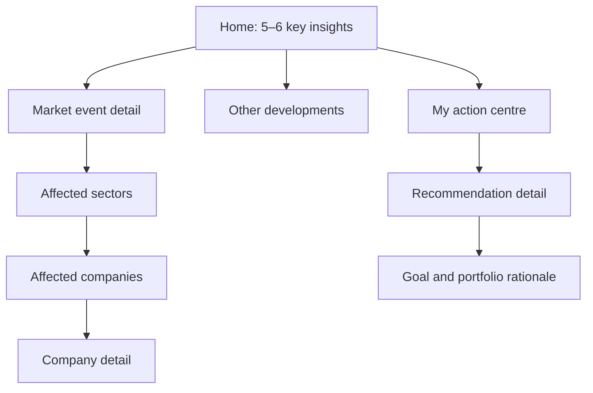
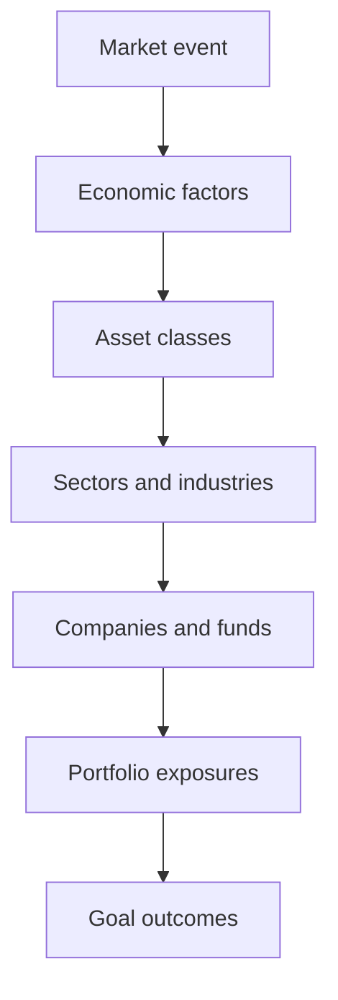
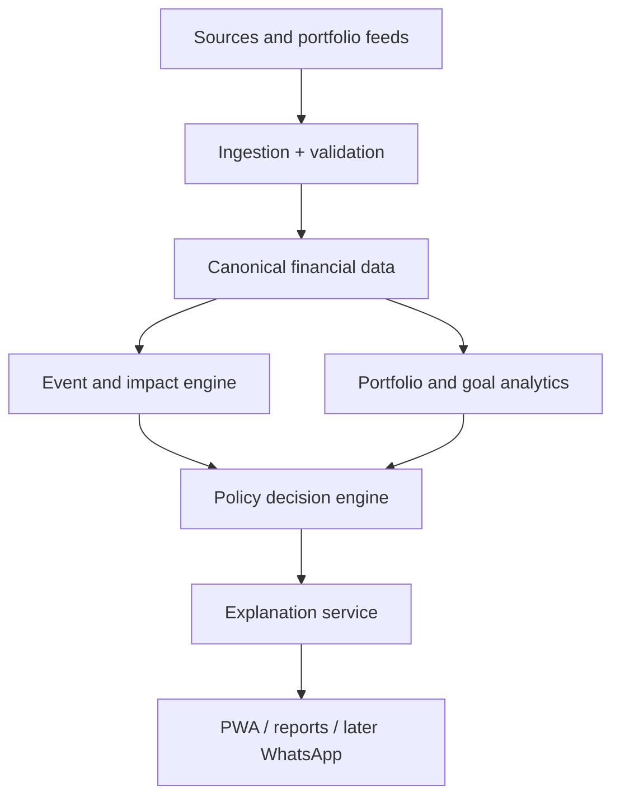

# Fingent360

A goal-aware market intelligence and portfolio platform for Indian investors. The first virtual portfolio journey is implemented across the browser, API and PostgreSQL. It uses explicitly fictional companies and fixed exercise prices; live market feeds and real-account features remain future work.

## Change handoffs and test failures (SDLC-002)

Every development request updates TODO with scope, acceptance criteria and a reusable prompt, adds or updates appropriate tests, updates documentation and receives a local commit. Verification remains manual and is tracked separately. No automatic push. Handoffs identify pre-existing edits that were left uncommitted.

After manually running tests in the Playwright UI, tell Codex **“Read artifacts/e2e/latest.md and fix the failures.”** The new local reporter saves selected cases, outcomes, locations, targets and errors there; historical runs live under `artifacts/e2e/handoffs/`. Reopen the UI once to load the reporter. Reports remain local and ignored by Git. Known secrets are redacted, but inspect arbitrary assertion text before external sharing. A report marked running is incomplete; only the selected cases are covered. No new dependencies. Reporter tests and [manual acceptance cases](tests/e2e/plans/sdlc-002-acceptance.md) are authored, not executed.

## Real economic data (DATA-001)

The default page now reads persisted India GDP growth and CPI inflation from a real World Bank adapter. An operator refresh calls the provider, saves source JSON in MongoDB and promotes exact decimal observations to PostgreSQL. Inspect annual history, revisions, attribution and raw evidence in the UI. Empty or failed sources never receive sample values. [Setup and test walkthrough](docs/development/real-data.md).

```bash
pnpm research:setup
pnpm db:up
pnpm format
pnpm check
pnpm db:migrate
pnpm dev
```

Restart the existing dev terminal to load the generated operator key; avoid duplicate dev sessions. At http://localhost:5173/#macro, expand Source refresh controls and use the local `.env` RESEARCH_ADMIN_TOKEN. Never share that key. No dependencies changed. In the existing E2E UI, manually run `@DATA-001` across api/desktop/mobile; those cases call the real provider and databases. Their credential-bearing traces are disabled. The prior virtual portfolio exercise remains under its own navigation link.

Implementation is written, not runtime-verified by Codex. Real-account authentication, real equity valuation and broader provider integrations remain unfinished backlog items.

## Accounts and saved watchlists (ACCOUNT-001)

Use **My watchlist / sign in** to create an account, save the real economic indicators you follow, sign out/in and recover your selections. Server sessions use HttpOnly cookies; private watchlists are stored in PostgreSQL. Account deletion requires the current password. This is separate from the earlier virtual exercise.

After `pnpm format` and `pnpm check`, apply `pnpm db:migrate` and load the updated app at http://localhost:5173/#account. In the E2E UI manually run `@ACCOUNT-001` across api/desktop/mobile. [Account behavior, limitations and manual walkthrough](docs/development/accounts.md). New cases remain unexecuted by Codex.

## Personal observation inbox (ALERT-001)

The signed-in watchlist now includes an inbox of latest reported observations for followed indicators. Acknowledgments persist per account and exact observation revision; later corrections are not silently treated as read. Use the source/history link to inspect evidence. This is an in-app data-review feature, not email/push or a trade signal. Apply the latest `pnpm db:migrate` and manually run `@ALERT-001` (real provider access required).

## Automatic local ports (DEV-PORTS-001)

API watch mode now snapshots configuration once at launch, so a restart does not load another session's ports from `.env`. Stop dev sessions launched before this correction once with Ctrl-C, then launch again. Existing watcher processes cannot acquire the new launcher code automatically. New sessions retain their own selected API port and web origin across source changes.

The reported launcher lint errors have been corrected using explicit conditionals for process signaling and exit handling. Rerun `pnpm format` and `pnpm check`; verification of this correction remains pending.

`pnpm dev` now brings up/reuses this repo's local databases, builds, selects free API/web ports and prints their actual URLs. Occupied ports no longer require killing another app. Selections are saved atomically in `.env`: API_PORT, WEB_PORT, WEB_ORIGIN, POSTGRES_PORT/MONGO_PORT and both database connection URLs. Vite's proxy, account Origin checks, migrations, smoke checks and newly opened E2E runners use the selected configuration. Existing unrelated processes are never killed.

`pnpm db:up` reuses running ports reported by Fingent360's Compose services. If a stopped database's preferred port is occupied, it selects another binding while retaining the named volume. `pnpm preview` starts a coordinated API/static-web preview with the same port selection. Test UI and report commands also select free ports starting at 9323/9324 and print the addresses.

Use the printed links rather than assuming 5173/4100/9323. Reopen the test UI after launching a new app session so it targets that session. Existing apps/browser tabs/test runners retain their launch addresses; they are not silently redirected. Schema migrations remain an explicit manual action (`pnpm db:migrate`). Docker must be available. A port taken in the small interval between selection and bind can still require retrying startup; the launcher does not terminate the competing process.

Manual verification: run `pnpm format` and `pnpm check`, then start `pnpm dev` while the previous app is still running. The new app should use different ports, connect to the existing databases, and allow account actions. Open `E2E_BROWSER=chrome pnpm e2e:ui`; verify its printed targets match the new app and run foundation/account cases. Start a second test UI to verify its listener moves too. Codex did not execute any of these steps.

## Start locally

Prerequisites: Node.js 24 LTS (Node 26 also supported locally), pnpm 11.23.0 and Docker with Compose.

```bash
cd /Users/arpanmacmini/code/fingent360
pnpm bootstrap
pnpm install --frozen-lockfile
pnpm db:up
pnpm format
pnpm check
pnpm dev
```

If pnpm is missing or differs, install the pinned version with `npm install --global pnpm@11.23.0`. `pnpm bootstrap` creates `.env` only when absent; it never overwrites existing settings.

- Web: http://localhost:5173
- API liveness: http://127.0.0.1:4100/api/v1/health
- Database readiness: http://127.0.0.1:4100/api/v1/ready
- PostgreSQL: localhost:55432; MongoDB: localhost:57017

The database ports intentionally avoid existing services on 5432/27017. Containers have a separate `fingent360` Compose project and persistent named volumes. Credentials in `.env.example` are local development defaults. Bindings are loopback-only. There is no production deployment configuration yet.

`pnpm dev` now prepares local database bindings, builds the workspace, selects available app ports, then watches contracts/API/web. Stop with Ctrl-C. `pnpm db:down` stops databases and preserves their data. If you change credentials after first startup, existing database users do not change automatically: migrate credentials rather than deleting volumes. If changing database ports/passwords, update the matching connection URI in `.env` as well.

## Working with Codex

Follow [AGENTS.md](AGENTS.md), [TODO.md](TODO.md) and [the SDLC](docs/development/sdlc.md). This README includes the full product blueprint below, including the free/paid source catalogue and 27-item source register.

For every development request, Codex adds/updates a TODO task with a detailed prompt and acceptance criteria, implements it, adds/updates E2E cases, updates TODO and README, then commits locally. **Codex does not execute deterministic checks or environment actions and never pushes automatically.** Tests, installation, formatting, lint/builds, service startup and Git push are manual user actions. Implementation and verification status are separate.

### Working end-to-end slice (SLICE-001)

You can now explore a fictional oil event and its company/source details, save virtual holdings, preview and confirm a reconciled CSV import, add multiple goals, and create educational reviews with preserved history. PostgreSQL persists the workspace across reloads. Invalid imports, competing edits and stale/conflicting review inputs have explicit handling.

**Source implementation complete; manual verification pending.** The earlier DEV-001 status referred to document review. Executable API/browser cases now exist for this working flow. Follow the [setup and test walkthrough](docs/development/working-journey.md):

```bash
pnpm db:up
pnpm format
pnpm check
pnpm db:migrate
pnpm dev
# Separate terminal; run selected cases manually:
E2E_BROWSER=chrome pnpm e2e:ui
```

No dependency changes. `pnpm check` builds the migration command; `pnpm db:migrate` creates the additive virtual-workspace tables without clearing data. Reuse or stop an existing dev terminal before starting another. Open http://localhost:5173 and follow the sample import → goals → review flow. In the test UI, select `@SLICE-001` across API/desktop/mobile and run manually; also rerun foundation browser cases.

This is a synthetic local learning workspace, not real account authentication or live financial research. Its browser access key protects only fictional exercise data. [Policy and implementation decisions](docs/product/educational-slice-policy.md) explain the exact monetary rules, review gates and remaining roadmap. DEV-002–DEV-010 retain their broader production scope in TODO; they are not marked complete by this slice.

DEV-001 reference artifacts remain the [screen requirements](docs/product/first-slice-prd.md), [canonical model](docs/data-dictionary/canonical-model.md), [glossary](docs/data-dictionary/glossary.md) and [manual requirements-review pack](tests/e2e/plans/dev-001-acceptance.md).

### Workspace creation returns 503 (BUG-003)

If E2E-API-011–013 all fail while creating a workspace, the shared storage operation failed before those scenarios ran. This does not by itself prove that migration was skipped. The API now distinguishes missing schema, authentication, permissions and connectivity errors without exposing credentials; the test assertion includes the failure response.

Manually run `pnpm format`, `pnpm check`, then `pnpm db:migrate`. Migration must print “Virtual journey schema is ready. Existing data preserved.” Both migration and API must use the same database configuration. If migration fails, share its safe error text. Once it succeeds, ensure the running API has loaded the rebuilt code and rerun E2E-API-011–013 in the existing test UI. No reset or data deletion is needed. If they still fail, share the new response message; the underlying cause remains unconfirmed until that evidence is available.

## Manual test dashboard

The reusable local tool uses Playwright UI mode for API and browser test selection and result inspection. It makes no LLM calls. Once dependencies are installed, new feature requests normally require only case/fixture/catalogue updates.

**One-time user setup:**

```bash
pnpm install --frozen-lockfile
pnpm e2e:install
```

**User starts the application** (if it is not already running):

```bash
pnpm bootstrap
pnpm db:up
pnpm dev
```

**In another terminal:**

```bash
pnpm e2e:ui
```

Open http://127.0.0.1:9323. Select all tests, a project (`api`, `desktop`, `mobile`), a task tag such as `@SDLC-001`, or individual cases and click Run. Opening the UI does not run tests; keep eye/watch toggles off. Results show pass/fail/skipped, steps, errors, source lines and available network/trace details. No service startup, migrations or seed/reset actions are hidden in the runner.

Optional **user-triggered** saved runs and reports:

```bash
pnpm e2e:run --project=api
pnpm e2e:run --grep @SDLC-001
pnpm e2e:report
```

Command-line runs save separate HTML/JSON/failure artifacts under ignored `artifacts/e2e/<run-id>/`. `e2e:report` opens the latest saved HTML report at http://127.0.0.1:9324; UI-session results remain visible in the dashboard. See [test instructions](tests/e2e/README.md), [case catalogue](tests/e2e/CATALOG.md) and [planned feature coverage](tests/e2e/plans/product-coverage.md).

**Current change status:** SDLC-001 implemented; SDLC-002 manual acceptance pending. API/browser cases are authored but not run. Installation, formatting, lint, builds and test execution were intentionally left to the user. Earlier foundation verification below/in status docs does not validate this change. GitHub CI is now manually triggered only.

## Startup conflict and browser download recovery

`pnpm dev` now checks web/API ports before building. A second session must not silently move to another port because E2E targets and the API proxy expect fixed ports. If an earlier Fingent360 session is running, reuse http://localhost:5173 or press Ctrl-C in that session's terminal before restarting. The guard reports the conflict and never kills an existing process. SIGTERM messages after a web failure are sibling cleanup; inspect the earlier web error for the original cause.

For a browser installer stuck after 100%, press Ctrl-C in its terminal. That progress measures transferred bytes, not completed extraction/installation. Google Chrome is already installed on this Mac, so managed Chromium is optional:

```bash
E2E_BROWSER=chrome pnpm e2e:ui
```

Open http://127.0.0.1:9323 yourself and click Run for selected cases. Installed-Chrome mode uses fresh isolated browser contexts, not your personal Chrome profile, and disables video so it does not require Playwright's FFmpeg download. Screenshots/traces remain available on failures. To save a run manually:

```bash
E2E_BROWSER=chrome pnpm e2e:run --project=desktop
```

The default remains managed Chromium. If retrying its installer, use Node 24 LTS and `DEBUG=pw:install pnpm e2e:install` to expose transfer/extraction details. No specific root cause of the download stall has been confirmed. Do not delete browser caches or stop unrelated applications as a workaround.

BUG-001: implementation authored, manual verification pending. Codex did not stop processes, install browsers or run startup/tests/checks.

## JSON error-response correction (BUG-002)

Unknown nested API routes are expected to return JSON HTTP 404 errors. The API global prefix now includes the leading slash required by the installed Express adapter's fallback-router mount. E2E-API-003 checks content type before JSON parsing, and the API regression tests cover multiple missing paths. This fix is authored, not verified; the user reported the previous HTML-response failure.

Manual next actions: run `pnpm format` and `pnpm check`; ensure the development API has reloaded (or restart `pnpm dev` after stopping its existing session). In the E2E dashboard rerun E2E-API-003, then E2E-API-001 and E2E-API-002 to check health/readiness remain intact. No changes to browser installation or database setup are needed.

## Repository map

The SDLC adds `TODO.md`, `tests/e2e/`, `playwright.config.ts` and `scripts/e2e.mjs`.

| Path                   | Responsibility                                                             |
| ---------------------- | -------------------------------------------------------------------------- |
| `apps/web`             | React/Vite responsive starter; shared-contract API check                   |
| `apps/api`             | NestJS API, configuration validation, liveness and real database readiness |
| `packages/contracts`   | Versioned runtime API schemas shared by web and API                        |
| `infra/local`          | Isolated PostgreSQL and MongoDB Compose services                           |
| `scripts`              | Non-destructive environment bootstrap and runtime smoke check              |
| `docs/product`         | Blueprint and accepted conversation decisions                              |
| `docs/development`     | Backlog, verification status and development conventions                   |
| `docs/adr`             | Architecture decisions and rejected alternatives                           |
| `docs/policies`        | Product safety boundary and source trust requirements                      |
| `docs/data-dictionary` | Entry point for future domain contracts                                    |
| `docs/evaluations`     | First vertical-slice acceptance/scenario plan                              |
| `.github/workflows`    | Manually triggered checks and real-database API smoke test                 |

## Verification commands — user runs manually

For this new SDLC change, run `pnpm format` before `pnpm check`; no formatter or checks were run by Codex. `pnpm check` also type-checks E2E definitions without executing them.

```bash
pnpm check       # format, lint, strict types, production builds, tests
pnpm db:status
pnpm smoke       # API must be running; requires both databases
pnpm format      # apply formatting
```

`/health` only proves the process is alive. `/ready` returns HTTP 503 when either database is unavailable. Automated API tests exercise both states with a controlled probe; `pnpm smoke` checks real PostgreSQL/MongoDB connections.

The web starter intentionally shows no market statistics or recommendations. Authentication, domain migrations, imports, workers, live providers, PWA install/offline support and recommendation policies are not implemented. See the [current status](docs/development/status.md).

## Source and recovery

Requirements were reviewed against all nine turns of **Market Analysis Review**, including the user's later corrections, and the supplied plan. [Shared conversation](https://chatgpt.com/share/e/6aa4c561-c880-8013-a081-a085a4c1a810).

The earlier runner reported commit `814fe0a063e2f52e04ea99cee5f085b2e3ff4119`. Its bundle download was blocked by Chrome; that commit was not imported. This is a fresh implementation of the agreed foundation, with its own local commit history. The user incorporated the full blueprint below into this README. The duplicate root `Market_Intelligence_and_Portfolio_Action_Platform_Plan.md` has been removed as requested. This README is now the current product document; `docs/product/market-intelligence-platform-plan.md` remains a historical reference copy.

# Market Intelligence and Portfolio Action Platform

## End-to-End Product, Data, Decisioning and Implementation Blueprint

**Working description:** A plain-language financial decision-support platform for people who own or want to own investments but do not understand how market events affect their goals and portfolio.

**Primary launch surface:** Responsive web application/PWA. Later, the same experience can be exposed through WhatsApp and packaged inside Android/iOS application shells.

**Immediate technology stack:** React/TypeScript frontend; Node.js/TypeScript and/or Java/Spring Boot backend; PostgreSQL for canonical structured data; MongoDB for documents and source content. No Temporal, Redis, Kafka or Elasticsearch in the initial platform.

**Asset-class sequence:** Indian listed equities → Indian mutual funds and bonds → other Indian assets → international mutual funds → international equities → other international assets → crypto.

**Planning approach:** Capability- and dependency-based. Conventional engineering-duration estimates are deliberately excluded. Codex can compress implementation, but regulatory interpretation, data rights, security review and recommendation validation remain release gates.

---

## 1. Executive decision

Build this as a **goal-aware market intelligence and portfolio decision-support system**, not as a news summariser and not as an LLM that improvises stock tips.

The product should answer five questions in this order:

1. **What changed?** Five or six verified developments that matter.
2. **Why does it matter?** Plain-language causal explanation.
3. **What can it affect?** Asset classes → sectors → industries → companies → the user's holdings and goals.
4. **What, if anything, should I do?** Hold, watch, add gradually, trim, rebalance, exit, pause deployment or move a defined amount between asset classes.
5. **Why is that action appropriate for me?** Goal, horizon, risk capacity, current allocation, taxes, confidence, alternatives and invalidation conditions.

The recommendation system must be primarily deterministic, evidence-backed and auditable. LLMs may extract events, help map evidence, and explain outputs; they must not independently decide portfolio actions.

### Recommended initial regulatory posture

Until a qualified Indian securities lawyer confirms the operating model and the appropriate SEBI registration/partnership structure:

- Provide research, education, simulations and user-controlled portfolio monitoring.
- Do not present unregistered personalised securities advice as regulated advice.
- Use neutral action language such as **Review**, **Potential rebalance**, **Watch trigger**, and **Discuss with adviser** where required.
- Develop the regulated recommendation engine behind feature flags.
- Plan either an Investment Adviser/Research Analyst registration pathway or a partnership with an appropriately registered entity before activating personalised Buy/Sell/asset-allocation instructions.

SEBI's current Investment Adviser master circular, Research Analyst FAQs and Execution Only Platform framework must be reviewed as formal product requirements, not treated as footer disclaimers.

---

## 2. Target user and product promise

### Primary user

An Indian retail investor who:

- has investments across one or more brokers, mutual-fund platforms or spreadsheets;
- does not understand most macroeconomic or market terminology;
- receives contradictory news and social-media advice;
- does not know whether an event requires action;
- wants wealth creation and goal protection rather than high-frequency trading;
- needs recommendations translated into rupee amounts and simple next steps.

### Core promise

> “Tell me what matters, what it means for my money, and whether I really need to do anything.”

### Product principles

1. **Action follows goals, not headlines.**
2. **No action is a valid and frequent recommendation.**
3. **Facts, expectations, scenarios, inferences and actions are visibly different.**
4. **Every material claim is traceable to a source and timestamp.**
5. **A recommendation always includes reason, size, timing, risk and invalidation.**
6. **Portfolio-level suitability overrides a stock-level opinion.**
7. **Beginners see plain language first; experts may expand the evidence.**
8. **Revisions are first-class data.** GDP, payroll and earnings estimates can change after publication.
9. **The platform never creates urgency merely to increase engagement or transactions.**
10. **Free-data MVP adapters can be replaced by licensed feeds without changing domain logic.**

---

## 3. Product scope

### 3.1 MVP scope

- Public market home page with five or six important insights.
- Market event detail pages with primary and corroborating sources.
- Event-to-sector and event-to-company impact graph.
- Indian listed-company profile pages.
- Goal and investor-profile creation.
- Portfolio upload through supported Excel/CSV templates.
- Manual/virtual portfolio.
- Portfolio health and exposure dashboard.
- Goal-aware action centre.
- Daily and weekly reports.
- Watchlists and material-change alerts.
- Evidence, confidence and “what would change this conclusion” for every action.
- Admin/research console for corrections, overrides, policy and source management.

### 3.2 Explicitly deferred from the first safe release

- Automatic order execution.
- Discretionary portfolio management.
- Intraday trading signals.
- Options strategy recommendations.
- Direct public redistribution of unlicensed real-time exchange feeds.
- Unreviewed recommendations generated directly from news text.
- Return guarantees or recommendations designed to hit arbitrary quarterly targets.

### 3.3 Progressive asset-class expansion

| Stage | Instruments                                     | New capabilities required                                                                                      |
| ----- | ----------------------------------------------- | -------------------------------------------------------------------------------------------------------------- |
| 1     | Indian listed equities, cash                    | Company master, EOD prices, corporate filings, portfolio lots, equity risk model                               |
| 2     | Indian mutual funds, government/corporate bonds | Scheme/security master, NAV/yield curves, duration/credit risk, XIRR, goal allocation                          |
| 3     | Gold, ETFs, REITs, InvITs, commodities          | Asset-specific pricing, tracking error, commodity/macroeconomic factor models                                  |
| 4     | Derivatives                                     | Suitability gates, payoff/risk engine, margin and expiry handling; not for beginner recommendations by default |
| 5     | International mutual funds                      | Currency, country, tax and fund look-through exposure                                                          |
| 6     | International equities                          | Corporate and market data licensing, FX, local-market calendars, tax handling                                  |
| 7     | Other international assets                      | Country-specific rules, custody and pricing sources                                                            |
| 8     | Crypto                                          | Separate suitability, custody, tax, volatility and regulatory controls                                         |

---

## 4. Information architecture



### 4.1 Public/non-logged-in experience

Use a generic profile representing a transparent blend of common goals, never a fictional personalised investor.

The generic home page contains:

- five or six important developments;
- simple “good/bad/mixed for Indian investors” labels;
- likely asset-class and sector effects;
- virtual portfolios by risk/horizon;
- educational examples of possible responses;
- a prompt to add goals or upload holdings for personalised impact.

The generic profile must not imply that one allocation fits everyone.

### 4.2 Logged-in home page

#### Above the fold

1. **Today/this week in one minute** — five or six ranked insights.
2. **Impact on you** — estimated positive, negative or mixed exposure in rupees and percentage of portfolio.
3. **Action required?** — a single calm status:
   - No action needed
   - Review recommended
   - Goal at risk
   - Rebalance recommended
   - Urgent data/account issue
4. **Next important event** — what it is, when it happens, what scenarios mean.
5. **Goal health** — on track, watch or off track.

#### Each summary card

- one-sentence fact;
- one-sentence meaning;
- personal impact badge;
- confidence and freshness;
- “Why this matters” detail link;
- source count and last update;
- expand for affected sectors/stocks.

### 4.3 Other developments page

Categorised, ranked and filterable list:

- Indian economy and policy
- Global macro and central banks
- Geopolitics
- Commodities and currency
- Institutional flows and liquidity
- Market valuation and breadth
- Sectors and themes
- Corporate earnings and filings
- Regulation and taxation
- Portfolio-specific developments

Every point opens the same canonical event-detail structure. Do not generate disconnected duplicate articles.

### 4.4 Event detail page

1. Plain-language title and one-paragraph explanation.
2. **Fact / expectation / scenario / interpretation** label.
3. Actual value, previous value, consensus and surprise.
4. Timeline of related developments.
5. Primary sources and corroborating sources.
6. Conflicting evidence or uncertainty.
7. Asset-class effects.
8. Sector and industry effects.
9. Companies positively/negatively/mixed affected.
10. Impact on the user's holdings and goals.
11. Scenario tree and invalidation conditions.
12. Related past events and how markets actually responded.

### 4.5 Company page

#### Identity and market data

- name, symbol, ISIN, exchange, industry and sector;
- market capitalisation, liquidity and index membership;
- price, total return, volatility, beta and drawdown;
- valuation compared with company history, sector and market.

#### Fundamentals

- revenue, EBITDA, PAT, EPS and cash flow trends;
- ROE/ROCE, operating margins and working capital;
- debt, interest coverage and liquidity;
- promoter holding/pledging and institutional ownership;
- segment/geographic/customer concentration;
- earnings estimates and revisions when reliable data becomes available;
- accounting-quality and governance flags.

#### Evidence and events

- exchange filings and results;
- earnings-call summaries linked to source documents;
- verified company news with source links;
- market events affecting the company;
- expandable causal explanation for every event-company relationship;
- positive, negative and mixed factors;
- relationship confidence, horizon and invalidation conditions.

#### Portfolio context

- current value, cost, gain/loss and tax lot;
- portfolio weight versus allowed band;
- contribution to goal and portfolio risk;
- correlated holdings and hidden concentration;
- recommendation, reason, size and alternative.

---

## 5. Goal and investor-profile model

### 5.1 Separate goals from preferences

Each user may have any number of goals, including multiple goals of the same type.

#### Goal fields

- goal name and type;
- target amount in today's or future rupees;
- target date/horizon;
- current allocated corpus;
- planned recurring and lump-sum contributions;
- priority: essential, important or aspirational;
- inflation assumption;
- tax assumption;
- minimum acceptable probability of success;
- allowed assets and exclusions;
- liquidity need and withdrawal schedule;
- flexibility of target amount/date;
- linked accounts, holdings and cash flows.

#### Supported goal types

- Long-term wealth/retirement creation
- Child education or other dated long-term obligation
- Medium-term purchase such as house down payment or car
- Short-term capital preservation/appreciation
- Income generation
- Emergency/liquidity reserve
- Sector/geography learning and allocation
- Existing portfolio monitoring with minimum intervention
- Capital protection
- Tax-aware rebalancing
- Custom goal

### 5.2 User-level suitability profile

- age and household context;
- income stability and investible surplus;
- assets, liabilities and emergency reserve;
- risk **capacity**, risk **tolerance** and loss reaction—stored separately;
- knowledge/experience by asset class;
- investment horizon;
- tax residency and bracket;
- restrictions and ethical exclusions;
- concentration limits;
- leverage/derivatives eligibility;
- preference for minimal action;
- adviser relationship and consent status.

### 5.3 Default values

Defaults must be visible and editable, with their source/version stored. They must never masquerade as user-provided facts.

For an anonymous user, show scenarios such as conservative, balanced and growth—not a single personalised recommendation.

### 5.4 Goal mathematics

For each goal calculate:

- future target value after inflation;
- required contribution;
- expected return distribution, not a single promised return;
- probability of reaching target;
- funded ratio;
- maximum tolerable drawdown given the remaining horizon;
- glide path and rebalancing bands;
- tax- and exit-load-aware withdrawal sequence;
- sensitivity to contributions, horizon and return assumptions.

Short-term goals must not be converted into aggressive equity bets merely because the user enters a high desired quarterly return. The system should flag goal/return infeasibility and propose changes to contribution, target, date or risk.

---

## 6. Portfolio acquisition and normalisation

### 6.1 Acquisition sequence

1. Manual virtual portfolio
2. Standard Excel/CSV upload
3. Platform-specific import templates and help articles
4. CAS/PDF import with user review
5. Broker APIs such as Zerodha/Upstox and other supported platforms
6. Registrar/platform partnerships for mutual funds
7. Consent-led Account Aggregator integrations where coverage and FIU eligibility permit
8. Custodian/wealth-platform feeds

Do not assume CAMS, MF Central, every broker or Account Aggregator exposes a freely usable retail portfolio API. Each integration requires commercial, consent, regulatory and technical validation.

### 6.2 Import UX

- Select platform.
- Show exact download steps with screenshots and last-verified date.
- Upload locally to an isolated ingestion area.
- Detect file format/version.
- Preview mapped accounts and holdings.
- Show unresolved symbols, duplicates and missing cost data.
- User confirms corrections.
- Generate reconciliation report: imported value versus source total.
- Store import evidence and parser version.

### 6.3 Canonical portfolio model

- Household → user → account → portfolio → position → tax lot → transaction.
- Instrument identity keyed primarily by ISIN plus exchange/symbol aliases.
- Cash and liabilities represented explicitly.
- Corporate actions adjust lots through auditable transformations.
- Separate source-reported values from system-calculated values.
- Preserve original files encrypted with retention controls.

### 6.4 Data-quality states

- Verified and reconciled
- User-confirmed
- Imported but incomplete
- Estimated
- Stale
- Conflicting
- Unusable

No personalised action can use unresolved or materially stale positions without a prominent warning or policy block.

---

## 7. Market intelligence taxonomy

Every event is classified across several dimensions rather than placed into one news category.

### Event families

- Macroeconomic data
- Monetary policy and interest rates
- Fiscal policy and taxation
- Regulation
- Geopolitics and security
- Commodity supply/demand
- Currency and external balance
- Institutional flows and liquidity
- Market structure, valuation and technical state
- Sector/industry development
- Company results, guidance and capital allocation
- Governance, litigation and management change
- Corporate action
- Climate/weather/natural disaster
- Technology/disruption

### Event attributes

- geography;
- announcement time, effective time and market-awareness time;
- actual, previous, expected and revised values;
- magnitude/surprise;
- direction;
- expected persistence;
- affected economic factors;
- first-order and second-order effects;
- confidence;
- sources and source hierarchy;
- expiry/review date;
- contradictory evidence;
- related event chain.

---

## 8. Event-to-investment knowledge graph

The platform's differentiating intellectual property is the causal graph:



### Example: crude-oil shock

- Event: Brent price rises because of supply disruption.
- Factors: input cost, inflation, INR, current account, rates, consumer spending.
- Assets: Indian equities mixed, short-duration debt potentially preferable to long duration under rising yields, gold context-dependent.
- Sectors: upstream energy positive; aviation/paints/tyres/logistics negative; OMCs conditional on pricing policy.
- Company: map revenue benefit, input-cost exposure, pricing power, hedging, regulation and balance sheet.
- Portfolio: calculate direct and indirect exposure.
- Goal: decide whether risk threatens a near-term essential goal or is normal volatility for a 15-year goal.

### Relationship record

Each event-factor-sector-company edge stores:

- direction: positive/negative/mixed;
- strength;
- horizon;
- transmission mechanism;
- prerequisites;
- invalidation conditions;
- quantitative sensitivity where available;
- evidence references;
- model/rule version;
- analyst review state;
- confidence.

Do not store only generated prose. Store structured causal edges and render prose from them.

---

## 9. Recommendation and action engine

### 9.1 Decision pipeline

1. Validate portfolio freshness and goal completeness.
2. Calculate strategic allocation and permitted bands.
3. Calculate portfolio/goal risk before considering news.
4. Detect material events and changed fundamentals.
5. Map events to positions through the knowledge graph.
6. Measure whether impact is already reflected in price/valuation.
7. Generate candidate actions using versioned policies.
8. Apply suitability, tax, liquidity, concentration and regulatory constraints.
9. Compare candidate action with “do nothing.”
10. Rank by expected goal improvement, downside avoided, cost and confidence.
11. Require evidence and validation.
12. Produce recommendation plus alternatives and invalidation.

### 9.2 Action vocabulary

- No action
- Watch
- Continue SIP/contribution
- Pause new deployment temporarily
- Add gradually
- Add only below valuation/price trigger
- Trim to target band
- Exit because thesis is broken
- Rebalance between equities, debt, cash, gold or other eligible assets
- Move upcoming-goal money to lower-risk assets
- Increase emergency liquidity
- Harvest loss/gain where legally and financially appropriate
- Seek regulated adviser review

### 9.3 Required recommendation structure

Every action contains:

- action and instrument/asset class;
- rupee amount and portfolio percentage range;
- priority;
- deadline or trigger;
- goal served;
- evidence and causal reasoning;
- confidence;
- expected benefit;
- principal downside;
- transaction costs, taxes, exit load and liquidity;
- alternative action;
- “do nothing” comparison;
- invalidation condition;
- policy/model version;
- regulatory status and approval requirement.

### 9.4 Materiality rules

News should reach the action centre only when it can plausibly:

- move a holding beyond a defined risk/valuation band;
- change a company's long-term earnings/cash-flow thesis;
- alter a goal's probability of success materially;
- create a liquidity or capital-loss risk for a near-term goal;
- cause a concentration breach;
- justify tax/cost-aware rebalancing;
- require user attention for a corporate action or account issue.

### 9.5 Prevent overtrading

- Minimum evidence threshold.
- Cooldown periods after recommendations.
- Turnover budget by user profile.
- Rebalancing bands rather than point targets.
- Tax and cost hurdle.
- Higher threshold for selling long-held quality assets.
- Separate tactical and strategic recommendations.
- Explicit penalty in ranking for unnecessary action.
- Notification batching unless genuinely urgent.

### 9.6 Asset-allocation actions

“Move equities to liquid funds/bonds” is not one generic action. The engine must distinguish:

- emergency liquidity;
- money needed for a dated goal;
- strategic allocation drift;
- valuation/risk regime;
- temporary parking for planned deployment;
- duration and credit risk within debt;
- tax and exit-load implications;
- whether a liquid fund, money-market fund, short-duration fund, target-maturity fund, FD or government security is appropriate and eligible.

---

## 10. Data strategy: free first, licensed later

### 10.1 Source hierarchy

1. Regulator, exchange, central bank, statistics ministry and issuer filing
2. Other government/international official source
3. Licensed institutional data/news provider
4. Reputable wire service
5. Reputable financial publication
6. Broker/research report with disclosed authorship
7. Other sources, usable only as leads and never as sole evidence for action

### 10.2 Initial free/public sources

#### India

- NSE/BSE EOD reports, indices, corporate filings and corporate actions
- NSDL/CDSL FPI and ownership information
- RBI and DBIE for monetary policy, rates, currency and reserves
- MoSPI for GDP, CPI, IIP and related releases
- Commerce Ministry for trade
- CGA for fiscal data
- GST and other official releases
- SEBI regulations/circulars
- Company annual reports, results, presentations and exchange filings
- AMFI for mutual-fund NAV and scheme data

#### Global

- Federal Reserve/FRED
- US BLS and BEA
- US Treasury
- ECB and other central banks
- World Bank, IMF and OECD
- EIA and other official commodity data
- Issuer and exchange filings

### 10.3 Upgrade adapters

- Licensed NSE/BSE real-time and historical data
- Reuters/LSEG, Bloomberg, FactSet, Morningstar, Capitaline, ACE Equity or CMIE as justified
- Consensus estimates and earnings revisions
- Corporate actions/security master provider
- News/event firehose
- Fund look-through and risk analytics
- International pricing/fundamentals

### 10.4 Provider abstraction

Every data provider implements a versioned adapter contract. Domain objects do not expose provider-specific fields. Store raw payload, normalised record, provenance, retrieval timestamp, effective timestamp, licence/usage classification and quality result.

### 10.5 Data-quality controls

- Schema validation and unknown-field rejection
- Unit/currency/frequency normalisation
- Trading-calendar awareness
- Duplicate and conflicting-source resolution
- Outlier detection
- Staleness SLA
- Preliminary/revised/final status
- Primary-source reconciliation
- Restatement and corporate-action backfills
- Lineage from displayed number to raw record
- Quarantine instead of silent failure

### 10.6 Data-source catalogue: free/public and paid candidates

**Important:** “Free/public” below means the information is publicly accessible. It does not automatically grant bulk-download, automated-ingestion, caching, derived-data, display or redistribution rights. Terms and licensing must be recorded before production use. Paid providers are candidates for commercial evaluation; listing one is not a recommendation or confirmation that its licence covers the intended product.

#### A. Common foundation and Indian equities

| Data needed                                                    | Free/public starting sources                                                                               | Paid/licensed upgrade candidates                                                                  | Initial use and caveats                                                                                                            |
| -------------------------------------------------------------- | ---------------------------------------------------------------------------------------------------------- | ------------------------------------------------------------------------------------------------- | ---------------------------------------------------------------------------------------------------------------------------------- |
| Indian security master, ISIN, symbol, series, listing status   | NSE/BSE security files; SEBI; NSDL/CDSL references                                                         | NSE Data & Analytics; BSE Market Data; Refinitiv/LSEG; Bloomberg; FactSet; Capitaline; ACE Equity | P0 canonical identity. Merge by ISIN and retain symbol history; exchange terms must be validated.                                  |
| Indian EOD equity prices, volume and deliverables              | NSE/BSE bhavcopy and EOD reports                                                                           | NSE/BSE licensed EOD/historical feeds; LSEG; Bloomberg; FactSet; Capitaline; ACE Equity           | P0. EOD is sufficient for initial daily/weekly product. Adjusted prices are calculated only after corporate-action reconciliation. |
| Indian intraday/real-time prices and order book                | Exchange website snapshots for manual verification only                                                    | NSE/BSE licensed L1/L2/L3 feeds through exchange or authorised vendor                             | Deferred. Do not build production ingestion on undocumented exchange webpage endpoints.                                            |
| Index levels, constituents, weights, valuation and methodology | NSE Indices/BSE Indices public factsheets and reports                                                      | NSE Indices/BSE licensed feeds; Bloomberg; LSEG; FactSet                                          | P0 for Nifty/Sensex/sector attribution. Constituent history and redistribution rights require checking.                            |
| Corporate announcements and filings                            | NSE/BSE corporate filing portals; issuer investor-relations sites; SEBI                                    | NSE/BSE corporate-data feeds; Bloomberg; LSEG; FactSet; S&P Capital IQ; AlphaSense                | P0. Exchange filing is authoritative; media interpretation remains secondary.                                                      |
| Financial statements and reported fundamentals                 | XBRL/exchange filings, annual reports, result PDFs and issuer presentations                                | Capitaline; ACE Equity; CMIE Prowess; S&P Capital IQ; FactSet; Bloomberg; LSEG                    | P0. Initially calculate canonical metrics from reported statements; PDF extraction must be reconciled against totals.              |
| Corporate actions: split, bonus, dividend, rights, merger      | NSE/BSE corporate-action reports; issuer filings; depository notices                                       | NSE/BSE licensed corporate data; LSEG; Bloomberg; FactSet; Capitaline; ACE Equity                 | P0. Needed before return, cost-basis and lot calculations can be trusted.                                                          |
| Shareholding, promoter pledge and institutional ownership      | Exchange shareholding-pattern filings; NSE/BSE pledge disclosures; NSDL/CDSL reports                       | Capitaline; ACE Equity; Prime Database; Bloomberg; LSEG; FactSet                                  | P0/P1. Preserve filing period and restatements.                                                                                    |
| Company classification, sectors and business segments          | NSE industry classification; annual reports; exchange filings                                              | Capitaline; ACE Equity; CMIE; FactSet RBICS; S&P Capital IQ; Bloomberg BICS                       | P0. Maintain internal taxonomy and provider crosswalks rather than adopting one provider identifier everywhere.                    |
| Historical financial ratios and peer comparisons               | Calculated internally from filings; limited public exchange/company history                                | Capitaline; ACE Equity; CMIE Prowess; Morningstar; FactSet; S&P Capital IQ; Bloomberg             | P0 calculated subset; upgrade when breadth and restatement effort become material.                                                 |
| Analyst consensus, target prices and earnings revisions        | Limited company guidance and manually sourced broker publications; no dependable comprehensive free source | LSEG I/B/E/S; Bloomberg; FactSet Estimates; S&P Capital IQ; Visible Alpha                         | P1. Do not approximate consensus from news articles. Show provider, analyst count and observation date.                            |
| India corporate credit ratings                                 | CRISIL/ICRA/CARE/India Ratings issuer releases and exchange filings                                        | CRISIL Market Intelligence; rating-agency feeds; Bloomberg; LSEG                                  | P1 for debt and balance-sheet risk. Rating action and analyst rationale are separate fields.                                       |
| IPO, issue and offer documents                                 | SEBI, NSE/BSE and issuer DRHP/RHP filings                                                                  | Prime Database; Capitaline; ACE Equity; Bloomberg; LSEG                                           | P2 unless IPO coverage is an initial editorial feature.                                                                            |

#### B. Market state, flows, positioning and risk

| Data needed                                             | Free/public starting sources                                         | Paid/licensed upgrade candidates                                                           | Initial use and caveats                                                                         |
| ------------------------------------------------------- | -------------------------------------------------------------------- | ------------------------------------------------------------------------------------------ | ----------------------------------------------------------------------------------------------- |
| FII/DII provisional cash activity                       | NSE/BSE institutional activity reports                               | NSE/BSE licensed feeds; Bloomberg; LSEG; institutional datasets                            | P0. Label provisional and distinguish exchange cash activity from total FPI flows.              |
| FPI total and sectoral investment                       | NSDL FPI reports; CDSL reports                                       | NSDL/CDSL commercial data where offered; EPFR; Bloomberg; LSEG                             | P0. Separate secondary-market, primary/other, equity and debt flows.                            |
| FII/DII/F&O participant positioning                     | NSE participant-wise OI/volume reports and derivatives bhavcopy      | NSE licensed derivatives/analytics feeds; Bloomberg; LSEG; specialised derivatives vendors | P0/P1. Use with cash flows; do not infer bullishness from one cash number.                      |
| Mutual-fund/SIP industry flows                          | AMFI monthly data and releases                                       | AMFI/commercial datasets where available; Morningstar; CRISIL MI&A; LSEG Lipper            | P1. Monthly flows are not a real-time market signal.                                            |
| Market breadth, advances/declines, highs/lows           | Calculated from NSE/BSE EOD universe                                 | Licensed exchange analytics; Bloomberg; LSEG; FactSet                                      | P0 and internally calculated. Define eligible universe to avoid suspended/illiquid distortions. |
| Volatility, beta, drawdown, correlations                | Calculated from licensed/permitted price history; India VIX from NSE | NSE analytics; Bloomberg; LSEG; FactSet; MSCI Barra/Axioma for institutional risk          | P0 basic calculations; P2 advanced factor risk. Method/version must be visible.                 |
| Valuation and equity risk premium                       | Internally calculated index/company multiples; RBI/FRED rates        | Bloomberg; LSEG; FactSet; S&P Capital IQ; MSCI; Damodaran datasets as research reference   | P0 basic. Avoid mixing trailing and forward multiples.                                          |
| Short interest, securities lending and block/bulk deals | NSE/BSE SLB and block/bulk deal reports                              | Licensed exchange feeds; Bloomberg; LSEG; FactSet                                          | P1. Useful for interpreting flows, not a standalone recommendation.                             |
| Options chain, implied volatility and Greeks            | NSE public option-chain/manual checks; derivatives bhavcopy          | NSE licensed real-time data and analytics; Bloomberg; LSEG; authorised options vendors     | P2/P3. Delayed/EOD educational analytics first; beginner suitability gate mandatory.            |

#### C. India macroeconomy, policy, rates and currency

| Data needed                                                  | Free/public starting sources                                                  | Paid/licensed upgrade candidates                                            | Initial use and caveats                                                                                                               |
| ------------------------------------------------------------ | ----------------------------------------------------------------------------- | --------------------------------------------------------------------------- | ------------------------------------------------------------------------------------------------------------------------------------- |
| GDP, GVA, consumption, investment, CPI and IIP               | MoSPI/eSankhyiki and official release PDFs                                    | CEIC; CMIE Economic Outlook; Macrobond; Haver; Bloomberg; LSEG              | P0. Store vintage, base year, preliminary/revised/final state and release calendar.                                                   |
| Repo rate, RBI policy, liquidity and banking indicators      | RBI website and DBIE                                                          | CEIC; CMIE; Macrobond; Haver; Bloomberg; LSEG                               | P0. Policy text and numerical series are separate evidence objects.                                                                   |
| Government securities yield curve and money-market rates     | RBI DBIE; FBIL benchmark publications; CCIL public reports where available    | CCIL data products; Bloomberg; LSEG; CRISIL MI&A; FIMMDA data products      | P0 for benchmark rates; P1 for detailed bond analytics. Validate benchmark usage rights.                                              |
| INR reference rates and forex reserves                       | RBI; FBIL; RBI Weekly Statistical Supplement                                  | Bloomberg; LSEG; ICE Data Services                                          | P0. Distinguish reference, onshore close and live tradable rates.                                                                     |
| Trade/current account and balance of payments                | Commerce Ministry; RBI; DGFT; MoSPI                                           | CEIC; CMIE; Macrobond; Haver; Bloomberg; LSEG                               | P0/P1. Use consistent merchandise/services and calendar/fiscal periods.                                                               |
| Fiscal deficit, government borrowing and expenditure         | Controller General of Accounts; Union Budget; RBI borrowing calendar          | CMIE; CEIC; Macrobond; Bloomberg; LSEG                                      | P1. Map announcement, budget estimate, revised estimate and actual.                                                                   |
| GST, tax and policy announcements                            | GST Council/GST portal; Finance Ministry; PIB; Income Tax Department; SEBI    | Tax databases such as Taxmann; Bloomberg Tax; LSEG news/regulatory products | P1. Editorial/legal review required before user-specific tax explanation.                                                             |
| Employment, monsoon, agriculture and high-frequency activity | Labour Ministry/PLFS; IMD; Agriculture Ministry; RBI; government dashboards   | CMIE Consumer Pyramids/Economic Outlook; CEIC; Macrobond; Bloomberg         | P1. Coverage/definitions vary; never combine incompatible labour series silently.                                                     |
| PMI and private economic surveys                             | S&P Global/HSBC public press releases with limited values; provider summaries | S&P Global PMI subscription; CEIC; Macrobond; Bloomberg; LSEG               | P0 headline where publicly licensed; paid for history/components. Do not copy values from secondary newsletters without verification. |

#### D. Mutual funds, bonds and other Indian assets

| Data needed                                                         | Free/public starting sources                                                                          | Paid/licensed upgrade candidates                                                       | Initial use and caveats                                                                    |
| ------------------------------------------------------------------- | ----------------------------------------------------------------------------------------------------- | -------------------------------------------------------------------------------------- | ------------------------------------------------------------------------------------------ |
| Mutual-fund scheme master and daily NAV                             | AMFI NAV files; AMC factsheets; SEBI disclosures                                                      | Morningstar Data; CRISIL MI&A; LSEG Lipper; Value Research commercial feeds            | P1. Map scheme-code history, mergers, direct/regular and growth/IDCW variants.             |
| Fund holdings, sector allocation, duration and portfolio disclosure | AMC monthly portfolio disclosures/factsheets; AMFI/SEBI disclosures                                   | Morningstar; CRISIL MI&A; LSEG Lipper; Value Research; Bloomberg                       | P1. Disclosure lags must be shown; look-through exposure is not current-day exposure.      |
| Fund returns, risk, benchmark and peer categories                   | Internally calculated from AMFI NAV plus official benchmark; SEBI category rules                      | Morningstar; CRISIL MI&A; LSEG Lipper; Value Research                                  | P1. Survivorship, scheme mergers and benchmark changes must be handled.                    |
| Indian government bonds/T-bills                                     | RBI Retail Direct information; RBI/CCIL public market/yield reports; NSE/BSE debt data                | CCIL; Bloomberg; LSEG; CRISIL MI&A                                                     | P1. Price, yield, accrued interest and duration need dedicated calculation rules.          |
| Corporate bonds and debentures                                      | NSE/BSE debt listings/trades; SEBI; issuer/rating disclosures                                         | CRISIL MI&A; Bloomberg; LSEG; India bond-data vendors                                  | P1. Liquidity and stale valuation are critical; last traded price may not be fair value.   |
| Deposits and small-savings rates                                    | Bank/issuer official sites; Finance Ministry small-savings notifications                              | Rate aggregators/commercial banking datasets                                           | P1 for goal alternatives. Product terms and premature-withdrawal rules must be versioned.  |
| Indian ETFs                                                         | NSE/BSE/AMFI/AMC data, NAV/iNAV and factsheets                                                        | Morningstar; CRISIL MI&A; Bloomberg; LSEG                                              | P2. Track NAV premium/discount, liquidity, spread, tracking error and underlying exposure. |
| Gold/silver                                                         | RBI/FRED/World Gold Council public research; LBMA reference data subject to terms; MCX public reports | LBMA/ICE; MCX licensed feeds; Bloomberg; LSEG; Metals Focus                            | P2. Domestic price also depends on INR, duty and local basis.                              |
| Commodities                                                         | Ministry/EIA/World Bank commodity data; MCX EOD/public reports subject to terms                       | MCX licensed data; CME/ICE/LME; Bloomberg; LSEG; Fastmarkets/Argus/Platts by commodity | P2. Select sources per commodity rather than one generic feed.                             |

#### E. News, events, transcripts and qualitative intelligence

| Data needed                         | Free/public starting sources                                                                                             | Paid/licensed upgrade candidates                                                                    | Initial use and caveats                                                                       |
| ----------------------------------- | ------------------------------------------------------------------------------------------------------------------------ | --------------------------------------------------------------------------------------------------- | --------------------------------------------------------------------------------------------- |
| Company-specific news               | Exchange filings and issuer releases first; reputable publisher pages/RSS where permitted; Google News only as discovery | Reuters/LSEG News; Bloomberg News; Dow Jones/Factiva; FactSet; AlphaSense; LexisNexis               | P0. Search/discovery licences do not necessarily permit full-text storage or display.         |
| Global market and geopolitical news | Government/central-bank releases; AP/public publisher pages where permitted; GDELT as discovery/metadata                 | Reuters; Bloomberg; Dow Jones Newswires/Factiva; AFP; LexisNexis; FiscalNote                        | P0. High-impact geopolitical claims require corroboration. GDELT is a lead source, not truth. |
| Earnings-call transcripts           | Issuer transcripts/recordings and exchange submissions where available                                                   | AlphaSense; S&P Capital IQ; FactSet; LSEG; Bloomberg; Quartr enterprise products                    | P1. Clearly distinguish company-prepared from third-party transcript and audio-derived text.  |
| Broker/research reports             | User-licensed documents and publicly released reports with permission                                                    | Bloomberg research distribution; LSEG; AlphaSense; S&P Capital IQ; FactSet; authorised broker feeds | P1/P2. Copyright and entitlements must be enforced per user/organisation.                     |
| Sentiment and narrative indicators  | Internally derived only from entitled corpus; Google Trends as contextual public signal                                  | RavenPack; MarketPsych; Bloomberg/LSEG analytics; alternative-data vendors                          | P2. Sentiment never directly produces a Buy/Sell action.                                      |

#### F. International markets and assets

| Data needed                                        | Free/public starting sources                                                                                    | Paid/licensed upgrade candidates                                                                                               | Initial use and caveats                                                                                          |
| -------------------------------------------------- | --------------------------------------------------------------------------------------------------------------- | ------------------------------------------------------------------------------------------------------------------------------ | ---------------------------------------------------------------------------------------------------------------- |
| Global macro, rates and release calendars          | FRED; US BLS/BEA/Treasury; Federal Reserve; ECB; BoE; BoJ; IMF; World Bank; OECD; national statistics offices   | Macrobond; Haver; CEIC; Bloomberg; LSEG                                                                                        | P0 for global factors affecting India; broader country coverage at P3+.                                          |
| US company filings and fundamentals                | SEC EDGAR/XBRL; issuer investor-relations sites                                                                 | S&P Capital IQ; FactSet; Bloomberg; LSEG; Morningstar; Intrinio; Financial Modeling Prep                                       | P4. Free filing ingestion is feasible; security master, normalisation and estimates remain substantial work.     |
| International equity/ETF prices and reference data | Exchange/issuer pages for verification; Stooq/Nasdaq Data Link/Alpha Vantage or similar only after terms review | ICE Data Services; Nasdaq/NYSE/direct exchange licences; Bloomberg; LSEG; FactSet; Morningstar; Twelve Data; Intrinio; Massive | P4. Free API tiers are usually insufficient for commercial redistribution and complete corporate-action history. |
| International mutual funds/UCITS                   | Fund issuer factsheets, regulator filings and public NAV disclosures                                            | Morningstar; LSEG Lipper; Bloomberg; FactSet                                                                                   | P3. Country/share-class/currency/distribution variants must be canonicalised.                                    |
| Global bonds and credit                            | US Treasury/FRED/central banks/regulator and issuer filings                                                     | Bloomberg; LSEG; ICE Data Services; S&P Global; Moody's; Fitch; MarketAxess data products                                      | P5. Evaluated pricing and liquidity are commonly paid.                                                           |
| Global commodities and energy                      | EIA; World Bank Pink Sheet; USDA; IEA limited public releases; exchange public pages subject to terms           | CME; ICE; LME; S&P Global Commodity Insights; Argus; Fastmarkets; Bloomberg; LSEG                                              | P2 for India-impact benchmarks; P5 for investible global products.                                               |
| Global FX                                          | Central-bank reference rates; FRED; ECB reference rates                                                         | LSEG; Bloomberg; ICE; CME; institutional FX vendors                                                                            | P0 major macro pairs/reference; P4/P5 investible/live use.                                                       |
| Crypto prices and reference data                   | Exchange public APIs and CoinGecko subject to commercial terms                                                  | Kaiko; Coin Metrics; CCData; Amberdata; Bloomberg/LSEG crypto data                                                             | P6. Exchange fragmentation, manipulation, custody and tax data require separate controls.                        |
| Crypto fundamentals/on-chain                       | Public blockchains/explorers and project disclosures                                                            | Glassnode; Coin Metrics; CryptoQuant; Nansen; Kaiko                                                                            | P6. On-chain activity does not substitute for suitability or valuation.                                          |

#### G. Portfolio, goals, tax and user data

| Data needed                                   | Free/public starting sources                                                                 | Paid/licensed/partner upgrade candidates                                            | Initial use and caveats                                                                 |
| --------------------------------------------- | -------------------------------------------------------------------------------------------- | ----------------------------------------------------------------------------------- | --------------------------------------------------------------------------------------- |
| Manual/virtual portfolio                      | User entry and platform-calculated prices                                                    | None required                                                                       | P0. Show that suggestions are hypothetical when there is no verified holding.           |
| Broker holdings and transactions              | User-downloaded CSV/XLSX; official broker APIs where available, such as Kite Connect/Upstox  | Broker partnerships; aggregation providers; custodian/wealth-platform feeds         | P0 upload; P2 integrations. OAuth/token consent only—never request password or OTP.     |
| Consolidated demat/MF holdings                | User-uploaded NSDL/CDSL CAS; MF Central/CAMS/KFintech statements subject to access and terms | Depository/RTA partnerships; authorised aggregation provider                        | P1. PDF/email ingestion requires secure handling and reconciliation.                    |
| Bank balances, deposits, loans and cash flows | Manual entry and statement upload                                                            | Account Aggregator through an eligible FIU/TSP/regulated partner; bank partnerships | P1/P2. AA access is consent- and eligibility-dependent, not an unrestricted public API. |
| Goal assumptions and risk profile             | User responses; published regulator/industry guidance as policy inputs                       | Licensed financial-planning engines or regulated-adviser partner                    | P0. Defaults are versioned and disclosed; desired return does not override suitability. |
| Tax rules and calculations                    | Income Tax Department, CBDT, Finance Act, SEBI and product documents                         | Taxmann; commercial tax engines; CA/tax partner                                     | P1. Keep an effective-dated rules engine and route complex cases to a professional.     |
| Product suitability and regulatory rules      | SEBI/RBI/PFRDA/IRDAI/foreign regulator publications                                          | Legal databases; compliance consultant; registered IA/RA partner                    | P0. Counsel validation is a launch gate for personalised recommendations.               |

### 10.7 Source priority model

Priority follows the requested asset sequence and distinguishes **product priority** from **provider quality**.

| Priority | Product/data scope                                                                                                                            | Release meaning                                                               |
| -------- | --------------------------------------------------------------------------------------------------------------------------------------------- | ----------------------------------------------------------------------------- |
| P0       | Shared platform foundation, Indian equities, global factors directly affecting Indian equities, user goals and spreadsheet/virtual portfolios | Required before the first credible public beta                                |
| P1       | Indian mutual funds, government/corporate bonds, deposits, tax-aware goal allocation and CAS imports                                          | Next complete asset-allocation layer                                          |
| P2       | Indian ETFs, gold, commodities, deeper derivatives/positioning data and automated broker connectivity                                         | Add one instrument family at a time after suitability and data checks         |
| P3       | International mutual funds                                                                                                                    | First international investible product layer                                  |
| P4       | International listed stocks and ETFs                                                                                                          | Requires international security master, corporate actions, FX and tax support |
| P5       | Other international assets, bonds, commodities and derivatives                                                                                | Expand country/asset-specific controls one at a time                          |
| P6       | Crypto                                                                                                                                        | Last planned layer with separate risk, custody, tax and regulatory model      |

### 10.8 Source onboarding tracker

#### Status legend

- **Not started** — candidate only
- **Terms review** — access/licence/redistribution being checked
- **Prototype** — adapter/parser under development
- **Shadow** — collecting and validating without user-facing dependency
- **Production** — approved, monitored source
- **Blocked** — rights, quality, access or commercial issue

The tracker is deliberately initialised honestly; no source is marked production before access, terms, validation and monitoring are complete.

| Order | ID      | Priority | Data domain                     | Preferred free/public starting source                | First paid candidate set                       | Current status | Next decision/action                                                                  | Launch gate |
| ----: | ------- | -------- | ------------------------------- | ---------------------------------------------------- | ---------------------------------------------- | -------------- | ------------------------------------------------------------------------------------- | ----------- |
|     1 | SRC-001 | P0       | Instrument/security master      | NSE + BSE + ISIN crosswalk                           | NSE/BSE licensed data; Capitaline/ACE          | Not started    | Obtain files, document terms, define canonical ISIN/symbol schema                     | Yes         |
|     2 | SRC-002 | P0       | Indian EOD prices/volume        | NSE/BSE EOD reports                                  | NSE/BSE licensed EOD feed                      | Not started    | Confirm automated-use rights; build dual-source reconciliation                        | Yes         |
|     3 | SRC-003 | P0       | Corporate actions               | NSE/BSE + issuer filings                             | Exchange corporate-data feed; LSEG/FactSet     | Not started    | Build action taxonomy and adjusted-price golden tests                                 | Yes         |
|     4 | SRC-004 | P0       | Corporate filings/results       | NSE/BSE + issuer IR                                  | Exchange corporate feed; AlphaSense/Capital IQ | Not started    | Build filing registry, hash/version and entitlement policy                            | Yes         |
|     5 | SRC-005 | P0       | Reported fundamentals           | Filing/XBRL extraction                               | Capitaline/ACE/CMIE                            | Not started    | Select initial financial schema and 25-company validation set                         | Yes         |
|     6 | SRC-006 | P0       | Index/sector data               | NSE Indices/BSE Indices                              | Licensed index feed                            | Not started    | Validate constituent/history rights and create classification crosswalk               | Yes         |
|     7 | SRC-007 | P0       | India macro                     | MoSPI + RBI/DBIE                                     | CEIC/Macrobond/CMIE                            | Not started    | Create release calendar, vintage model and initial series registry                    | Yes         |
|     8 | SRC-008 | P0       | Global macro/rates              | FRED, BLS, BEA, Treasury, Fed, ECB                   | Macrobond/Haver/Bloomberg/LSEG                 | Not started    | Identify minimum India-impact series and official API limits                          | Yes         |
|     9 | SRC-009 | P0       | Oil/commodity/FX benchmarks     | EIA, World Bank, RBI/FBIL, official releases         | ICE/CME/LSEG/Bloomberg                         | Not started    | Define permissible EOD benchmarks and currency conversion rules                       | Yes         |
|    10 | SRC-010 | P0       | FII/DII/FPI flows               | NSE + NSDL/CDSL                                      | Exchange/depository feed; EPFR                 | Not started    | Separate provisional cash, total FPI and derivatives measures                         | Yes         |
|    11 | SRC-011 | P0       | F&O participant positioning     | NSE participant OI and bhavcopy                      | NSE analytics feed                             | Not started    | Create positioning metrics and block misleading single-number narratives              | Yes         |
|    12 | SRC-012 | P0       | Market/company news             | Primary filings/releases + permitted reputable links | Reuters/LSEG or Dow Jones/Factiva              | Not started    | Define link-only/full-text rights and two-source verification policy                  | Yes         |
|    13 | SRC-013 | P0       | Portfolio spreadsheet imports   | User CSV/XLSX exports                                | Aggregation/broker partners later              | Not started    | Collect sample exports from initial five Indian platforms and build versioned parsers | Yes         |
|    14 | SRC-014 | P0       | Regulatory/tax source registry  | SEBI, RBI, Income Tax, Finance Ministry              | Taxmann + counsel/compliance partner           | Not started    | Counsel review; effective-dated policy schema                                         | Yes         |
|    15 | SRC-015 | P1       | MF scheme master/NAV            | AMFI                                                 | Morningstar/CRISIL/Lipper                      | Not started    | Validate AMFI use terms; map scheme variants and history                              | P1 gate     |
|    16 | SRC-016 | P1       | MF holdings/factsheets          | AMC/SEBI disclosures                                 | Morningstar/CRISIL/Lipper                      | Not started    | Choose top AMCs and test portfolio-disclosure parsers                                 | P1 gate     |
|    17 | SRC-017 | P1       | India G-sec/yield curve         | RBI/FBIL/CCIL public reports                         | CCIL/Bloomberg/LSEG                            | Not started    | Validate benchmark rights and bond calculator inputs                                  | P1 gate     |
|    18 | SRC-018 | P1       | Corporate bonds/ratings         | NSE/BSE + rating releases                            | CRISIL MI&A/Bloomberg/LSEG                     | Not started    | Define liquidity, evaluated-price and credit-event policy                             | P1 gate     |
|    19 | SRC-019 | P1       | CAS/MF statement import         | User-uploaded CDSL/NSDL/RTA statements               | Depository/RTA partner                         | Not started    | Gather formats; security/privacy review; reconciliation tests                         | P1 gate     |
|    20 | SRC-020 | P1       | Consensus/earnings revisions    | Company guidance only                                | LSEG I/B/E/S/FactSet/Capital IQ                | Not started    | Commercial comparison; feature remains unavailable until reliable                     | No for P0   |
|    21 | SRC-021 | P2       | Broker API connectivity         | Official broker APIs                                 | Broker/aggregator partnership                  | Not started    | Prioritise brokers by target-user coverage; OAuth/consent design                      | P2 gate     |
|    22 | SRC-022 | P2       | Indian ETFs/gold/commodities    | Exchange/AMC/AMFI/EIA/World Bank                     | MCX/ICE/CME/Morningstar                        | Not started    | Add asset families separately with tracking/liquidity models                          | P2 gate     |
|    23 | SRC-023 | P2       | Options/derivatives analytics   | NSE EOD reports                                      | NSE licensed analytics                         | Not started    | Suitability and educational-only boundary before implementation                       | P2/P3 gate  |
|    24 | SRC-024 | P3       | International mutual funds      | Issuer/regulator factsheets                          | Morningstar/Lipper                             | Not started    | Select first jurisdictions and canonical share-class schema                           | P3 gate     |
|    25 | SRC-025 | P4       | International equities/ETFs     | SEC/issuer filings plus approved EOD source          | LSEG/Bloomberg/FactSet/ICE/vendor              | Not started    | Choose first market, license prices/reference/corporate actions                       | P4 gate     |
|    26 | SRC-026 | P5       | International bonds/commodities | Official issuers/central banks/reference sources     | Bloomberg/LSEG/ICE/CME/S&P Global              | Not started    | Add one asset and jurisdiction per policy/evaluation pack                             | P5 gate     |
|    27 | SRC-027 | P6       | Crypto market/on-chain          | Approved exchange/public blockchain sources          | Kaiko/Coin Metrics/CCData                      | Not started    | Regulatory, custody, tax and manipulation-risk design first                           | P6 gate     |

### 10.9 Source-selection scorecard

Score every candidate before onboarding. A cheap source that cannot legally support the product is scored as unusable, not “best value.”

| Criterion                                  | Weight | Minimum rule                                                           |
| ------------------------------------------ | -----: | ---------------------------------------------------------------------- |
| Authority and accuracy                     |    20% | Primary or independently validated source for action-driving facts     |
| Commercial usage and redistribution rights |    20% | Written terms compatible with storage, derivation and intended display |
| Coverage and history                       |    12% | Meets defined instrument/series universe and back-test period          |
| Timeliness and revision handling           |    10% | Meets report SLA and exposes correction/revision behaviour             |
| Identifiers and metadata quality           |    10% | Stable IDs, currency, units, calendars and corporate-action support    |
| API/file reliability                       |     8% | Documented delivery, limits and operational support                    |
| Reconciliation and explainability          |     8% | Can be cross-checked and traced to an observation/source document      |
| Cost and scaling model                     |     7% | Sustainable at expected users, requests and display channels           |
| Support/SLA                                |     3% | Escalation path for production incidents                               |
| Exit portability                           |     2% | Data model and derived records can migrate without provider lock-in    |

### 10.10 Tracker governance

- One named owner per source before work begins.
- Store terms URL/document, review date, approved uses and prohibited uses.
- Maintain development, staging and production credentials separately.
- Define freshness, completeness and reconciliation SLAs.
- Run every new provider in shadow mode against the existing source before cutover.
- Do not allow a commercial provider switch to silently change historical calculations.
- Review P0 tracker at every product-quality checkpoint; review later priorities only when their asset-class gate begins.
- Add cost, actual coverage, error rate and incident history after the first provider evaluation.

---

## 11. Content and explanation system

### 11.1 Five-layer explanation

Every insight can be expanded progressively:

1. **One line:** what happened.
2. **Beginner:** why it matters in simple language.
3. **Portfolio:** what it changes for this user.
4. **Analytical:** causal chain, scenarios and quantitative evidence.
5. **Sources:** raw releases, filings, calculations and revisions.

### 11.2 Language

- English first, with controlled financial glossary.
- Indian-language support later, beginning with Bengali/Hindi based on demand.
- Avoid unexplained jargon.
- Generate examples in Indian household terms without trivialising risk.
- Never use fear, guaranteed-return or urgency language.

### 11.3 Source presentation

- Source name, title, publication time and access time.
- Primary-source badge.
- Direct link to the supporting page/document.
- Exact table/section/page reference where possible.
- “Reported by” versus “independently verified.”
- Revision history and correction notices.

---

## 12. Technical architecture

### 12.1 Recommended immediate architecture

Use a **modular application with database-backed workers**, not premature microservices or scale infrastructure.

- **Frontend:** React/TypeScript responsive PWA. Next.js may be used for routing, server rendering and public discoverability, but the user application remains React-based and reusable inside later Android/iOS shells.
- **Backend:** Node.js/TypeScript and/or Java. Use NestJS for Node.js modules and Spring Boot for Java modules. Do not implement the same module twice or mix languages inside one service. Prefer Node.js for the initial API, content and ingestion modules; introduce Java only for modules where its libraries, performance or team ownership provide a concrete benefit.
- **Primary structured database:** PostgreSQL for users, goals, portfolios, instruments, prices, calculations, recommendations, audit records and relational impact edges.
- **Document database:** MongoDB for retrieved articles, filings, source snapshots, extracted document structures, news/event working documents and generated explanation versions. Canonical numerical facts must still be promoted into validated PostgreSQL records.
- **Scheduling and background work:** application schedulers plus PostgreSQL job/outbox tables, leases and advisory locks. Node.js workers may use cron-based scheduling; Java workers may use Spring Scheduler/Quartz. Jobs must be idempotent, retryable and auditable.
- **Time-series:** ordinary partitioned PostgreSQL tables initially. Introduce a specialised time-series extension only after measured storage/query pressure.
- **Search:** PostgreSQL full-text search and MongoDB indexes initially.
- **Graph:** PostgreSQL relational edge tables initially; introduce a graph database only if measured queries justify it.
- **Cache:** in-process bounded caches and HTTP/CDN caching only where safe. PostgreSQL/MongoDB remain the source of truth.
- **Messaging:** PostgreSQL transactional outbox and job tables; synchronous internal APIs where appropriate.
- **Object storage:** encrypted S3-compatible storage for original uploads and large raw documents where database storage is unsuitable.
- **Analytics:** versioned Node.js/TypeScript or Java calculation libraries. No Python runtime is required for the initial platform.
- **LLM gateway:** provider-neutral, schema-constrained, logged and evaluation-gated.
- **Observability:** OpenTelemetry traces, metrics, structured logs and data-quality dashboards.

### 12.1.1 Explicitly excluded from the immediate stack

- Temporal
- Redis
- Kafka
- Elasticsearch/OpenSearch
- Dedicated graph database
- Dedicated time-series database
- Kubernetes unless the chosen deployment environment makes it unavoidable

### 12.1.2 Scale-triggered additions

Add infrastructure only after a defined trigger is observed:

| Addition                    | Introduce when                                                                                                                                            |
| --------------------------- | --------------------------------------------------------------------------------------------------------------------------------------------------------- |
| Redis                       | Repeated database/cache pressure, distributed rate limiting, session scale or sub-second hot-read requirements cannot be met safely by the initial design |
| Kafka                       | Sustained event volume, multiple independent consumers, replay requirements and producer/consumer decoupling exceed the PostgreSQL outbox/worker model    |
| Elasticsearch               | Full-text corpus size, multilingual search, faceting or relevance requirements exceed PostgreSQL/MongoDB search capabilities                              |
| Dedicated time-series store | Price/history volume and analytical workloads materially affect PostgreSQL operational workloads                                                          |
| Graph database              | Multi-hop impact/exposure queries become too complex or slow in the relational edge model                                                                 |
| Service decomposition       | Independent scaling, release ownership, fault isolation or regulatory boundaries justify extracting a module                                              |

### 12.2 Bounded modules

- Identity and household
- Consent and privacy
- Investor profile and suitability
- Goals and planning
- Instrument/security master
- Market data
- Macroeconomic data
- Corporate fundamentals and filings
- News and source corpus
- Event intelligence
- Impact/knowledge graph
- Portfolio and transactions
- Valuation and risk analytics
- Recommendation policy engine
- Reports and notifications
- Education/glossary
- Regulatory/audit
- Admin/research operations
- Provider integration registry

### 12.3 High-level runtime



### 12.4 API principles

- Contracts-first and versioned schemas.
- Reject unknown boundary fields.
- Idempotency for imports and workflows.
- Effective-time and system-time on financial facts.
- Never overwrite revised observations; create new versions.
- Monetary values carry currency and scale.
- Percentages distinguish percentage from percentage points.
- Recommendations are immutable issued records superseded by later records.
- Every externally visible insight exposes evidence and freshness metadata.

---

## 13. LLM and agentic design

### 13.1 Permitted LLM roles

- Extract candidate events from trusted documents.
- Map entities to canonical instruments with deterministic validation.
- Draft causal explanations from approved structured edges.
- Simplify language.
- Generate questions when profile data is missing.
- Compare conflicting sources for human/reviewer attention.
- Produce daily/weekly narrative from calculated facts.

### 13.2 Prohibited autonomous roles

- Invent or alter market data.
- Decide Buy/Sell solely from text or sentiment.
- Bypass suitability or policy rules.
- Execute trades.
- infer missing holdings, goals or risk tolerance.
- claim certainty or guaranteed performance.
- cite a source that does not support the claim.

### 13.3 Agent pipeline

1. Source discovery agent
2. Source authenticity/classification agent
3. Structured extraction agent
4. Deterministic validation and reconciliation
5. Event-linking agent
6. Causal hypothesis agent
7. Policy/rule evaluation—not an LLM
8. Explanation agent
9. Citation verification agent
10. Safety/compliance critic
11. Publish or send to review queue

### 13.4 Evaluation suites

- Numerical fidelity
- Citation entailment
- Time, release-sequence and market-session correctness
- Entity resolution
- Event deduplication
- Direction-of-impact accuracy
- Portfolio arithmetic
- Goal suitability
- Recommendation consistency
- Unsupported certainty
- Regulatory language
- Beginner comprehension
- Overtrading propensity
- Regression against historical events

---

## 14. Daily, weekly and event-triggered products

### 14.1 Daily pre-market brief

- Overnight markets
- Rates, dollar, oil, commodities and INR
- Important scheduled data/results
- Five or six portfolio-relevant developments
- Exposure and gap-risk summary
- Trigger changes
- Action: usually none

### 14.2 Post-market brief

- What actually moved
- Breadth and sector attribution
- Portfolio gain/loss attribution
- Important filings/results
- Whether any thesis, risk or rebalance trigger changed
- Next-session watch list

### 14.3 Weekly brief

- Five or six most important verified developments
- Market/sector/portfolio performance
- FPI/DII and derivatives positioning
- Valuation and earnings changes
- Goal health
- Ranked action list
- Upcoming event calendar and scenarios
- Corrections to prior expectations

### 14.4 Material-event alert

Only for:

- major central-bank or policy surprise;
- war/supply shock with material exposure;
- earnings/guidance shock;
- governance/default/regulatory event;
- goal or allocation threshold breach;
- portfolio data/account problem.

An event alert explains the event immediately but recommends action only after required validations.

---

## 15. Admin and research operations

### Required consoles

- Source registry and licensing classification
- Ingestion/job health
- Data conflicts and quarantined records
- Entity-resolution review
- Event merge/split/correction
- Impact-edge authoring and approval
- Recommendation-policy authoring, simulation and release
- Content/citation review
- User complaint/correction handling
- Feature flags and jurisdiction controls
- Audit search and recommendation reconstruction
- Model/evaluation dashboard

### Four-eyes controls

Require appropriate review for:

- new recommendation policies;
- high-impact causal templates;
- regulatory-language changes;
- new asset classes;
- material data-provider changes;
- corrections affecting issued recommendations.

---

## 16. Security, privacy and trust

- Explicit, granular consent for each portfolio source and use.
- Purpose limitation and consent expiry.
- Encryption in transit and at rest.
- Field-level protection for PAN, account numbers and uploaded statements.
- Token vault for broker integrations.
- Never ask users to share broker passwords or OTPs.
- Least-privilege access and audited support access.
- PII separated from research/analytics identifiers.
- Deletion/export controls and retention policy.
- Secure document parsing and malware scanning.
- Dependency and secret scanning.
- Threat modelling for prompt injection from filings/news.
- Untrusted document text can never initiate tools, trades or policy changes.
- Immutable audit record for every published recommendation.

---

## 17. Regulatory workstream

This is a release-blocking workstream, not a later legal disclaimer exercise.

### Questions for formal counsel

1. Which screens/phrases constitute personalised investment advice?
2. Does model-generated Buy/Sell/Hold research require RA, IA or another structure?
3. When does asset-allocation advice become investment advice?
4. What suitability/risk-profiling obligations apply?
5. What records, disclosures, audits and grievance processes are mandatory?
6. Can the platform partner with an IA/RA, and who owns the recommendation?
7. What referral/commission/subscription models create conflicts?
8. What restrictions apply to performance displays and hypothetical portfolios?
9. What requirements apply to broker deep-links and order execution?
10. How should social/WhatsApp distribution and finfluencer rules be handled?
11. What data-consent status is required for Account Aggregator use?
12. What changes for international assets and crypto?

### Product architecture implication

Maintain a jurisdiction/regulatory policy layer that controls:

- available features;
- permitted action vocabulary;
- disclosure templates;
- reviewer/approver requirements;
- communication channel;
- historical record retention;
- execution permissions.

---

## 18. Quality gates and non-functional requirements

### Release gates

- No critical numerical reconciliation failures.
- 100% of material claims have supporting evidence.
- Citation-entailment pass threshold defined and met.
- Portfolio totals reconcile within defined tolerance.
- All actions reconstructible from inputs, rules and versions.
- Security/privacy review complete.
- Regulatory feature flags approved.
- Historical scenario tests passed.
- Beginner usability testing demonstrates comprehension.
- Kill switch for recommendations and notifications tested.

### Service objectives

- EOD portfolio/report readiness before promised reporting window.
- Clear per-source freshness indicators.
- Graceful degradation: show stale/unavailable, never silently reuse old data as current.
- Idempotent reprocessing.
- Complete auditability.
- Mobile-first accessibility and low-bandwidth support.

---

## 19. Capability-based implementation roadmap

### Gate 0 — Product and regulatory foundation

- Finalise product vocabulary and regulatory boundary.
- Define personas, goals and default scenarios.
- Create source hierarchy and licensing register.
- Establish canonical data contracts.
- Create recommendation governance and audit policy.
- Produce UX prototype and test comprehension with target users.

**Exit:** It is clear what the product may say, to whom, based on which data and with which disclosures.

### Gate 1 — Trusted public market intelligence

- Instrument/security master.
- Official EOD market and macro ingestion.
- Source corpus and evidence records.
- Event taxonomy, event pages and “other developments.”
- Five/six-point generic daily and weekly summaries.
- Company pages using official filings and available fundamentals.
- Correction/revision workflow.

**Exit:** Generic insight is numerically correct, sourced, comprehensible and reproducible.

### Gate 2 — Portfolio understanding

- Virtual portfolios.
- Standard spreadsheet import.
- Platform-specific help and parsers.
- Position/lot/transaction normalisation.
- Portfolio attribution, allocation, concentration and risk.
- Company-event-to-holding mapping.

**Exit:** Imported portfolios reconcile and event impact is correctly attributed.

### Gate 3 — Goals and planning

- Multi-goal creation.
- Investor/suitability profile.
- Goal funding and probability models.
- Strategic allocation/glide-path policies.
- Goal-portfolio linking.
- Feasibility warnings and scenario simulator.

**Exit:** The system explains whether each goal is on track without promising returns.

### Gate 4 — Action centre in simulation/research mode

- Candidate action engine.
- No-action comparator.
- Materiality/turnover/tax/cost controls.
- Full recommendation detail.
- Historical and shadow-mode evaluation.
- Research/admin approval flow.

**Exit:** Actions are consistent, reconstructible and outperform naïve headline reactions on defined safety/suitability metrics—not merely on returns.

### Gate 5 — Regulated personalised recommendations

- Activate only under approved registration/partner model.
- Regulatory disclosures and record keeping.
- Reviewer/accountability workflow.
- Complaints/grievance process.
- Suitability and communication surveillance.

**Exit:** Counsel/compliance approval plus production monitoring.

### Gate 6 — Automated portfolio connectivity

- Broker OAuth/API integrations.
- Mutual-fund/CAS/registrar paths.
- Account Aggregator path where eligible.
- Sync reconciliation, consent and revocation.

**Exit:** Data sync is secure, consented and operationally supportable.

### Gate 7 — Multichannel delivery

- WhatsApp summaries and deep links.
- Android/iOS webview shell with secure session and notifications.
- Channel-aware content and regulatory controls.

**Exit:** All channels preserve the same evidence, permissions and audit trail.

### Gate 8 onward — Asset-class/country expansion

Add one asset class/jurisdiction at a time, with its own data, valuation, risk, tax, suitability, evaluation and regulatory acceptance criteria.

---

## 20. Codex-oriented delivery structure

Large code-generation capacity should be used to create breadth in parallel **after contracts and invariants are locked**.

### Repository layout

```text
apps/
  web
  admin
  api
  workers
packages/
  contracts
  ui
  auth
  instruments
  market-data
  events
  impact-graph
  portfolios
  goals
  risk
  recommendations
  explanations
  compliance
  observability
  testing
infra/
  local
  deploy
  monitoring
docs/
  adr
  policies
  data-dictionary
  source-registry
  evaluations
```

### Generation sequence

1. Non-negotiable rules and threat model
2. Domain glossary and data dictionary
3. Versioned contracts and invariants
4. Architecture decision records
5. Test fixtures and golden scenarios
6. Database migrations
7. Provider adapters
8. Domain/calculation engines
9. APIs/workflows
10. UI flows
11. Admin operations
12. Evaluation, security and load tests

### Mandatory Codex guardrails

- No invented API fields or implicit schemas.
- No direct LLM-to-recommendation or LLM-to-trade path.
- No source parser without fixtures and provenance tests.
- No recommendation policy without unit tests and golden scenarios.
- No UI number without a defined source/calculation endpoint.
- No hidden default.
- No silent stale-data fallback.
- No merge when reconciliation, security or citation gates fail.

---

## 21. Success metrics

### Trust and correctness

- Material factual-error rate
- Unsupported-claim rate
- Citation-entailment rate
- Data freshness/SLA rate
- Portfolio reconciliation rate
- Correction frequency and correction latency

### User outcomes

- Percentage who correctly understand the key event after reading
- Goals created and funded
- Improvement in goal success probability
- Reduction in unintended concentration
- Emergency/near-term goals protected from unsuitable equity exposure
- Avoided unnecessary turnover
- Action completion and later outcome—not raw transaction count

### Product engagement

- Weekly brief read rate
- Detail expansion rate
- Source-view rate
- Portfolio connection/upload completion
- Retention among users with active goals
- Alert usefulness and mute rate

### Recommendation safety

- Recommendations later reversed due to data/error
- Suitability exceptions
- Excess turnover
- Drawdown relative to stated risk capacity
- Action versus no-action counterfactual
- Complaint rate

Avoid optimising for number of trades, sensational alerts or time spent.

---

## 22. Monetisation options kept open

The architecture should support without committing to:

- Freemium: generic summaries free; connected portfolios, goals and advanced analytics paid.
- Household subscription.
- Adviser-assisted tier through registered partners.
- B2B2C distribution through employers, brokers, banks or wealth platforms.
- White-label intelligence/portfolio API.
- Research tools for advisers.

### Conflict controls

- Sponsored securities/funds never influence ranking or recommendations.
- Referral/commission relationships visibly disclosed.
- Separate commercial eligibility from suitability ranking.
- Log why every instrument entered a recommendation set.

---

## 23. Recommended first vertical slice

Build one narrow flow completely before broadening:

> **Oil shock → verified event page → factor/sector/company impacts → uploaded Indian equity portfolio → goal-aware “No action/Review/Rebalance” result → daily/weekly explanation with sources.**

This slice exercises almost every differentiator:

- multi-source verification;
- actual versus scenario distinction;
- causal graph;
- company sensitivity;
- portfolio mapping;
- different actions for short- and long-horizon goals;
- source-linked explanation;
- recommendation governance and audit.

After this is correct, add parallel vertical slices for:

1. RBI/Fed rate decision
2. India CPI/GDP surprise
3. Company earnings and guidance
4. Governance/regulatory shock
5. FPI flow and market-liquidity change

---

## 24. Non-negotiable product decisions

1. Do not launch personalised Buy/Sell instructions until the regulatory operating model is approved.
2. Do not allow an LLM to be the decision engine.
3. Do not optimise engagement through fear or trading frequency.
4. Do not confuse one-day FII cash numbers with total institutional positioning.
5. Do not use price performance as proof that an explanation was correct.
6. Do not show a recommendation without position size, goal, costs, risk and invalidation.
7. Do not hide stale, estimated, revised or conflicting data.
8. Do not treat all holdings as belonging to the same goal.
9. Do not force a requested return target if it is inconsistent with horizon/risk.
10. Do not expand asset classes before their data, policy and evaluation packs are complete.

---

## 25. Immediate next artefacts

Create these in order:

1. Product requirements document with screen-level acceptance criteria
2. Regulatory decision memo and counsel question pack
3. Domain glossary and canonical data dictionary
4. Market-source registry with rights/freshness/adapter status
5. Event and causal-edge schemas
6. Goal, suitability and portfolio schemas
7. Recommendation policy specification
8. UX wireframes for public home, personalised home, event, company, goal, portfolio and action pages
9. Golden scenario/evaluation dataset
10. Repository rules and contracts-first skeleton
11. First oil-shock vertical slice

---

## 26. Key source references used for this plan

- SEBI, Investment Adviser Master Circular, 27 June 2025: https://www.sebi.gov.in/sebi_data/attachdocs/jun-2025/1751022988074.pdf
- SEBI, Research Analyst regulatory FAQs, July 2025: https://www.sebi.gov.in/sebi_data/faqfiles/jul-2025/1753269723942.pdf
- SEBI, Execution Only Platforms for direct plans of mutual funds: https://www.sebi.gov.in/sebi_data/attachdocs/jun-2023/1686652952650.pdf
- NSE data and reports: https://www.nseindia.com/static/products-services/equity-market-data-reports-download
- NSDL FPI reports: https://www.fpi.nsdl.co.in/web/latest.aspx
- MoSPI eSankhyiki: https://esankhyiki.mospi.gov.in/macroindicators
- FRED API: https://fred.stlouisfed.org/docs/api/fred/index.html
- US BLS Public Data API: https://www.bls.gov/developers/api_signature_v2.htm
- CME FedWatch: https://www.cmegroup.com/markets/interest-rates/cme-fedwatch-tool.html
- Sahamati Account Aggregator ecosystem: https://sahamati.org.in/
- CDSL Consolidated Account Statement FAQ: https://www.cdslindia.com/cas/FAQ.html
- Zerodha Kite Connect portfolio API: https://kite.trade/docs/connect/v3/portfolio/
- Upstox holdings API: https://upstox.com/developer/api-documentation/get-holdings/

---

## 27. Final product test

The platform succeeds when a non-expert user can open it and, within one minute, correctly answer:

- What changed?
- Why does it matter?
- How much of my money is exposed?
- Which goal, if any, is affected?
- Do I need to act?
- If yes, exactly what should I review or change—and what evidence would make that advice wrong?

If the product merely produces a longer and more attractive market newsletter, it has failed.

### E2E discovery correction (BUG-004)

Account/macro/inbox specs now declare worker-scoped capture settings at file scope. Nesting these settings inside a describe group caused Playwright collection errors. Credential recording stays disabled. Close the previous E2E UI terminal and reopen with `E2E_BROWSER=chrome pnpm e2e:ui`; clear search/status filters and select all projects. Tests should list before any Run action. No tests were executed by Codex.

### API syntax correction (BUG-005)

Restored a missing closing brace in AccountStore. If formatting/checks previously failed at accounts.ts before remove(), stop the existing dev terminal and rerun `pnpm format`, then `pnpm check`. Only after those succeed, run `pnpm db:migrate` and `pnpm dev` so the migration uses the rebuilt output. Existing containers and data are preserved. Manual verification is pending; Codex did not execute these commands.
