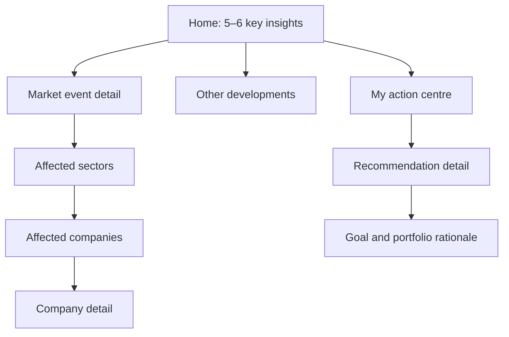
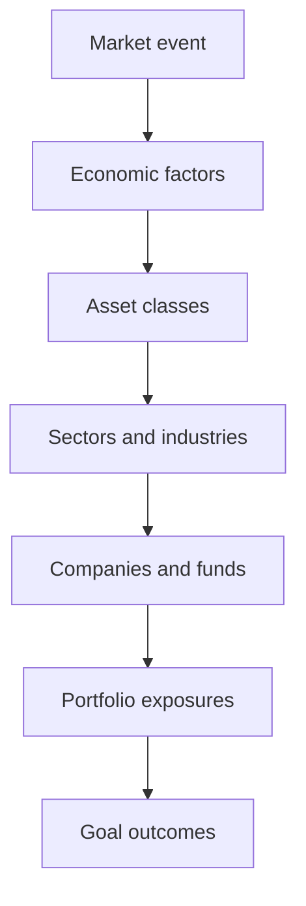
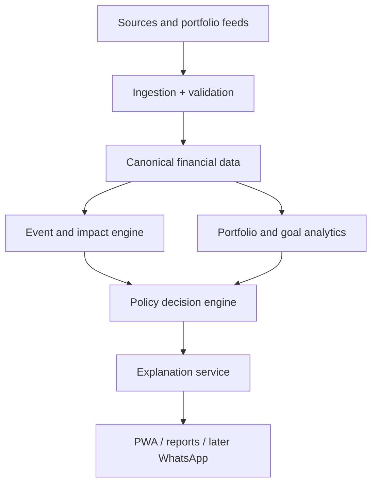

# Fingent360

The 20 September follow-up adds reviewed daily Nifty index history and historical
CCIL bond-liquidity evidence, alongside Mongo recovery, scheduler outcomes,
release grouping, offline assistance, feedback/image/privacy recovery and keyboard
journey acceptance. The new source and keyboard continuation is **authored, not yet validated**; earlier follow-up code is included in user commit `c99d62b`. See
[the exact scope and manual commands](docs/development/nondeferred-authoring-2026-09-20.md).
Additive migrations124/129 are included; no dependencies or automatic source
activation are added. BSE originals, original XBRL/taxonomy and five broker export
layouts remain unavailable after the recorded source research.

The reported CCIL check failures are repaired in authored code: the workbook
parser accepts only retained bytes, while the fixed source URL remains separate
edition provenance, and the capture helper accepts request IDs returned through
the runtime-validated edition contract. API2322 contains the provenance and
idempotent-replay regression assertions. These repairs have not been validated or
committed; see
[CCIL-LIQUIDITY-001](docs/tasks/CCIL-LIQUIDITY-001.md#scoped-check-repair--2026-09-20).

The completed validation baseline at `a9e4f43` has **1527 passing case/project receipts**: 565 API, 377 desktop, 377 mobile and 208 offline-package cases. All **107 then-reviewed automated acceptance matrices passed** at that revision. [TODO](TODO.md) records **107 Done scoped tasks**, including 79 automatically accepted functional scopes; the other completions are bounded repair, tooling, documentation or historical deliveries. This is not a claim that the entire roadmap or native release is complete.

The complete run at `a9e4f43` passed 1317 connected cases and 208 offline cases, with one intermittent filing-scheduler failure and one intentional outage skip. Both exact follow-ups then passed unchanged at the same source fingerprint. The daily-oil initialization race is repaired and passed on desktop/mobile. Preserve the distinction between a strict passing retry and a confirmed root-cause fix: [scheduler isolation](docs/tasks/RESEARCH-WORKER-ISOLATION-001.md) and [Mongo restoration](docs/tasks/READINESS-RECOVERY-001.md) now have authored recovery/contention regressions awaiting new user-run validation. The original incident rejection was not captured. The local API and databases were restored to ready; no data volumes were removed.

See the [final receipt summary](docs/development/functional-acceptance-2026-09-20.md#final-current-revision-reconciliation), [remaining gates and scope](docs/development/validation-remaining-2026-09-20.md), generated [story results](docs/validation/README.md) and [test-bug evidence](docs/bugs/README.md). Source/provider rights, unavailable named import layouts, physical-device/design checks and unreviewed broader parent scope cannot be completed by rerunning already passing tests.

Implementation and verification are tracked separately in [TODO](TODO.md) and each linked task. Full current case/project requirements and completion boundaries live in [the acceptance manifest](docs/tasks/acceptance.json); passing a selected retry alone does not complete a broader story. [Main-module closure](docs/development/main-module-closure-2026-09-19.md) documents portfolio and saved-reading boundaries. Prior run-specific “not run” and “in progress” notes are preserved in the [status archive](docs/development/readme-status-history-2026-09-20.md), with their original task links and commands.

`pnpm sdlc "Complete account workflow" --story ACCOUNT-001` runs the normal gates, a gated local commit, the story’s connected cases and rebuilt offline cases, then reconciles its validation and bug records. Story mode fails if the reviewed acceptance remains incomplete. Post-test result documents may remain uncommitted; no push occurs. Deterministic execution normally remains user-operated; the prior complete-validation and repair exception has ended. New changes are authored without running gates, tests, builds or migrations.

| Completed implementation scope              | What is now authored                                                                                                                                                                                        |
| ------------------------------------------- | ----------------------------------------------------------------------------------------------------------------------------------------------------------------------------------------------------------- |
| DEV-006 / DEV-016                           | Independently reviewed five/six-point intelligence briefs, corrections and progressive source/context/scenario reading.                                                                                     |
| DEV-010 / DEV-015 / DEV-019                 | Educational oil-to-goal trace, research governance, FIFO/purchase/rebalance comparisons, restricted tax policies and unchanged/no-action alternatives.                                                      |
| DEV-011 / RESEARCH-AUTO-002                 | Durable report workers, scheduled evidence capture/publication controls, selected verified calendars, original GDP vintages and dated CPI model history.                                                    |
| DEV-020 / EVENT-SCENARIOS-001               | Seven source-backed educational event families, reviewed mechanisms and original GDP/CPI expectation comparisons, including a dated historical CPI model golden.                                            |
| DEV-018 / IMPACT-TRACE-001                  | Watchlist/follow controls with exact BEA calendar context and evidence-to-holding/goal traces with uncertainty, conflicts, stale-data handling and no-action receipts. Numerical forecasts are unavailable. |
| DEV-017                                     | Supported private-record encryption, identity lookup, MFA and owner lifecycle.                                                                                                                              |
| DEV-021                                     | Shared API monitoring plus independent uptime observations, persisted incidents and a read-only viewer.                                                                                                     |
| DEV-029                                     | Consented one-off/scheduled WhatsApp public summaries and Android/iOS shared workflows, native feedback, broker return and private-file sharing.                                                            |
| SRC-003                                     | Initial action taxonomy, consolidation bridges, independently reviewed rights/stock-swap terms and explicit theoretical comparisons.                                                                        |
| SRC-009                                     | Daily WTI/Brent source capture/review and scheduled drafts, monthly oil/metals and daily reference FX.                                                                                                      |
| SRC-016                                     | Initial SBI/Axis holdings and Kotak factsheet fee/fund-size workflows with independent plan mapping and offline evidence.                                                                                   |
| SRC-005                                     | Four initial financial statement schemas and a25-company source-backed revenue/PAT acceptance cohort; original-source validation remains manual.                                                            |
| SRC-007 / 008 / 010 / 011 / 012 / 014 / 015 | Initial India/global macro, institutional flows, participant positioning, company-news onboarding, regulatory-source registry and AMFI current/history workflows.                                           |

Original SPF GDP survey expectations and Cleveland Fed CPI model snapshots now support retained, independently reviewed comparisons against original releases. Seven-family qualitative transmission mechanisms are bound to reviewed contexts and reconstructible holding/goal receipts; they do not establish numerical causal forecasts. Additional SBI/Axis fund disclosures, reconciled banking/general-insurance/life-insurance statements, monthly commodity capture, India GDP vintages, retained price-history pages and reviewed share-consolidation bridges are authored. Their exact coverage is tracked in [current delivery](docs/tasks/current-delivery.md), alongside remaining exchange, broker, fund/bond and historical-source gaps. A completed child never silently completes those broader parents.

New fund/bond flows include original announced fund-merger lineage, independently mapped AMC fee/fund-size factsheets with paginated history, and a four-original historical sovereign auction example with exact clean/accrued/dirty calculations. See [funds and bonds](docs/tasks/FUNDS-BONDS-001.md), [factsheets](docs/tasks/SRC-016-FACTSHEET.md) and [sovereign sources](docs/tasks/SRC-017.md). Migrations119–123/125–128 and API/browser/offline1900–2003 cases are authored; these are not current bond quotes, investor conversion instructions or evidence that every current acceptance case has passed.

CCIL curve originals have a separate disabled server gate (`CCIL_ZERO_ENABLED`, `CCIL_ZERO_PERMISSION_REFERENCE`), reviewed source-point/parameter history and offline support. Their original labels leave numerical conventions unresolved; the app does not use them to value holdings. [Source scope and manual acceptance](docs/tasks/SRC-017-CURVE.md).

Daily oil is available at More → Daily oil observations (`#daily-oil`), with a separate contributor-permission control in Operations → Daily oil source. The source schedule remains disabled until configured by the operator. Corporate ratings use an exact attributed ICRA original and separate agency withdrawal from editorial withdrawal. Saved bond comparisons can explicitly attach an admitted historical ISIN/source version, with stale/withdrawn denial and immutable receipt reconstruction; description-only evidence remains valid while attached observations must match an exact verified source row. See [credit source scope](docs/tasks/SRC-018.md).

The [original filing watch](docs/tasks/SRC-004-WATCH.md) monitors selected verified historical financial-result URLs, retains corrections and stages drafts for independent review. Its permission control and schedule start disabled. The separate [official RSS discovery inbox](docs/tasks/SRC-004-DISCOVERY.md) retains newly advertised original/revised filing pointers with explicit identity and parsing gaps. Source revocation also affects fresh company and downstream fundamental admission.

Provider/source permissions, public deployment, signing and physical-device acceptance remain explicit activation inputs. WhatsApp and regulatory retention are disabled by default. Installed offline Android apps require a new snapshot/build/reinstall to receive web changes. Native background push and generated story video are not claimed implemented.

Use [WhatsApp configuration](docs/development/whatsapp.md), [iOS setup](docs/development/ios.md), [native feedback](docs/development/ios-feedback.md), [broker return](docs/development/ios-broker-return.md), and [regulatory-source requirements](docs/tasks/SRC-014.md) for exact setup and focused acceptance. Independent monitoring starts only when the user runs `pnpm uptime:monitor /absolute/operator/uptime.json /absolute/persistent/monitor/state.json`; edit the example targets first and read the [monitor runbook](docs/development/independent-uptime.md).

**Server encryption setup:** configure `PRIVATE_DATA_ACTIVE_KEY` and `PRIVATE_DATA_KEYS` in ignored `.env` before using connected feedback, private financial records or authenticator enrollment. These features now require server encryption keys, independently of optional AI history. Keep old keys until every retained record/history and required backup has been rewrapped or expired; a seven-day AI retention window does not cover financial history. Missing keys fail protected operations closed. Never put these keys in VITE variables or an APK. See [private storage](docs/development/private-financial-storage.md), [authenticator](docs/development/account-authenticator.md) and [action comparisons](docs/development/action-plan-completion.md).

For local setup, run `pnpm privacy:keys`; use `pnpm privacy:keys --status` for identifiers/counts only or `pnpm privacy:keys --rotate` to add an active key while preserving old ones. Restart the API afterward. First setup also creates the stable identity lookup key. Existing pre-identity installations use `pnpm privacy:keys --add-identity-key` once; a lost identity key must be restored, not regenerated. These commands never print keys or rewrap the database themselves. [Options, safeguards and manual acceptance](docs/development/private-key-setup.md).

The pickup-queue batch now adds support-access history, private AI-history encryption, durable deployment monitoring, corporate-action/IndAS imports, BLS calendars, current AMFI Plan/Option support, historical Fed scenario extraction and safe public-link sharing. See [exact authored scope, remaining work and manual activation](docs/tasks/DELIVERY-TEAM-005.md). Current validation is recorded in the generated story results; parent tasks remain partial where specified. Shared web changes require an Android rebuild/reinstall to reach an installed APK.

[Task pickup readiness](docs/tasks/pickup-queue.md) separates active records into agent-ready work, research-first work, parent rollups and validation/activation evidence. Existing user answers are recorded in each task; the next independent steps need no new questionnaire. Source/format/regulatory research belongs to the agent. Readiness does not authorize test execution, provider spending or regulated activation.

For a clear implemented-versus-pending breakdown, read [Current delivery](docs/tasks/current-delivery.md). **The batch still has functional gaps, listed individually; completed implementation and manual validation are tracked separately.** [TODO.md](TODO.md) is now a concise task index. Every task links to its own specification, reusable prompt, history, evidence and remaining actions under [docs/tasks](docs/tasks/README.md). Update the task record and its index row together after every implementation; do not add long prompts or summaries back to TODO.

DELIVERY-TEAM-004 adds connected company evidence, owned impact traces, educational change comparisons, fund/cash-flow tools, automatic research controls, release-calendar captures, source evaluation and reviewed story images. See the [delivery handoff](docs/development/team-004/README.md) and top of TODO.md for exact scope and remaining gaps. Existing test results apply only to their recorded revisions and selected cases. Shared web changes reach an installed Android app after rebuilding and reinstalling its package.

New reader destinations are **More → Indian companies**, **Evidence and my plans**, **Explore a change**, **Funds and bonds** and **Release calendar**. Operations adds **Indian equity data**, **Fund data**, **Automatic research** and **Research evaluation**. Existing Publishing → Prepare visual summary can request a configured image, then approve that exact image. Stories show reviewed images without the previous arrow placeholder; gesture help is a dismissible one-time overlay.

Eligible existing discovery sources refresh automatically while the API runs; `RESEARCH_AUTO_ENABLED=false` disables the worker globally and Operations can pause each source. Captures retain source data. An approved per-source automatic-publication policy adds qualifying official news to Today/Stories; other drafts retain individual review. Policies expire and named mode requires independent approval. `STORY_IMAGE_PROVIDER` defaults to `off`; deliberate image generation uses a configured OpenAI/Gemini image model and matching server key. Live provider use requires its separate configuration and acceptance.

Privacy now offers a separate opt-in seven-day private AI request history with owner-only export/deletion; Operations evaluation joins public source/model/composite-view records with submitted feedback.

Complete Indian equity history, the five named broker export parsers, complete causal impact policies, remaining RBI calendar/backfill and additional original numerical vintages and fund look-through/bond market coverage remain distinct pending requirements. Zerodha account connectivity is authored separately from its still-missing export parser; Upstox connectivity is also authored; Eligible Angel publisher connectivity is also authored. All require provider activation and their own acceptance. Generic mapped imports and normalized evidence ingestion are not labelled complete source adapters.

A failed manual SDLC stage starts a scoped Codex repair attempt. For E2E, it receives only one failed case's error/location; the script rebuilds and reruns that exact file, title and project, never the full suite. Other command failures retry that command. Nested repair agents edit only; the authorized parent or user owns execution. Default repair budget:3 attempts per invocation (`SDLC_REPAIR_LIMIT`, range1–10); opt out with `SDLC_AUTO_REPAIR=0`. Formatting-only check failures use scoped Prettier retries without an agent (maximum two). CLI discovery checks `SDLC_CODEX_BIN`, then PATH, then installed macOS Codex/ChatGPT app binaries; an invalid explicit override stops with a clear error. Codex authentication still uses your configured CLI login. Post-commit repairs remain uncommitted until new format/check gates pass. Use current saved SDLC evidence for the launcher revision in use.

Use `pnpm sdlc --affected-plan` to preview conservative E2E selection without running anything, then `pnpm sdlc "Describe change" --affected` to run all check gates, commit and execute the selected E2E files. Add `--base HEAD~1` for changes already committed. The default baseline is HEAD captured before the run, plus all working changes. Web changes select desktop/mobile and freshly rebuilt offline web tests; shared API/contracts/migrations and unmapped files fall back to full coverage. This does not select unit tests: `pnpm check` remains complete. See [impact selection](docs/development/sdlc.md#impacted-e2e-selection-sdlc-affected-001) for limitations. Selection limits remain as documented.

For a user-operated format/check/gated commit without E2E: `pnpm sdlc "Describe change" --checks-only`. For a scoped SDLC run: `pnpm sdlc "Describe change" -- --grep TASK-ID`. The existing unfiltered command still runs all E2E cases. Agents author changes and affected test IDs; deterministic execution is user-operated unless explicitly authorized for the current task.

Remaining roadmap implementation is active under ROADMAP-COMPLETE-003. The current delivery adds saved goal downside assessments, mapped and attested-cost imports, progressive explanations, reviewed events, named operator approvals, numerical ECB policy and reference exchange rates, monthly oil benchmarks, material-change monitoring, purpose-consent controls and Operations diagnostics. Implementation and current saved verification are tracked separately; shared web delivery does not establish an installed native-package release.

[Reader diagnostics](docs/tasks/READER-DIAGNOSTICS-001.md) retain safe incident/category/phase evidence for failures. Historical API120503 notes must be reconciled against current saved API120 results; a deliberate diagnostic-outage case is not a substitute for that result.

## Map a holdings CSV

Holdings → Map CSV columns lets you choose ISIN, quantity and total purchase-cost columns, declare units/source totals, review duplicates and inspect the actual saved-baseline replacement before confirming. Mapping choices survive receipt/history/export; raw files and ignored values are not retained. The same flow works on device. Broker help links the researched export instructions for Zerodha, Groww, Upstox, Angel One and ICICI Direct; automatic platform adapters are not claimed without verified formats. [Evidence, cases and remaining format requirements](docs/development/mapped-import-handoff.md).

For a mapped file without reliable total purchase costs, choose **Supply exact costs from my records**. Enter each source row's exact cost and its basis, reconcile the total and attest before the usual saved-holdings replacement review. Saved receipts, history and privacy exports distinguish these user-attested amounts from imported cost columns. Broker help explains the researched export paths and known cost caveats; named automatic adapters remain unverified. [Scope and cases](docs/development/broker-dialects-handoff.md).

## Downside capacity for saved goals

My goals now supports an explicit affordable monthly ceiling, interrupted contributions and protected savings. Review the unchanged plan against exact stressed totals, save a dated goal-version receipt, reopen it and remove it without changing goals or allocations. Unknown inputs remain unknown. This is a user-entered capacity check, not an investment forecast or suitability score. Migration037 adds owned storage; privacy export/deletion and device-only persistence are included. [Scope and user-run acceptance](docs/development/goal-feasibility-handoff.md).

## Progressive source explanations

Published readers now expose source-bound excerpts, beginner context, your actual private research connections, analytical limits and exact source/version references. Basis controls move focus to the cited stored-edition field. Withdrawal and changed editions invalidate stale reading; approved causal or investment-impact claims are not invented. [Scope and cases](docs/development/evidence-layers-handoff.md).

## Purpose consent and private assistance

Privacy → Purpose consent lets you review, grant, expire, revoke or renew four separate uses: private context sent to configured AI, personalized reading order, scheduled saved-record reviews and automatic material checks. Revocation preserves your financial records, downloads and query-based help. Workers and AI requests check actual permission after waits; AI results also recheck the exact private record versions. The device uses the same local controls, with no external AI capability implied. Migration043 stores the owned immutable ledger. [Policy, cases and manual acceptance](docs/development/consent-lifecycle-handoff.md).

## Operations data quality and request diagnostics

Operations → Data quality shows actual valid/invalid/missing publication heads, review/evidence gaps, retrieval-age triage and recent ingestion outcomes. It also shows process-scoped request/error/latency counters. Safe structured request logs and X-Request-ID support diagnosis without logging private URLs, headers or body text. [Operational objectives and manual acceptance](docs/development/quality-overview.md). No uptime or production-readiness claim is implied.

## Reviewed events and entity exploration

Operations → Event review creates versioned editorial events from exact excerpts of published sources, with optional reviewed sector context and retained security identities. Named mode requires a different operator identity to approve publication. More → Events connects public event details, citations, context filters and reviewed history; changed or withdrawn source/identity records suppress affected content. Impact and horizon remain explicitly unknown. User-generated offline snapshots retain admitted events for the Android app. No events are fabricated or automatically published. [Specification](docs/product/event-review.md), [cases and manual acceptance](docs/development/event-review-handoff.md).

Operations → Merge/split events now authors complete replacement plans, preserves original revisions and applies all outputs together after review. Named mode requires another identity. Public event details show safe predecessor/replacement links; offline snapshots keep admitted relationships. Migration046 stores immutable plans and receipts. [Workflow and acceptance](docs/development/event-lineage-handoff.md).

Event review → Prepare event from a source connects retained published source selection to exact excerpts and a normal saved event draft. A keyless source template works without AI; configured OpenAI, Gemini or Anthropic can select exact excerpts only. People supply classifications and explanations, inspect the candidate and explicitly save or decline it. Receipts support uncertain-response recovery, and publication remains a separate review. Migration047 retains attempts and decisions. Connected preparation is unavailable offline; reviewed published events use the Android snapshot. [Specification](docs/product/event-extraction.md), [cases and manual acceptance](docs/development/event-extraction-handoff.md). Implementation is authored; user validation is pending.

Operations → Identity selections lets reviewers choose among actual retained provider candidates. The choice is explicitly editorial judgement; provider ambiguity and original evidence remain unchanged. Named mode requires independent approval. Public security details show the choice separately, and event authors may explicitly bind it. Changed or withdrawn selections invalidate dependent event context; dated snapshots preserve the same distinction. Migration048 stores the immutable review history. [Scope and acceptance](docs/development/identity-adjudication-handoff.md). Implementation is authored; user validation is pending.

## ECB policy-rate history

More → ECB policy rates adds exact deposit, fixed refinancing and marginal-lending levels, effective dates, retrieval editions, history and evidence. Connected Operations captures the fixed official source, retains failed responses for inspection and requires explicit publication; named mode uses independent approval. Withdrawn history stays retired after later publications. The offline snapshot includes only admitted editions when you rebuild it. No provider data was ingested or bundled during authoring. [Setup, source scope and pending acceptance](docs/development/ecb-rates-handoff.md).

## Daily reference exchange rates

More → Reference exchange rates presents unchanged ECB USD/EUR and INR/EUR observations beside a separately labelled, exactly calculated INR/USD cross-rate. Choose a month or full captured window, inspect the method and compare immutable retrieval editions. Operations retains the original fixed-source XML and requires publication review; named mode requires another operator. Rolling-window absences are disclosed, not filled with invented rates. Migration045 and rebuilt offline snapshots support the same reader on Android. This is reference context rather than an executable quote. [Source, workflow and cases](docs/development/ecb-fx-handoff.md).

## Monthly oil benchmarks

More → Oil benchmarks shows reviewed World Bank monthly Brent and WTI observations with year selection, exact source precision, retrieval history and expandable evidence. Operations captures the fixed public workbook and retains originals before numerical reconciliation; publication requires review, with independent approval in named mode. Withdrawn editions stay retired. Rebuilt offline snapshots carry only admitted data. No live data was ingested during authoring, and monthly averages are not daily or Indian landed prices. [Source selection, cases and manual acceptance](docs/development/oil-benchmarks-handoff.md).

## Material changes in followed observations

Account → Observation inbox → Material changes supports explicit annual GDP/CPI thresholds, fresh opt-in baselines, exact percentage-point comparisons and one coalesced notice per indicator. Mute/unmute, correction/null/stale handling, acknowledgment, immutable history and complete privacy export/deletion work in the API and local app. Checks read stored observations; they do not fetch providers or invent release dates. Migration039 is required. [Scope, cases and manual acceptance](docs/development/material-alerts-handoff.md).

Automatic checks are separately opt-in: review the purpose and enable daily checks of stored observations. Due state survives API restarts; concurrent workers cannot duplicate a check. Revocation pauses future automatic use, and resuming starts a fresh baseline. Device checks run while the app is open against its installed bundle. Operations → Workers shows aggregate health. Migration044 and the consent lifecycle are required. [Cases and manual acceptance](docs/development/material-automatic-handoff.md).

## Named operator permissions and independent review

An explicit named mode adds viewer, researcher, publisher and administrator roles. Material content, visual, registry and ECB publication changes use proposals inspected and approved by a different named identity. Shared-key and legacy bearer bypasses are rejected in that mode; role changes invalidate existing sessions even after storage waits. Bootstrap mode remains the default until you provision identities and choose named mode. [Setup, exact scope and pending validation](docs/development/named-operators-handoff.md).

## Ad hoc requests and roadmap status

The [session request register](docs/development/session-request-register.md) maps all visible requests to stable TODO tasks, implementation evidence and remaining scope. Missing ASSIST-001 and MEDIA-001 tracker entries are restored. Inaccessible shared-chat content is not claimed as reviewed.

## Roadmap status audit

[TODO.md](TODO.md) now separates **Implemented** work from **Partial** parents with named remaining acceptance. Implementation does not imply validation or a commit. Accounts, the initial ingestion framework, PWA and current product/security specifications are credited; unfinished event/company analysis, platform-specific imports and policy work remain visible. [Evidence and exact remaining gaps](docs/development/roadmap-gaps.md) records the audit without treating synthetic lessons as completed real-data features.

Reusable domain contracts now cover versioned events/evidence edges, exact reconciled lots, explicit profile inputs and education-only results. Their golden cases do not publish synthetic data or implement the remaining event/policy screens. [Contract scope](docs/product/domain-contracts.md).

## Separate database runtime access

`MIGRATION_DATABASE_URL` now keeps schema ownership separate from the API’s `DATABASE_URL`. The manual `pnpm db:roles` preview and `pnpm db:roles --apply` provision a distinct runtime role; migrations preserve its bounded table/sequence grants and read-only ledger. Legacy single-URL installations remain compatible; this machine now uses separated credentials. Local setup was explicitly authorized and completed: the API now uses the dedicated role; the private .env retains separate migration-owner credentials. [Private configuration and manual steps](docs/development/database-least-privilege-handoff.md).

## Publishing review queue

Operations → Publishing now shows 20 current heads per page, newest changed edition first, with source/status/text filters, Previous/Next, Reset and Retry. Review retains the existing evidence, exact-version conflict checks and saved decision receipt. Pages are a current queue, not a frozen snapshot; reset to find newly changed heads. [Specification and manual acceptance](docs/development/publishing-queue-handoff.md).

## Recover retained BEA responses — BEA-QUARANTINE-001

**Operations → BEA recovery** lists linked ingestion attempts and their actual retained/parsed/staged/failed events. Inspect verified original evidence, explicitly revalidate those stored bytes, review candidates against current heads, then stage drafts and open Publishing review. Revalidation makes no provider request and staging never publishes automatically. Historical receipts survive uncertain replies, list failures and reloads; changed heads require another review.

New normal BEA refreshes link only complete, verified Mongo responses to immutable PostgreSQL attempts. A staged event commits with its drafts, so a later run-finalization failure cannot hide the committed outcome. Missing, altered, incomplete or legacy unlinked evidence is unavailable for recovery. Migration035 adds attempts/events/validation/staging receipts and bounded staging admission. Existing fixed official source, parser and rights boundaries are reused. Operations remains connected-only in device mode. [Specification](docs/product/bea-quarantine.md), [verification](docs/development/status.md).

## Review source changes — SOURCE-REVIEW-DIFF-001

**Operations → Publishing → Review** compares the current head with its nearest earlier published or withdrawn edition. It shows exact field differences, states, dates and retained evidence before an explicit publication or withdrawal. Intermediate drafts are not mistaken for public predecessors. A changed head requires Reload and another review; successful decisions retain a dated saved receipt. Back/Escape and expired sessions clear protected content safely.

This reuses actual stored editions and the existing immutable publication workflow: no new provider call, dataset, migration or dependency. Device Operations remains connected-only with zero outgoing API requests. [Specification](docs/product/source-review-diff.md), [verification](docs/development/status.md). Named roles, independent second review and production source approval remain separate.

## Operator activity history — OPS-AUDIT-001

**Operations → Audit activity** shows recorded requests and specific existing cleanup events with UTC filters and50-row pages. Request entries show that an action was requested; they do not prove it completed. Use the relevant module's saved results to inspect completion. Actor/session hashes, raw targets, credentials and private request bodies are excluded.

Reset starts a fresh chronological boundary; Retry repeats the failed page and filters. Signed cursors preserve exact ordering and reject altered filters. A late401 ends the protected parent session even after leaving the audit tab, and older successful reads cannot restore its contents. Existing immutable audit storage is reused without a migration or dependency. Device mode explains that Operations requires a connection and makes no API call. [Specification](docs/product/operator-audit.md), [verification](docs/development/status.md). Named operator identities, complete action attribution and production audit acceptance remain separate.

## Follow reading updates — READING-FOLLOW-001

**Saved → Reading updates** lets you follow reviewed sources or topics and explicitly check stored editions. New follows and unmuting start from a fresh baseline, without an old-news backlog. Later checks create one dated notice per changed item; acknowledge marks that version as seen and a later change reopens it. Retained overlapping follows preserve existing notices. Mute pauses checking; unfollow resolves the related notices without erasing history.

Review and consent before changing settings. Retry a lost response safely, reload current status, inspect paginated notices/history and download your complete private history. Withdrawn sources lose current-reading links; notices retain only identifiers, versions and your choices, without copied article text. No provider refresh, background monitoring, email or push is added. Migration032 adds owned settings, notices and immutable events. Shared offline storage follows the same rules using its dated bundle with no API calls; rebuild/reinstall the APK for phone updates. [Specification](docs/product/reading-follow.md), [verification](docs/development/status.md).

## Compare two saved reports — REPORT-COMPARE-001

**Saved record reviews → Compare reports** lets you choose two of your issued originals, review their capture dates and compare recorded goals, contribution plans, holdings and allocation bindings. Differences use exact arithmetic and always run from the older capture to the newer one, regardless of selection order. Missing values stay unknown; changes in acquisition cost are not investment returns. Optional research receipts remain dated personal context.

Open either original, close its reader and return to the comparison. Refresh or reload checks that both originals remain available; deletion or sign-out removes the private comparison. It is calculated on demand and creates no additional stored report or hidden snapshot. Existing report export/deletion rules remain. The same workflow uses actual on-device reports without an API; rebuild/reinstall the APK for phone changes. No migration or dependency added. [Specification](docs/product/report-comparison.md), [verification](docs/development/status.md). Verified: all37 selected connected scenarios have passing evidence across correction runs, and20/20 packaged offline cases passed. Physical-phone acceptance remains separate.

## Review holdings replacements — HOLDINGS-RECONCILE-001

Every manual, CSV or standard XLSX replacement now shows the actual saved baseline and proposed added, removed, changed and unchanged holdings before confirmation. Quantities and acquisition-cost differences use exact arithmetic. Removing rows requires an explicit acknowledgement. These are changes to recorded inputs, not market returns or valuations.

A changed baseline disables stale confirmation. **Refresh baseline and keep draft** retains your proposed input for a fresh review. Successful retries preserve the original receipt; failed current reads keep that receipt dated and prevent another preview until reload. The review also shows how many saved allocation and research connections may need your attention, without modifying them. Privacy export includes the reviewed baseline and differences; account deletion removes owned records. Real local storage uses the same workflow without an API. No dependency or migration is added; rebuild/reinstall the APK for phone changes. [Specification](docs/product/holdings-reconciliation.md), [verification](docs/development/status.md). Arbitrary broker formats, market prices and tax accounting remain separate. Verified:31/31 connected checks and14/14 packaged offline checks passed; physical-phone acceptance remains separate.

## Consistent withdrawn-source handling — SOURCE-WITHDRAWAL-001

When a reviewed reading item is withdrawn, its public reader and history show a dated unavailable notice. Source, evidence, visual and new-connection actions disappear. Saved reading, reminder responses and privacy exports also hide that item's provider text while retaining your saved state and controls. Explicit republication makes permitted published editions available again. Your own notes, minimal connection receipts and separately consented issued report copies remain preserved.

Public evidence now contains only the selected published edition's excerpt; its hash identifies the complete retained provider response. A published sibling cannot expose withdrawn text from a shared feed. Operators can still inspect protected original history and evidence after authentication. Reminder workers use consistent account/source admission before claiming due work, preserving pause controls and cancellation.

Device mode uses the highest reviewed edition in its dated bundle. New snapshots check a final publication manifest and refuse inconsistent replacement. An already disconnected APK cannot discover a later server withdrawal until its bundle is replaced. No new migration or dependency. [Publication policy](docs/product/source-withdrawal.md), [verification and APK status](docs/development/status.md). Verified:27/27 connected withdrawal/media checks passed, with27 earlier worker/source regressions also passing. All26 selected offline scenarios have passing evidence across correction runs. Physical-phone acceptance remains separate.

## Optional saved-record schedules — REPORT-SCHEDULES-001

**Saved record reviews → Schedules** creates up to five daily or weekly schedules with your chosen IANA timezone, local time and weekday. Review and consent before saving. Create, edit and resume start at the next future occurrence. A missed active schedule captures only its latest due occurrence, records skipped dates and labels the actual capture time. Scheduled reports contain ordinary saved financial records; research notes are not included automatically.

Pause, resume, edit and delete retain dated configuration and outcome receipts. Existing reports remain separately owned and deletable. Full report history or hourly capacity records a skipped outcome without creating a hidden snapshot. Current state and historical replay remain distinct; conflicting drafts require explicit discard and reload. Full privacy and schedule-history downloads follow every bounded page. Device mode creates due reports only while the app is open or revisited; a disconnected APK cannot run a server worker. No email, push or provider request is added.

Additive migration029 supplies schedules/history;030 controls worker admission. No dependency added. [Specification](docs/product/report-schedules.md), [verification and APK availability](docs/development/status.md). Rebuild/reinstall the APK for phone changes. Verified:18/18 connected feature cases,26 worker/privacy regressions and20/20 packaged offline regressions passed; the timezone correction also passed2/2 browser and2/2 rebuilt offline cases. Physical-phone and operational uptime acceptance remain separate.

## Worker health and controls — WORKER-HEALTH-001

**Operations → Worker health** shows report/reminder heartbeats, last successful work, safe failure categories and bounded queue counts. Stale, not observed and unavailable states are distinct. An operator can review and confirm Pause or Resume, then inspect its dated audit receipt and reload current status. A pause blocks new work across instances; already claimed report jobs may finish. Resume preserves ordinary leases and duplicate protection.

No private report content, reminder titles or raw database errors are displayed. Migration030 adds minimal controls/observations/audit records. Scheduled-report counts say not enabled until the separate schedule migration exists. On-device mode explains that these controls require the connected server; no network request is attempted. [Specification](docs/product/worker-health.md), [verification](docs/development/status.md). Shared web changes require a rebuilt/reinstalled APK to reach an offline phone. Verified:39/39 connected worker checks and19/19 packaged offline regressions passed.

## BEA release reading — BEA-001

Today and Explore include reviewed US Bureau of Economic Analysis release headlines. Choose BEA in Explore to switch between Scan and Stories, open a dated release, inspect history and its permitted evidence excerpt, or connect it to your own saved records. Learning links use existing educational content. The release headline and date are factual source metadata; the app does not infer portfolio impact or extract economic figures from this feed.

Operations refreshes the fixed official RSS, retains original evidence, creates immutable drafts and requires explicit publication. Failures preserve existing editions. Public evidence shows only the selected release metadata and identifies that its hash covers the complete original RSS. BEA withdrawal removes public text and source/evidence actions while preserving protected originals and minimal private receipts. All supported discovery sources now share the consistent withdrawal policy described above. No dependency or migration is added. The dated Android bundle is updated explicitly and a rebuilt APK must be reinstalled to update a phone. [Source scope and provenance](docs/product/bea-releases.md), [actual verification and bundle availability](docs/development/status.md). Verified:19/19 connected BEA cases and11/11 source regressions; all19 selected offline scenarios have passing evidence across correction runs. The dated public bundle contains179items, including43BEA releases. Physical-phone acceptance remains separate.

## Your connection review inbox — CONNECTION-REVIEWS-001

**More → Review inbox**, also linked from Research connections, checks your saved research connections when you choose **Check for updates**. Changed or withdrawn source editions and changed or removed financial records create one dated notice per connection. Acknowledge marks that evaluated state as seen; it does not reaffirm the connection. A later change reopens the notice, and removing or explicitly reaffirming the connection resolves it on the next check.

Open a notice to read your owned connection receipt, then visit Research connections to load current context. Failed refreshes retain dated notices and historical operation receipts without calling them current. There is no background monitoring, provider fetch, email or push. The on-device workflow uses its dated bundle and durable local storage without a server. Additive migration027 adds bounded private inbox and replay records; private export/account deletion includes them. No new dependency. [Specification and retention limits](docs/product/connection-reviews.md), [verification and APK availability](docs/development/status.md). Rebuild/reinstall the APK to update a phone. Verified:54/54 connected cases and7/7 packaged offline regressions passed; physical-phone acceptance remains separate.

## Research receipts in saved reports — REPORTS-003

**Saved record reviews** can now optionally include up to20 of your research connections. Select the exact connection revisions, review the captured notes/source dates and warnings, then request the report. Existing reports and requests without research keep their original v1 shape; optional research produces an immutable v2 report. Capture-time context stays dated, and current source availability requires opening your connections again.

The worker uses only the saved snapshot. Identical retries retain the original capture; changed selection under the same request ID conflicts. Original financial calculations, request limits, cancellation, retry and individual deletion remain. JSON and self-contained printable HTML downloads preserve the selected report; web can also open a private print view. Android saves HTML through the existing file picker for browser printing/PDF. Removing a connection does not remove its already-consented report copy; delete that report or account separately. No article text, automated impact or provider call is added. Shared device mode implements the same workflow with its dated local bundle and no server. No new migration/dependency; rebuild/reinstall the APK to update a phone. [Specification](docs/product/report-research-receipts.md), [verification](docs/development/status.md). All54 selected connected scenarios have passing evidence across runs, and15/15 packaged offline report cases passed; physical phone/printing acceptance remains separate.

## Compare contribution plans — GOAL-SCENARIOS-001

**My money → Goals → Compare plans** compares an actual saved goal with up to three explicit monthly-contribution/horizon alternatives. Exact contribution-only amounts show the unchanged plan alongside your alternatives; no investment growth is assumed. Save and reopen a comparison without changing the goal. To use an alternative, separately review and confirm adoption; changed or removed goals require a new comparison from their current edition.

Comparisons and adoption receipts retain immutable versions. A saved or replayed receipt does not establish current goal state: failed refresh keeps it visible but disables adoption until current records load. Adoption creates the ordinary goal revision and makes existing allocations visibly require review. The same workflow persists on device without a server; privacy export/account deletion include its records. Migration025 is additive, with no new dependency. The limit is 100 immutable saved comparisons per account. [Specification](docs/product/goal-scenarios.md), [verification and APK availability](docs/development/status.md). Verified: all27 selected connected scenarios have passing evidence across correction runs, and4/4 packaged offline regressions passed. Physical-phone acceptance remains separate.

## Your research connections — EVIDENCE-LINKS-001

An eligible source reader now offers **Connect to my records**. Choose one of your saved goals or holdings, explain the connection in your own words, then review and save. **My money / More → Research connections** lets you reopen, edit, explicitly reaffirm, remove and inspect earlier receipts. Changed source editions and changed/removed records ask for review; a withdrawn source does not expose copied article text. These are your own research notes, not computed exposure or investment recommendations.

Connections retain the exact source edition/hash/dates and record version. Note edits do not silently update either binding. Saved receipts remain available during failed refreshes, while current-source links and reaffirmation wait for an authoritative reload. The same flow uses the dated public bundle in device mode with no API calls. Privacy export includes history; deleting the account removes its connections. Migration024 is additive; no new dependency. Shared web changes reach a phone after rebuilding/reinstalling its APK. [Specification](docs/product/research-connections.md), [verification](docs/development/status.md). Verified:41/41 connected cases,4/4 final keyboard/disclosure checks and12/12 selected offline regressions; physical-device acceptance remains separate.

## Session protection during financial updates — AUTH-WAIT-001

Private financial requests recheck their session after waiting for account and subsequent preview, goal or report locks. If a password reset revoked the session, or it expired during the wait, the request returns to sign-in without changing holdings, goals, allocations or reports. Report cancel/retry follows the same account-before-report lock order. Previously authorized report workers continue independently. Existing saved records and replay receipts remain private and preserved.

This correction reuses the current account/session tables; no migration or dependency is added. On-device storage is already serialized and has no PostgreSQL lock waits. [Ordering and scope](docs/product/account-lock-authorization.md), [verification](docs/development/status.md). Selected authorization/recovery/allocation/report-deletion verification has passing evidence for all32 scenarios across correction runs, including12 new selections. Exact runs and physical-device limits are recorded in status.

## Expired data cleanup — RETENTION-001

**Operations → Expired data cleanup** previews eight fixed categories under existing expiry rules. An operator reviews the saved cutoff/counts and explicitly confirms a bounded batch, then sees actual results and history. Repeating a completed request returns the saved result; a failed batch rolls back before offering retry. No cleanup timer is installed. Fresh content, financial histories, source evidence and confirmed holdings receipts are preserved. Offline Operations explains that connected access is required and makes no API calls.

Migration022 adds count-only maintenance records/indexes; running the migration does not execute cleanup. Confirmed holdings preview receipts now remain replayable and do not consume the20-unconfirmed-draft capacity. [Policy and limits](docs/product/retention.md), [verification](docs/development/status.md). Install/build, run `pnpm db:migrate`, then use the printed development URL. Cleanup testing uses isolated records; no cleanup is run on your application data as verification.

## Reviewed workbook import — XLSX-001

**My money → Holdings → Import CSV or XLSX** now accepts the downloadable standard workbook. Fill the Holdings and Reconciliation sheets, upload, inspect the exact rows and declared cost total, then Preview and Confirm. Failed imports preserve the draft. Editing the normalized rows explicitly switches to CSV. Dates, formulas, external links and ambiguous numeric formatting are rejected; keep long numbers as text. Acquisition cost remains a user-entered record, not a market valuation.

The API independently validates the original workbook in a bounded disposable worker. Saved revisions and privacy exports contain normalized holdings and parser/reconciliation metadata; raw files, filenames and paths are not retained. The same workflow uses local workers and storage in device mode. Install the pinned dependencies with `pnpm install --frozen-lockfile`; no database migration is added. Shared Android assets must be rebuilt and the APK reinstalled to receive this change. [Format, limits and acceptance](docs/product/workbook-import.md); [verification](docs/development/status.md). Arbitrary broker exports and physical spreadsheet/phone acceptance remain separate gates.

## Individual record-report deletion — REPORTS-002

Record reports now support **Delete report → review confirmation → permanently delete**, with cancel/Escape and a visible result. Deletion removes the owned private snapshot and issued report, reclaims one of100 report slots and prevents the original request ID from recreating deleted content. Cancel running work before deleting it. Goals, holdings and allocations remain; downloaded copies cannot be recalled.

Migration021 retains only owner/request IDs and deletion time until account deletion. New report requests are limited to100 per account/hour; deletion and existing-request retries remain available at the limit. Normal list polling is bounded; a full privacy export includes metadata-only deletion receipts. The same workflow is implemented in the shared offline app. [Specification](docs/product/report-deletion.md), [verification and current APK availability](docs/development/status.md).

**Verified:** passing evidence for all19 selected connected report scenarios across correction runs,5/5 packaged offline report passes, and94 unit tests with format/check. Migration021 preserved existing user/financial records. The current code5 APK predates this addition; the rebuilt feature-batch APK will be recorded in status.

A market research and personal record-keeping application for Indian investors. It stores real World Bank annual macro observations and user-entered account, holdings and goal data. Holdings cost basis is not market value; contribution-only planning assumes no investment return. A separately labelled virtual learning exercise uses fictional companies and prices. Personalised regulated advice and trade execution remain disabled.

## Connected planning, recovery and source identities — TEAM-002

The parallel team implemented **Goal allocations**, **Saved record reviews**, **Account recovery** and a **Security directory** across contracts, database/API, web, offline Android, tests and documentation. Integration verification is recorded in [status](docs/development/status.md).

Allocations connect exact quantities of saved holdings to repeated goals, retain history and flag changed inputs for review. Recorded cost is shown separately from contribution-only planning and market value. Saved record reviews capture immutable inputs and prepare a downloadable version through durable server jobs or on-device processing. Recovery codes are generated explicitly under Privacy & security, displayed once, stored as hashes and consumed when resetting a password; a reset revokes the account's sessions while preserving its records. No email service is required.

Five real Indian-equity ISINs are now stored with original evidence. The source identity directory uses explicit operator lookups against free OpenFIGI metadata; private holdings are never sent automatically. It supplies dated names, tickers and FIGIs with original evidence and edition history. It does not supply prices or corporate-action adjustments. The checked [source decision](docs/product/security-identities.md) records the remaining exchange-data gates. Investor navigation lives under My money and More; ingestion remains in Operations.

Migrations017–020 are additive. Shared web changes are included in the rebuilt **0.4.0-planning / code5** offline APK; installing that build over the previous version is required to update a phone. No automatic private-data synchronization or deployment is introduced. Feature specifications: [allocations](docs/product/goal-allocations.md), [recovery](docs/product/account-recovery.md), [record reviews](docs/product/record-reports.md), [identities](docs/product/security-identities.md). New tests use isolated actual application/database fixtures; existing app accounts and quotas are preserved.

**Verification:**177 connected API/desktop/mobile passes, zero failures and one intentional database-outage skip;26/26 packaged offline passes;94 unit tests plus format/check gates. Actual records were preserved through migrations and regression. See [status](docs/development/status.md) for exact runs, focused corrections, APK identity and physical-device limits.

## Repeatable feedback tests — FEEDBACK-TEST-001

Feedback tests now use a fresh temporary schema and real API for each case. Repeated full runs no longer consume the normal app's hourly allowance. Production limits, real screenshot/audio uploads, receipt/review/deletion assertions and app data are preserved. API194 tests the actual20/21 quota boundary; API195 verifies cancellation cleanup. The test UI still runs only when you click Run, and listing tests starts no fixtures. Errors retain the original delivery failure, and reports identify the actual temporary API/schema.

**Verified:** full API/desktop/mobile run `2026-09-13T17-43-32-847Z-19192` passed **148**, failed **0**, with one intentional E2E-API-004 outage skip. All seven reported failures passed. Two preceding feedback runs each passed21/21 consecutively. Main feedback rows/quotas remained unchanged and temporary resources were removed. Format/check passed with85 unit tests.

Use the existing local databases, web app and compiled API (`pnpm build` after changes). Run `E2E_BROWSER=chrome pnpm e2e:ui`, select @FEEDBACK-001 or Run all, and keep watch off. No new dependency or app migration is required. The local database role needs CREATE SCHEMA permission; the supplied Compose role has it. [Runner setup and isolation](tests/e2e/README.md#repeatable-feedback-tests), [verification](docs/development/status.md). This correction changes tests and diagnostics; the code4 Android APK is unchanged.

## In-app feedback — FEEDBACK-001

Tap the floating finger button for **Screenshot + feedback** or **Feedback only**. Capture the app viewport, crop or cover details, then type, record a voice note, or use both. Preview/play attachments before confirming submission. **More → Your feedback** keeps receipts, attachment previews, delivery status, retry and deletion together. Voice is recorded audio, with no transcription provider or paid API required.

Reports persist separately from accounts: browser IndexedDB for web and app-private native storage for Android. Android starts with feedback delivery disabled and no server configured. Set an HTTPS **Feedback API URL** and enable delivery in feedback settings when a reachable Fingent360 API is available. Reports retry while the app is open and when it resumes/reconnects; closed-app background delivery is not promised. The original destination stays bound after the first attempt, and duplicate-safe receipts handle interrupted responses. Switching workspace mode does not upload financial records or clear feedback.

Migration **016** adds private PostgreSQL report/attachment storage, idempotency, deletion tombstones, retention and review audit. **Operations → Feedback inbox** reviews submissions and updates Received / Being reviewed / Resolved. Server content expires after 30 days, with physical cleanup on the next feedback operation; explicit deletion removes it immediately. Form values are hidden during capture, but review the image for private information rendered as ordinary text before sharing.

The same feedback implementation is retained in Android **0.4.0-planning / code 5**, together with the new planning and recovery workflows. Install the rebuilt APK over the previous version with the same key; repository changes do not update an installed offline APK automatically. On another checkout, run `pnpm install --frozen-lockfile` for the added `html2canvas` dependency, then apply `pnpm db:migrate` and start `pnpm dev`. Use `E2E_BROWSER=chrome pnpm e2e:ui` with **@FEEDBACK-001**, or `E2E_BROWSER=chrome pnpm android:test:ui` for offline cases; select and run manually with watch off.

[Feedback workflow and configuration](docs/development/feedback.md), [API](docs/development/feedback-api.md), [delivery queue](docs/development/feedback-sync.md), [native behavior](docs/development/feedback-native.md), [executed verification and APK identity](docs/development/status.md). Physical-phone microphone, TalkBack and user design feedback remain separate from automated results.

**UI-RACES-001 correction:** Feedback delivery controls now appear only after stored settings load, with an explicit Retry when storage fails. Goal and holding steps focus before interaction, preventing late callbacks from moving typed digits into another field. The two user-reported failures and adjacent regressions passed in a focused 30-case desktop/mobile run; see [status](docs/development/status.md) for exact runs and the current APK. No dependency or database migration is added by this correction. Earlier broad-suite evidence remains historical; hardware microphone input and actual native HTTPS delivery remain manual checks.

The rebuilt Android bundle passed all **16 offline cases**. Format/check passed, including **85 unit tests**. To repeat the reported paths, select WEB060/194 and @UI-RACES-001 in desktop/mobile using the existing test UI; leave watch off and share `artifacts/e2e/latest.md` for failures.

## Free-source reading — SOURCES-002

Today and Explore now connect published Fed releases, ECB press/statistics, Indian PIB economic releases, five World Bank annual India series and eleven original educational terms. Source/topic/India-global filters work in Scan and Stories, signed in or as a guest. Today offers a bounded source-balanced digest; Explore keeps the full dated collection. Readers link to evidence, history, relevant explanations, related reading and seven quizzes plus a learning-interest poll. Learning lab and overview link back to real research while preserving their fictional and recorded-data boundaries.

The complete source workflow is fixed official adapter → bounded validation → original MongoDB evidence → immutable PostgreSQL drafts → explicit editorial publication → interactive reading. Migration015 records independent source outcomes; a failed source preserves earlier editions and does not cancel successful sources. **Operations → Publishing** selects sources and shows outcomes. For a user-invoked refresh: `pnpm research:refresh --sources=fed,ecb-press,ecb-statistics,pib,world-bank,glossary`, then review drafts in **#ops**. No timer or paid provider is required. RBI/SEBI/BoE permission gates and unavailable MoSPI/BLS feeds remain documented; this does not add Indian equity prices or comprehensive company news.

**Delivered:** 136 reviewed items across six reading collections; real repeat refresh checked 136 items with zero duplicate drafts or source failures. The public snapshot was captured at 2026-09-13T08:33:53.105Z; annual observations keep their own effective dates. Full run and APK identity are recorded in status.

[Source access evidence](docs/development/free-sources.md), [reading and operations workflows](docs/development/source-ux.md), [learning connections](docs/development/source-learning.md), [current verification](docs/development/status.md). The same React UI is packaged into Android. **An installed offline APK needs a rebuilt/reinstalled APK to receive changed code or a newer public snapshot.** The future connected CDN mode uses the deployed web code and configured API; no deployment or automatic private-data sync is performed.

## Android APK — no server needed

An installable Android feedback build is available at `artifacts/android/fingent360-debug.apk` (Android 8+ and a current Android System WebView). Copy it to your phone, install it, and use **On this device** mode—even in airplane mode. It contains the complete current investor workflows with durable local accounts, goals, holdings/imports, reading/preferences/reminders, learning and export/deletion, plus a dated public research snapshot. Server accounts and secrets are not included. Reminders appear while using/reopening the app; research refreshes and cloud AI need connected operation.

**More → App settings** explains local storage and provides future HTTPS CDN/API configuration. Switching modes keeps local and server accounts separate and never uploads financial records. Explicitly submitted feedback has its own delivery setting, described above. The existing web app still uses PostgreSQL/MongoDB. See [installation, rebuild and connection guide](docs/development/android.md) and [verification](docs/development/status.md) for current run counts and build identity. No existing SQL migration is changed. The current `0.4.0-planning` APK retains136 public items,52 annual histories and22 reviewed visuals, and adds5 real security identities with evidence captured2026-09-13T20:29:39.159Z. Android emulator acceptance and its physical-phone limits are recorded separately in status.

```bash
# The APK is already generated; these commands rebuild and test it:
pnpm android:build
E2E_BROWSER=chrome pnpm android:test
# Or select tests and click Run manually:
E2E_BROWSER=chrome pnpm android:test:ui
```

For a fresh build machine, first run `pnpm install --frozen-lockfile` and `pnpm android:setup` (pinned isolated macOS Apple Silicon toolchain). Snapshot updates are explicit with `pnpm android:snapshot`; ordinary APK builds use the checked-in public snapshot. Build outputs and signing material are not committed. Keep the same signing key when updating the installed app to preserve its data.

## Mobile reading and planning experience — UX-002

The app opens on **Today**, a compact reading selection. **Explore** searches the full published collection; **My money** connects real holdings, goals and overview; **Saved** holds reading, reminders and preferences; **More** lists the remaining investor pages. Scan and Stories share the same collection. Readers have contextual Back, version/source details, saved state, explicit interest feedback and Undo. Macro year/history/source actions open a visible reader and restore the original row on return.

The feed uses reviewed Federal Reserve, ECB and PIB material, actual stored World Bank annual observations and eleven sourced educational terms; source coverage is detailed above. It is a bounded real-data discovery release, not comprehensive Indian company news. Private saved versions, reactions, reading progress, preferences and in-app reminders persist in PostgreSQL. The reminder worker checks current publication and delivers once; Saved supports search, status filters, edit/cancel/snooze and incoming reminders. No email/push delivery is promised.

Goals and holdings use guided input → review → confirmed saved records. Previous owned entries are reusable explicitly. Assistance supports **OpenAI, Gemini and Anthropic** through server-only key/model pairs in .env, selected by AI_PROVIDER; query suggestions work without a model and remain the fallback on provider failure. User history sharing is optional and visible. Amounts and calculations never come from an LLM. Reviewed learning questions/polls persist actual attempts/votes. Source-based visuals, captions/transcript and genuine downloadable WebM clips are bound to a reviewed source version; optional AI only selects grounded source excerpts before operator review.

Operations are separate at **#ops**, protected by a short-lived server-authorized session. Investor pages contain no operator key/refresh controls. Operators refresh real sources, review/publish/correct/withdraw items and prepare/review media. Migrations010–015 are additive. No new package dependency is required. [Plan and release gates](docs/product/mobile-experience-plan.md), [CTA inventory](docs/development/ux2-cta-inventory.md), [TODO](TODO.md), [assistance configuration](docs/development/assistance.md) and [media workflow](docs/development/media.md) document the complete paths and limits. Current runtime verification is recorded in [status](docs/development/status.md); physical-device/user design acceptance is kept separate.

**Verification:** `2026-09-13T04-24-09-866Z-83652` completed API/desktop/mobile with **110 passed, zero failed**, one intentional database-outage skip. Format/check and **68 unit tests** passed; migrations010–014 are applied locally. Optional paid-provider calls and physical-device/user design acceptance remain open.

## Implemented baseline — UX-001

The implemented correction joins overview → account → holdings → goals → research/inbox → privacy with a responsive workspace, guided editing and recovery. An authenticated overview API reads actual saved goals, holdings, watchlists and inbox state in one consistent database transaction. The roadmap now requires specification, UI, UX, API, functionality, database, real data, automation, tests and documentation for every feature. **Integrated verification passed: 68 E2E passes, zero failures, one deliberate-outage skip; 40 unit tests passed.** See [experience acceptance](docs/product/experience.md), [roadmap audit](docs/development/delivery-matrix.md), [current status](docs/development/status.md) and [TODO](TODO.md).

Existing bounded capabilities:

- Real annual India GDP/CPI ingestion with PostgreSQL revisions and original MongoDB source evidence; operator-controlled refresh and source links.
- Authenticated accounts, persisted watchlists, observation acknowledgments and mute/unmute preferences.
- User-entered holdings with exact cost basis, strict CSV preview/confirmation and history; versioned saved goals and contribution-only gaps.
- Own-data export, current-session visibility, revocation of other sessions and account deletion.
- Operator source-rights registry with immutable history; public approved metadata does not activate ingestion.
- Browser-dependent installation metadata and a neutral offline fallback; no account/API pages cached by the service worker.

See [holdings](docs/development/holdings.md), [goals](docs/development/goals.md), [privacy](docs/development/privacy.md), [sources](docs/development/sources.md), [preferences](docs/development/alert-preferences.md) and [PWA](docs/development/pwa.md). These children do not complete all DEV/SRC parent tasks. TEAM-002 adds bounded OpenFIGI identities and leased saved-record reports. Complete exchange-master/prices/corporate-actions adapters, real equity valuation, broader event intelligence, scheduled market reports and production identity/security remain unfinished. Provider entitlements, regulated advice and later asset/channel gates remain explicit.

## Start locally

Prerequisites: Node 24 LTS (Node 26 supported locally), pnpm 11.23.0, Docker with Compose. Commands below are user-run by default.

```bash
pnpm bootstrap
pnpm install --frozen-lockfile
pnpm db:up
pnpm format
pnpm check
pnpm db:migrate
pnpm research:setup
pnpm dev
```

`bootstrap` creates .env only if absent. `research:setup` configures the local operator key needed for actual provider refresh cases; keep it private. Apply migrations after building/checking so compiled migration code is current. Migration checksums reject edits to already-applied SQL: add a new migration instead. No dependency changes are required for UX-002.

Use the **URLs printed by pnpm dev**, not an old fixed port. The launcher chooses free web/API ports, prepares this project's database services and propagates addresses through .env/proxy/origin/test configuration. New test sessions use the latest selected addresses; existing tabs and watchers retain their session settings. Default preferred ports are web 5173, API 4100, PostgreSQL 55432 and MongoDB 57017. Stop your dev launcher with Ctrl-C. No unrelated service is killed. Database down preserves named volumes; never remove volumes to solve a port or credential problem.

## Check, commit and test

With databases, migrations and the app ready:

```bash
pnpm sdlc "Describe the change"
# Or run selected API cases after the same gates:
pnpm sdlc "Describe the change" -- --project=api
# Manual selection and diagnosis:
pnpm e2e:ui
```

The SDLC command runs **format → check → stage/commit → E2E**, stops on failure and never pushes. Format and check must pass before any commit. It stages all nonignored changes, so inspect scope first; it does not apply migrations or start the app. E2E failure leaves the earlier gated commit in place. Codex authors the complete change and leaves it awaiting the user-run `pnpm sdlc` workflow. The latest instruction revokes the earlier testing override: agents do not run format/check/build/E2E/migrations or invoke `pnpm sdlc`.

`pnpm format` rewrites formatting. `pnpm check` checks formatting/lint/types, builds and runs unit tests; it type-checks E2E definitions but does not execute browser cases. The test UI starts at the printed available port, initially 9323. Select cases/projects and click Run with watch/eye mode off. macOS defaults to installed Google Chrome; choose E2E_BROWSER=chromium for manually installed managed Chromium or E2E_BROWSER=chrome explicitly. Run pnpm e2e:install only when managed Chromium is needed. Real-source cases require external provider connectivity and the configured research key.

After failure, ask Codex: **Read artifacts/e2e/latest.md and fix the failures.** It records run time, targets and every selected case, puts failures first and bounds/redacts each error without truncating later cases; historical reports remain local under artifacts/e2e/handoffs. A running report is incomplete. Inspect assertions before sharing externally. For startup errors before a report exists, provide launcher output. See [test catalogue](tests/e2e/CATALOG.md) and [test usage](tests/e2e/README.md).

### SDLC command options

Place SDLC options before the `--` separator. Everything after it is forwarded to Playwright. Use a quoted positional commit message or `--message "..."`, not both. If omitted, the message defaults to `chore: validated local changes`.

- **No option:** Format → full checks → local commit → all connected E2E (API, desktop, mobile). Example: `pnpm sdlc "Change"`.
- **`--all`:** Full gates and gated local commit, then every connected E2E and a freshly built full offline web suite. Continues to offline inventory after an unresolved connected test failure, but returns failure overall. Cannot combine with story, affected, checks-only or Playwright filters. For a stable validation audit without repair-agent edits: `SDLC_AUTO_REPAIR=0 pnpm sdlc "Audit all pending validation" --all`. Existing reporters update TODO/task validation and bug records. Tasks without reviewed acceptance matrices or with manual requirements remain open. Native device acceptance is separate. This new option is authored; validation is pending.
- **`--message <text>`:** Explicit commit message. Example: `pnpm sdlc --message "Change"`.
- **`--story <task-id>`:** Run the reviewed connected and offline acceptance matrix for one story, even when changes are already committed. Example: `pnpm sdlc "Complete account workflow" --story ACCOUNT-001`. Requires a matrix in docs/tasks/acceptance.json; cannot combine with affected mode, checks-only or manual filters.
- **`--checks-only`:** Format, full checks and gated commit; skip E2E. Example: `pnpm sdlc "Change" --checks-only`.
- **`--affected`:** Full gates and commit, then conservative affected E2E selection. Example: `pnpm sdlc "Change" --affected`.
- **`--affected-plan`:** Print changed paths, selection and reasons; no gates, tests, commit or agent. Example: `pnpm sdlc --affected-plan`.
- **`--base <git-ref>`:** Baseline for affected mode; defaults to HEAD captured before the run. Example: `pnpm sdlc --affected-plan --base HEAD~1`.
- **`-- <Playwright arguments>`:** Explicit test file/project/title/tag filters after gates and commit. Example: `pnpm sdlc "Feedback" -- --project=desktop --grep FEEDBACK-001`.

`--checks-only` cannot be combined with affected mode or E2E filters. Affected mode cannot be combined with manual E2E filters. `--base` requires `--affected` or `--affected-plan`; use the separate value syntax shown above. Preview implies affected mode. There is no custom SDLC `--help` option; this list is the reference.

All executing modes retain the complete `pnpm check` gate: formatting validation, lint, application typechecks, E2E typechecks, builds and unit tests. Affected mode narrows E2E only. It includes staged/unstaged/untracked/deleted paths against the baseline even after the workflow commits. For already committed changes choose an earlier ref. A clean tree does not prove prior validation and falls back to full coverage. Documentation-only changes explicitly skip E2E.

Changed test files select those files; web changes select desktop/mobile and offline coverage. API/contracts/migrations/helpers and unknown dependencies fall back to full coverage. Offline selections first rebuild the offline web package, then test it; native APK/device validation is separate. The ordinary unfiltered command runs connected projects; use `--all` to also build and test the offline package. See [selection details and limitations](docs/development/sdlc.md#impacted-e2e-selection-sdlc-affected-001).

### SDLC repair settings and results

- **`SDLC_AUTO_REPAIR=0`:** Disable automatic repair, including formatting-only recovery. Unset enables repair.
- **`SDLC_REPAIR_LIMIT=3`:** Maximum agent attempts per invocation; integer 1–10. Formatting-only retries do not consume agent attempts.
- **`SDLC_CODEX_BIN=/absolute/path/to/codex`:** Explicit executable override. Otherwise search PATH, then installed macOS Codex/ChatGPT app binaries. Invalid override stops rather than falling back.
- **`E2E_BROWSER=chrome`:** Installed Chrome; `chromium` selects managed Chromium. macOS defaults to Chrome; see test setup for other platforms.

`F360_SDLC_REPAIR_ACTIVE` is an internal recursion guard set by the launcher, not a user option. CLI login/model configuration is reused; the script does not install or sign in automatically. Formatting-only failures get up to two scoped deterministic retries. Connected and offline E2E repair receive one failed case and retry only its file/title/project. Offline retries rebuild the offline web package first. Missing or malformed run-specific reports stop recovery without a broad rerun.

```bash
# Disable agents and automatic formatting recovery for this invocation
SDLC_AUTO_REPAIR=0 pnpm sdlc "Change" --affected
# Allow one scoped agent attempt
SDLC_REPAIR_LIMIT=1 pnpm sdlc "Feedback" -- --grep FEEDBACK-001
# Override CLI location when necessary
SDLC_CODEX_BIN=/Applications/ChatGPT.app/Contents/Resources/codex pnpm sdlc "Change" --checks-only
# Explicit test file selection
pnpm sdlc "Feedback" -- tests/e2e/cases/browser/feedback.spec.ts --project=mobile
```

Run only after reviewing all nonignored changes: the workflow stages them all. Successful gates permit a local commit; nothing pushes. E2E failures retain that commit, and later repair edits remain uncommitted until new gates pass. Execution needs the documented dependencies and, for connected tests, running app/databases with migrations applied. Preview needs only the checkout and Git.

Stage logs, agent handoffs/results and affected plans are saved under `artifacts/sdlc/<run>/` (`impact-plan.json` for actual affected runs). Preview prints its plan without writing it. E2E reports are under `artifacts/e2e/`; `latest.md` describes only its recorded run, not all earlier selections. Report the failing stage log and impact plan for diagnosis. New launcher options and cases are authored; no execution pass is implied by this reference.

## Delivery and evidence

Follow [SDLC](docs/development/sdlc.md): maintain TODO before work; deliver every required layer; add meaningful cases and UX acceptance; record real evidence; update docs; commit only after gates; never push automatically. A screenshot, generated document, mocked UI or passed endpoint alone does not finish a feature. Implementation, verification and acceptance are separate statuses.

Historical UX-001 run `2026-09-12T17-03-42-614Z-70343`: 68 passed, zero failed, E2E-API-004 intentionally skipped; API/desktop/mobile against web http://127.0.0.1:5175 and API http://127.0.0.1:4103. Format/check and all 40 unit tests passed. In-app browser review covered empty/populated overview, goals, holdings, macro context and account; full accessibility and user design acceptance remain separate. Existing migrations001–009 are reused with no schema change. Historical TEAM-001 evidence is retained in TODO/status. Connected allocations, evidence connections and durable reports now have separately verified children above. Remaining work includes eligible equity prices/valuation, broader source coverage, source-review/operational completion and production release acceptance; full parent scope remains in TODO.

## Repository map

| Path               | Responsibility                                                  |
| ------------------ | --------------------------------------------------------------- |
| apps/web           | React workflows, API-boundary validation and responsive UI      |
| apps/api           | NestJS domain/API behavior, authorization and storage           |
| packages/contracts | Shared runtime schemas and exact-value boundaries               |
| infra/migrations   | Additive PostgreSQL migrations with checksum ledger             |
| infra/local        | Isolated PostgreSQL/MongoDB Compose services                    |
| scripts            | User-invoked setup, launchers, gates and E2E runner             |
| tests/e2e          | API/browser cases, fixtures, catalogue and manual acceptance    |
| docs/product       | Accepted decisions, current experience and historical blueprint |
| docs/development   | SDLC, implementation/evidence status and delivery audit         |
| .github/workflows  | Manually triggered verification only                            |

## Product blueprint and source catalogue

The full accepted blueprint below is preserved as product scope, including the 27-source tracker. It is not a claim that every screen, adapter or product gate exists. Current implementation evidence is recorded above and in TODO/status. Historical conversation market claims are not live fixtures. The duplicate root plan was removed at the user's request; docs/product/market-intelligence-platform-plan.md remains reference material.

# Market Intelligence and Portfolio Action Platform

## End-to-End Product, Data, Decisioning and Implementation Blueprint

**Working description:** A plain-language financial decision-support platform for people who own or want to own investments but do not understand how market events affect their goals and portfolio.

**Primary launch surface:** Responsive web application/PWA. Later, the same experience can be exposed through WhatsApp and packaged inside Android/iOS application shells.

**Immediate technology stack:** React/TypeScript frontend; Node.js/TypeScript and/or Java/Spring Boot backend; PostgreSQL for canonical structured data; MongoDB for documents and source content. No Temporal, Redis, Kafka or Elasticsearch in the initial platform.

**Asset-class sequence:** Indian listed equities → Indian mutual funds and bonds → other Indian assets → international mutual funds → international equities → other international assets → crypto.

**Planning approach:** Capability- and dependency-based. Conventional engineering-duration estimates are deliberately excluded. Codex can compress implementation, but regulatory interpretation, data rights, security review and recommendation validation remain release gates.

---

## 1. Executive decision

Build this as a **goal-aware market intelligence and portfolio decision-support system**, not as a news summariser and not as an LLM that improvises stock tips.

The product should answer five questions in this order:

1. **What changed?** Five or six verified developments that matter.
2. **Why does it matter?** Plain-language causal explanation.
3. **What can it affect?** Asset classes → sectors → industries → companies → the user's holdings and goals.
4. **What, if anything, should I do?** Hold, watch, add gradually, trim, rebalance, exit, pause deployment or move a defined amount between asset classes.
5. **Why is that action appropriate for me?** Goal, horizon, risk capacity, current allocation, taxes, confidence, alternatives and invalidation conditions.

The recommendation system must be primarily deterministic, evidence-backed and auditable. LLMs may extract events, help map evidence, and explain outputs; they must not independently decide portfolio actions.

### Recommended initial regulatory posture

Until a qualified Indian securities lawyer confirms the operating model and the appropriate SEBI registration/partnership structure:

- Provide research, education, simulations and user-controlled portfolio monitoring.
- Do not present unregistered personalised securities advice as regulated advice.
- Use neutral action language such as **Review**, **Potential rebalance**, **Watch trigger**, and **Discuss with adviser** where required.
- Develop the regulated recommendation engine behind feature flags.
- Plan either an Investment Adviser/Research Analyst registration pathway or a partnership with an appropriately registered entity before activating personalised Buy/Sell/asset-allocation instructions.

SEBI's current Investment Adviser master circular, Research Analyst FAQs and Execution Only Platform framework must be reviewed as formal product requirements, not treated as footer disclaimers.

---

## 2. Target user and product promise

### Primary user

An Indian retail investor who:

- has investments across one or more brokers, mutual-fund platforms or spreadsheets;
- does not understand most macroeconomic or market terminology;
- receives contradictory news and social-media advice;
- does not know whether an event requires action;
- wants wealth creation and goal protection rather than high-frequency trading;
- needs recommendations translated into rupee amounts and simple next steps.

### Core promise

> “Tell me what matters, what it means for my money, and whether I really need to do anything.”

### Product principles

1. **Action follows goals, not headlines.**
2. **No action is a valid and frequent recommendation.**
3. **Facts, expectations, scenarios, inferences and actions are visibly different.**
4. **Every material claim is traceable to a source and timestamp.**
5. **A recommendation always includes reason, size, timing, risk and invalidation.**
6. **Portfolio-level suitability overrides a stock-level opinion.**
7. **Beginners see plain language first; experts may expand the evidence.**
8. **Revisions are first-class data.** GDP, payroll and earnings estimates can change after publication.
9. **The platform never creates urgency merely to increase engagement or transactions.**
10. **Free-data MVP adapters can be replaced by licensed feeds without changing domain logic.**

---

## 3. Product scope

### 3.1 MVP scope

- Public market home page with five or six important insights.
- Market event detail pages with primary and corroborating sources.
- Event-to-sector and event-to-company impact graph.
- Indian listed-company profile pages.
- Goal and investor-profile creation.
- Portfolio upload through supported Excel/CSV templates.
- Manual/virtual portfolio.
- Portfolio health and exposure dashboard.
- Goal-aware action centre.
- Daily and weekly reports.
- Watchlists and material-change alerts.
- Evidence, confidence and “what would change this conclusion” for every action.
- Admin/research console for corrections, overrides, policy and source management.

### 3.2 Explicitly deferred from the first safe release

- Automatic order execution.
- Discretionary portfolio management.
- Intraday trading signals.
- Options strategy recommendations.
- Direct public redistribution of unlicensed real-time exchange feeds.
- Unreviewed recommendations generated directly from news text.
- Return guarantees or recommendations designed to hit arbitrary quarterly targets.

### 3.3 Progressive asset-class expansion

| Stage | Instruments                                     | New capabilities required                                                                                      |
| ----- | ----------------------------------------------- | -------------------------------------------------------------------------------------------------------------- |
| 1     | Indian listed equities, cash                    | Company master, EOD prices, corporate filings, portfolio lots, equity risk model                               |
| 2     | Indian mutual funds, government/corporate bonds | Scheme/security master, NAV/yield curves, duration/credit risk, XIRR, goal allocation                          |
| 3     | Gold, ETFs, REITs, InvITs, commodities          | Asset-specific pricing, tracking error, commodity/macroeconomic factor models                                  |
| 4     | Derivatives                                     | Suitability gates, payoff/risk engine, margin and expiry handling; not for beginner recommendations by default |
| 5     | International mutual funds                      | Currency, country, tax and fund look-through exposure                                                          |
| 6     | International equities                          | Corporate and market data licensing, FX, local-market calendars, tax handling                                  |
| 7     | Other international assets                      | Country-specific rules, custody and pricing sources                                                            |
| 8     | Crypto                                          | Separate suitability, custody, tax, volatility and regulatory controls                                         |

---

## 4. Information architecture



### 4.1 Public/non-logged-in experience

Use a generic profile representing a transparent blend of common goals, never a fictional personalised investor.

The generic home page contains:

- five or six important developments;
- simple “good/bad/mixed for Indian investors” labels;
- likely asset-class and sector effects;
- virtual portfolios by risk/horizon;
- educational examples of possible responses;
- a prompt to add goals or upload holdings for personalised impact.

The generic profile must not imply that one allocation fits everyone.

### 4.2 Logged-in home page

#### Above the fold

1. **Today/this week in one minute** — five or six ranked insights.
2. **Impact on you** — estimated positive, negative or mixed exposure in rupees and percentage of portfolio.
3. **Action required?** — a single calm status:
   - No action needed
   - Review recommended
   - Goal at risk
   - Rebalance recommended
   - Urgent data/account issue
4. **Next important event** — what it is, when it happens, what scenarios mean.
5. **Goal health** — on track, watch or off track.

#### Each summary card

- one-sentence fact;
- one-sentence meaning;
- personal impact badge;
- confidence and freshness;
- “Why this matters” detail link;
- source count and last update;
- expand for affected sectors/stocks.

### 4.3 Other developments page

Categorised, ranked and filterable list:

- Indian economy and policy
- Global macro and central banks
- Geopolitics
- Commodities and currency
- Institutional flows and liquidity
- Market valuation and breadth
- Sectors and themes
- Corporate earnings and filings
- Regulation and taxation
- Portfolio-specific developments

Every point opens the same canonical event-detail structure. Do not generate disconnected duplicate articles.

### 4.4 Event detail page

1. Plain-language title and one-paragraph explanation.
2. **Fact / expectation / scenario / interpretation** label.
3. Actual value, previous value, consensus and surprise.
4. Timeline of related developments.
5. Primary sources and corroborating sources.
6. Conflicting evidence or uncertainty.
7. Asset-class effects.
8. Sector and industry effects.
9. Companies positively/negatively/mixed affected.
10. Impact on the user's holdings and goals.
11. Scenario tree and invalidation conditions.
12. Related past events and how markets actually responded.

### 4.5 Company page

#### Identity and market data

- name, symbol, ISIN, exchange, industry and sector;
- market capitalisation, liquidity and index membership;
- price, total return, volatility, beta and drawdown;
- valuation compared with company history, sector and market.

#### Fundamentals

- revenue, EBITDA, PAT, EPS and cash flow trends;
- ROE/ROCE, operating margins and working capital;
- debt, interest coverage and liquidity;
- promoter holding/pledging and institutional ownership;
- segment/geographic/customer concentration;
- earnings estimates and revisions when reliable data becomes available;
- accounting-quality and governance flags.

#### Evidence and events

- exchange filings and results;
- earnings-call summaries linked to source documents;
- verified company news with source links;
- market events affecting the company;
- expandable causal explanation for every event-company relationship;
- positive, negative and mixed factors;
- relationship confidence, horizon and invalidation conditions.

#### Portfolio context

- current value, cost, gain/loss and tax lot;
- portfolio weight versus allowed band;
- contribution to goal and portfolio risk;
- correlated holdings and hidden concentration;
- recommendation, reason, size and alternative.

---

## 5. Goal and investor-profile model

### 5.1 Separate goals from preferences

Each user may have any number of goals, including multiple goals of the same type.

#### Goal fields

- goal name and type;
- target amount in today's or future rupees;
- target date/horizon;
- current allocated corpus;
- planned recurring and lump-sum contributions;
- priority: essential, important or aspirational;
- inflation assumption;
- tax assumption;
- minimum acceptable probability of success;
- allowed assets and exclusions;
- liquidity need and withdrawal schedule;
- flexibility of target amount/date;
- linked accounts, holdings and cash flows.

#### Supported goal types

- Long-term wealth/retirement creation
- Child education or other dated long-term obligation
- Medium-term purchase such as house down payment or car
- Short-term capital preservation/appreciation
- Income generation
- Emergency/liquidity reserve
- Sector/geography learning and allocation
- Existing portfolio monitoring with minimum intervention
- Capital protection
- Tax-aware rebalancing
- Custom goal

### 5.2 User-level suitability profile

- age and household context;
- income stability and investible surplus;
- assets, liabilities and emergency reserve;
- risk **capacity**, risk **tolerance** and loss reaction—stored separately;
- knowledge/experience by asset class;
- investment horizon;
- tax residency and bracket;
- restrictions and ethical exclusions;
- concentration limits;
- leverage/derivatives eligibility;
- preference for minimal action;
- adviser relationship and consent status.

### 5.3 Default values

Defaults must be visible and editable, with their source/version stored. They must never masquerade as user-provided facts.

For an anonymous user, show scenarios such as conservative, balanced and growth—not a single personalised recommendation.

### 5.4 Goal mathematics

For each goal calculate:

- future target value after inflation;
- required contribution;
- expected return distribution, not a single promised return;
- probability of reaching target;
- funded ratio;
- maximum tolerable drawdown given the remaining horizon;
- glide path and rebalancing bands;
- tax- and exit-load-aware withdrawal sequence;
- sensitivity to contributions, horizon and return assumptions.

Short-term goals must not be converted into aggressive equity bets merely because the user enters a high desired quarterly return. The system should flag goal/return infeasibility and propose changes to contribution, target, date or risk.

---

## 6. Portfolio acquisition and normalisation

### 6.1 Acquisition sequence

1. Manual virtual portfolio
2. Standard Excel/CSV upload
3. Platform-specific import templates and help articles
4. CAS/PDF import with user review
5. Broker APIs such as Zerodha/Upstox and other supported platforms
6. Registrar/platform partnerships for mutual funds
7. Consent-led Account Aggregator integrations where coverage and FIU eligibility permit
8. Custodian/wealth-platform feeds

Do not assume CAMS, MF Central, every broker or Account Aggregator exposes a freely usable retail portfolio API. Each integration requires commercial, consent, regulatory and technical validation.

### 6.2 Import UX

- Select platform.
- Show exact download steps with screenshots and last-verified date.
- Upload locally to an isolated ingestion area.
- Detect file format/version.
- Preview mapped accounts and holdings.
- Show unresolved symbols, duplicates and missing cost data.
- User confirms corrections.
- Generate reconciliation report: imported value versus source total.
- Store import evidence and parser version.

### 6.3 Canonical portfolio model

- Household → user → account → portfolio → position → tax lot → transaction.
- Instrument identity keyed primarily by ISIN plus exchange/symbol aliases.
- Cash and liabilities represented explicitly.
- Corporate actions adjust lots through auditable transformations.
- Separate source-reported values from system-calculated values.
- Preserve original files encrypted with retention controls.

### 6.4 Data-quality states

- Verified and reconciled
- User-confirmed
- Imported but incomplete
- Estimated
- Stale
- Conflicting
- Unusable

No personalised action can use unresolved or materially stale positions without a prominent warning or policy block.

---

## 7. Market intelligence taxonomy

Every event is classified across several dimensions rather than placed into one news category.

### Event families

- Macroeconomic data
- Monetary policy and interest rates
- Fiscal policy and taxation
- Regulation
- Geopolitics and security
- Commodity supply/demand
- Currency and external balance
- Institutional flows and liquidity
- Market structure, valuation and technical state
- Sector/industry development
- Company results, guidance and capital allocation
- Governance, litigation and management change
- Corporate action
- Climate/weather/natural disaster
- Technology/disruption

### Event attributes

- geography;
- announcement time, effective time and market-awareness time;
- actual, previous, expected and revised values;
- magnitude/surprise;
- direction;
- expected persistence;
- affected economic factors;
- first-order and second-order effects;
- confidence;
- sources and source hierarchy;
- expiry/review date;
- contradictory evidence;
- related event chain.

---

## 8. Event-to-investment knowledge graph

The platform's differentiating intellectual property is the causal graph:



### Example: crude-oil shock

- Event: Brent price rises because of supply disruption.
- Factors: input cost, inflation, INR, current account, rates, consumer spending.
- Assets: Indian equities mixed, short-duration debt potentially preferable to long duration under rising yields, gold context-dependent.
- Sectors: upstream energy positive; aviation/paints/tyres/logistics negative; OMCs conditional on pricing policy.
- Company: map revenue benefit, input-cost exposure, pricing power, hedging, regulation and balance sheet.
- Portfolio: calculate direct and indirect exposure.
- Goal: decide whether risk threatens a near-term essential goal or is normal volatility for a 15-year goal.

### Relationship record

Each event-factor-sector-company edge stores:

- direction: positive/negative/mixed;
- strength;
- horizon;
- transmission mechanism;
- prerequisites;
- invalidation conditions;
- quantitative sensitivity where available;
- evidence references;
- model/rule version;
- analyst review state;
- confidence.

Do not store only generated prose. Store structured causal edges and render prose from them.

---

## 9. Recommendation and action engine

### 9.1 Decision pipeline

1. Validate portfolio freshness and goal completeness.
2. Calculate strategic allocation and permitted bands.
3. Calculate portfolio/goal risk before considering news.
4. Detect material events and changed fundamentals.
5. Map events to positions through the knowledge graph.
6. Measure whether impact is already reflected in price/valuation.
7. Generate candidate actions using versioned policies.
8. Apply suitability, tax, liquidity, concentration and regulatory constraints.
9. Compare candidate action with “do nothing.”
10. Rank by expected goal improvement, downside avoided, cost and confidence.
11. Require evidence and validation.
12. Produce recommendation plus alternatives and invalidation.

### 9.2 Action vocabulary

- No action
- Watch
- Continue SIP/contribution
- Pause new deployment temporarily
- Add gradually
- Add only below valuation/price trigger
- Trim to target band
- Exit because thesis is broken
- Rebalance between equities, debt, cash, gold or other eligible assets
- Move upcoming-goal money to lower-risk assets
- Increase emergency liquidity
- Harvest loss/gain where legally and financially appropriate
- Seek regulated adviser review

### 9.3 Required recommendation structure

Every action contains:

- action and instrument/asset class;
- rupee amount and portfolio percentage range;
- priority;
- deadline or trigger;
- goal served;
- evidence and causal reasoning;
- confidence;
- expected benefit;
- principal downside;
- transaction costs, taxes, exit load and liquidity;
- alternative action;
- “do nothing” comparison;
- invalidation condition;
- policy/model version;
- regulatory status and approval requirement.

### 9.4 Materiality rules

News should reach the action centre only when it can plausibly:

- move a holding beyond a defined risk/valuation band;
- change a company's long-term earnings/cash-flow thesis;
- alter a goal's probability of success materially;
- create a liquidity or capital-loss risk for a near-term goal;
- cause a concentration breach;
- justify tax/cost-aware rebalancing;
- require user attention for a corporate action or account issue.

### 9.5 Prevent overtrading

- Minimum evidence threshold.
- Cooldown periods after recommendations.
- Turnover budget by user profile.
- Rebalancing bands rather than point targets.
- Tax and cost hurdle.
- Higher threshold for selling long-held quality assets.
- Separate tactical and strategic recommendations.
- Explicit penalty in ranking for unnecessary action.
- Notification batching unless genuinely urgent.

### 9.6 Asset-allocation actions

“Move equities to liquid funds/bonds” is not one generic action. The engine must distinguish:

- emergency liquidity;
- money needed for a dated goal;
- strategic allocation drift;
- valuation/risk regime;
- temporary parking for planned deployment;
- duration and credit risk within debt;
- tax and exit-load implications;
- whether a liquid fund, money-market fund, short-duration fund, target-maturity fund, FD or government security is appropriate and eligible.

---

## 10. Data strategy: free first, licensed later

### 10.1 Source hierarchy

1. Regulator, exchange, central bank, statistics ministry and issuer filing
2. Other government/international official source
3. Licensed institutional data/news provider
4. Reputable wire service
5. Reputable financial publication
6. Broker/research report with disclosed authorship
7. Other sources, usable only as leads and never as sole evidence for action

### 10.2 Initial free/public sources

#### India

- NSE/BSE EOD reports, indices, corporate filings and corporate actions
- NSDL/CDSL FPI and ownership information
- RBI and DBIE for monetary policy, rates, currency and reserves
- MoSPI for GDP, CPI, IIP and related releases
- Commerce Ministry for trade
- CGA for fiscal data
- GST and other official releases
- SEBI regulations/circulars
- Company annual reports, results, presentations and exchange filings
- AMFI for mutual-fund NAV and scheme data

#### Global

- Federal Reserve/FRED
- US BLS and BEA
- US Treasury
- ECB and other central banks
- World Bank, IMF and OECD
- EIA and other official commodity data
- Issuer and exchange filings

### 10.3 Upgrade adapters

- Licensed NSE/BSE real-time and historical data
- Reuters/LSEG, Bloomberg, FactSet, Morningstar, Capitaline, ACE Equity or CMIE as justified
- Consensus estimates and earnings revisions
- Corporate actions/security master provider
- News/event firehose
- Fund look-through and risk analytics
- International pricing/fundamentals

### 10.4 Provider abstraction

Every data provider implements a versioned adapter contract. Domain objects do not expose provider-specific fields. Store raw payload, normalised record, provenance, retrieval timestamp, effective timestamp, licence/usage classification and quality result.

### 10.5 Data-quality controls

- Schema validation and unknown-field rejection
- Unit/currency/frequency normalisation
- Trading-calendar awareness
- Duplicate and conflicting-source resolution
- Outlier detection
- Staleness SLA
- Preliminary/revised/final status
- Primary-source reconciliation
- Restatement and corporate-action backfills
- Lineage from displayed number to raw record
- Quarantine instead of silent failure

### 10.6 Data-source catalogue: free/public and paid candidates

**Important:** “Free/public” below means the information is publicly accessible. It does not automatically grant bulk-download, automated-ingestion, caching, derived-data, display or redistribution rights. Terms and licensing must be recorded before production use. Paid providers are candidates for commercial evaluation; listing one is not a recommendation or confirmation that its licence covers the intended product.

#### A. Common foundation and Indian equities

| Data needed                                                    | Free/public starting sources                                                                               | Paid/licensed upgrade candidates                                                                  | Initial use and caveats                                                                                                            |
| -------------------------------------------------------------- | ---------------------------------------------------------------------------------------------------------- | ------------------------------------------------------------------------------------------------- | ---------------------------------------------------------------------------------------------------------------------------------- |
| Indian security master, ISIN, symbol, series, listing status   | NSE/BSE security files; SEBI; NSDL/CDSL references                                                         | NSE Data & Analytics; BSE Market Data; Refinitiv/LSEG; Bloomberg; FactSet; Capitaline; ACE Equity | P0 canonical identity. Merge by ISIN and retain symbol history; exchange terms must be validated.                                  |
| Indian EOD equity prices, volume and deliverables              | NSE/BSE bhavcopy and EOD reports                                                                           | NSE/BSE licensed EOD/historical feeds; LSEG; Bloomberg; FactSet; Capitaline; ACE Equity           | P0. EOD is sufficient for initial daily/weekly product. Adjusted prices are calculated only after corporate-action reconciliation. |
| Indian intraday/real-time prices and order book                | Exchange website snapshots for manual verification only                                                    | NSE/BSE licensed L1/L2/L3 feeds through exchange or authorised vendor                             | Deferred. Do not build production ingestion on undocumented exchange webpage endpoints.                                            |
| Index levels, constituents, weights, valuation and methodology | NSE Indices/BSE Indices public factsheets and reports                                                      | NSE Indices/BSE licensed feeds; Bloomberg; LSEG; FactSet                                          | P0 for Nifty/Sensex/sector attribution. Constituent history and redistribution rights require checking.                            |
| Corporate announcements and filings                            | NSE/BSE corporate filing portals; issuer investor-relations sites; SEBI                                    | NSE/BSE corporate-data feeds; Bloomberg; LSEG; FactSet; S&P Capital IQ; AlphaSense                | P0. Exchange filing is authoritative; media interpretation remains secondary.                                                      |
| Financial statements and reported fundamentals                 | XBRL/exchange filings, annual reports, result PDFs and issuer presentations                                | Capitaline; ACE Equity; CMIE Prowess; S&P Capital IQ; FactSet; Bloomberg; LSEG                    | P0. Initially calculate canonical metrics from reported statements; PDF extraction must be reconciled against totals.              |
| Corporate actions: split, bonus, dividend, rights, merger      | NSE/BSE corporate-action reports; issuer filings; depository notices                                       | NSE/BSE licensed corporate data; LSEG; Bloomberg; FactSet; Capitaline; ACE Equity                 | P0. Needed before return, cost-basis and lot calculations can be trusted.                                                          |
| Shareholding, promoter pledge and institutional ownership      | Exchange shareholding-pattern filings; NSE/BSE pledge disclosures; NSDL/CDSL reports                       | Capitaline; ACE Equity; Prime Database; Bloomberg; LSEG; FactSet                                  | P0/P1. Preserve filing period and restatements.                                                                                    |
| Company classification, sectors and business segments          | NSE industry classification; annual reports; exchange filings                                              | Capitaline; ACE Equity; CMIE; FactSet RBICS; S&P Capital IQ; Bloomberg BICS                       | P0. Maintain internal taxonomy and provider crosswalks rather than adopting one provider identifier everywhere.                    |
| Historical financial ratios and peer comparisons               | Calculated internally from filings; limited public exchange/company history                                | Capitaline; ACE Equity; CMIE Prowess; Morningstar; FactSet; S&P Capital IQ; Bloomberg             | P0 calculated subset; upgrade when breadth and restatement effort become material.                                                 |
| Analyst consensus, target prices and earnings revisions        | Limited company guidance and manually sourced broker publications; no dependable comprehensive free source | LSEG I/B/E/S; Bloomberg; FactSet Estimates; S&P Capital IQ; Visible Alpha                         | P1. Do not approximate consensus from news articles. Show provider, analyst count and observation date.                            |
| India corporate credit ratings                                 | CRISIL/ICRA/CARE/India Ratings issuer releases and exchange filings                                        | CRISIL Market Intelligence; rating-agency feeds; Bloomberg; LSEG                                  | P1 for debt and balance-sheet risk. Rating action and analyst rationale are separate fields.                                       |
| IPO, issue and offer documents                                 | SEBI, NSE/BSE and issuer DRHP/RHP filings                                                                  | Prime Database; Capitaline; ACE Equity; Bloomberg; LSEG                                           | P2 unless IPO coverage is an initial editorial feature.                                                                            |

#### B. Market state, flows, positioning and risk

| Data needed                                             | Free/public starting sources                                         | Paid/licensed upgrade candidates                                                           | Initial use and caveats                                                                         |
| ------------------------------------------------------- | -------------------------------------------------------------------- | ------------------------------------------------------------------------------------------ | ----------------------------------------------------------------------------------------------- |
| FII/DII provisional cash activity                       | NSE/BSE institutional activity reports                               | NSE/BSE licensed feeds; Bloomberg; LSEG; institutional datasets                            | P0. Label provisional and distinguish exchange cash activity from total FPI flows.              |
| FPI total and sectoral investment                       | NSDL FPI reports; CDSL reports                                       | NSDL/CDSL commercial data where offered; EPFR; Bloomberg; LSEG                             | P0. Separate secondary-market, primary/other, equity and debt flows.                            |
| FII/DII/F&O participant positioning                     | NSE participant-wise OI/volume reports and derivatives bhavcopy      | NSE licensed derivatives/analytics feeds; Bloomberg; LSEG; specialised derivatives vendors | P0/P1. Use with cash flows; do not infer bullishness from one cash number.                      |
| Mutual-fund/SIP industry flows                          | AMFI monthly data and releases                                       | AMFI/commercial datasets where available; Morningstar; CRISIL MI&A; LSEG Lipper            | P1. Monthly flows are not a real-time market signal.                                            |
| Market breadth, advances/declines, highs/lows           | Calculated from NSE/BSE EOD universe                                 | Licensed exchange analytics; Bloomberg; LSEG; FactSet                                      | P0 and internally calculated. Define eligible universe to avoid suspended/illiquid distortions. |
| Volatility, beta, drawdown, correlations                | Calculated from licensed/permitted price history; India VIX from NSE | NSE analytics; Bloomberg; LSEG; FactSet; MSCI Barra/Axioma for institutional risk          | P0 basic calculations; P2 advanced factor risk. Method/version must be visible.                 |
| Valuation and equity risk premium                       | Internally calculated index/company multiples; RBI/FRED rates        | Bloomberg; LSEG; FactSet; S&P Capital IQ; MSCI; Damodaran datasets as research reference   | P0 basic. Avoid mixing trailing and forward multiples.                                          |
| Short interest, securities lending and block/bulk deals | NSE/BSE SLB and block/bulk deal reports                              | Licensed exchange feeds; Bloomberg; LSEG; FactSet                                          | P1. Useful for interpreting flows, not a standalone recommendation.                             |
| Options chain, implied volatility and Greeks            | NSE public option-chain/manual checks; derivatives bhavcopy          | NSE licensed real-time data and analytics; Bloomberg; LSEG; authorised options vendors     | P2/P3. Delayed/EOD educational analytics first; beginner suitability gate mandatory.            |

#### C. India macroeconomy, policy, rates and currency

| Data needed                                                  | Free/public starting sources                                                  | Paid/licensed upgrade candidates                                            | Initial use and caveats                                                                                                               |
| ------------------------------------------------------------ | ----------------------------------------------------------------------------- | --------------------------------------------------------------------------- | ------------------------------------------------------------------------------------------------------------------------------------- |
| GDP, GVA, consumption, investment, CPI and IIP               | MoSPI/eSankhyiki and official release PDFs                                    | CEIC; CMIE Economic Outlook; Macrobond; Haver; Bloomberg; LSEG              | P0. Store vintage, base year, preliminary/revised/final state and release calendar.                                                   |
| Repo rate, RBI policy, liquidity and banking indicators      | RBI website and DBIE                                                          | CEIC; CMIE; Macrobond; Haver; Bloomberg; LSEG                               | P0. Policy text and numerical series are separate evidence objects.                                                                   |
| Government securities yield curve and money-market rates     | RBI DBIE; FBIL benchmark publications; CCIL public reports where available    | CCIL data products; Bloomberg; LSEG; CRISIL MI&A; FIMMDA data products      | P0 for benchmark rates; P1 for detailed bond analytics. Validate benchmark usage rights.                                              |
| INR reference rates and forex reserves                       | RBI; FBIL; RBI Weekly Statistical Supplement                                  | Bloomberg; LSEG; ICE Data Services                                          | P0. Distinguish reference, onshore close and live tradable rates.                                                                     |
| Trade/current account and balance of payments                | Commerce Ministry; RBI; DGFT; MoSPI                                           | CEIC; CMIE; Macrobond; Haver; Bloomberg; LSEG                               | P0/P1. Use consistent merchandise/services and calendar/fiscal periods.                                                               |
| Fiscal deficit, government borrowing and expenditure         | Controller General of Accounts; Union Budget; RBI borrowing calendar          | CMIE; CEIC; Macrobond; Bloomberg; LSEG                                      | P1. Map announcement, budget estimate, revised estimate and actual.                                                                   |
| GST, tax and policy announcements                            | GST Council/GST portal; Finance Ministry; PIB; Income Tax Department; SEBI    | Tax databases such as Taxmann; Bloomberg Tax; LSEG news/regulatory products | P1. Editorial/legal review required before user-specific tax explanation.                                                             |
| Employment, monsoon, agriculture and high-frequency activity | Labour Ministry/PLFS; IMD; Agriculture Ministry; RBI; government dashboards   | CMIE Consumer Pyramids/Economic Outlook; CEIC; Macrobond; Bloomberg         | P1. Coverage/definitions vary; never combine incompatible labour series silently.                                                     |
| PMI and private economic surveys                             | S&P Global/HSBC public press releases with limited values; provider summaries | S&P Global PMI subscription; CEIC; Macrobond; Bloomberg; LSEG               | P0 headline where publicly licensed; paid for history/components. Do not copy values from secondary newsletters without verification. |

#### D. Mutual funds, bonds and other Indian assets

| Data needed                                                         | Free/public starting sources                                                                          | Paid/licensed upgrade candidates                                                       | Initial use and caveats                                                                    |
| ------------------------------------------------------------------- | ----------------------------------------------------------------------------------------------------- | -------------------------------------------------------------------------------------- | ------------------------------------------------------------------------------------------ |
| Mutual-fund scheme master and daily NAV                             | AMFI NAV files; AMC factsheets; SEBI disclosures                                                      | Morningstar Data; CRISIL MI&A; LSEG Lipper; Value Research commercial feeds            | P1. Map scheme-code history, mergers, direct/regular and growth/IDCW variants.             |
| Fund holdings, sector allocation, duration and portfolio disclosure | AMC monthly portfolio disclosures/factsheets; AMFI/SEBI disclosures                                   | Morningstar; CRISIL MI&A; LSEG Lipper; Value Research; Bloomberg                       | P1. Disclosure lags must be shown; look-through exposure is not current-day exposure.      |
| Fund returns, risk, benchmark and peer categories                   | Internally calculated from AMFI NAV plus official benchmark; SEBI category rules                      | Morningstar; CRISIL MI&A; LSEG Lipper; Value Research                                  | P1. Survivorship, scheme mergers and benchmark changes must be handled.                    |
| Indian government bonds/T-bills                                     | RBI Retail Direct information; RBI/CCIL public market/yield reports; NSE/BSE debt data                | CCIL; Bloomberg; LSEG; CRISIL MI&A                                                     | P1. Price, yield, accrued interest and duration need dedicated calculation rules.          |
| Corporate bonds and debentures                                      | NSE/BSE debt listings/trades; SEBI; issuer/rating disclosures                                         | CRISIL MI&A; Bloomberg; LSEG; India bond-data vendors                                  | P1. Liquidity and stale valuation are critical; last traded price may not be fair value.   |
| Deposits and small-savings rates                                    | Bank/issuer official sites; Finance Ministry small-savings notifications                              | Rate aggregators/commercial banking datasets                                           | P1 for goal alternatives. Product terms and premature-withdrawal rules must be versioned.  |
| Indian ETFs                                                         | NSE/BSE/AMFI/AMC data, NAV/iNAV and factsheets                                                        | Morningstar; CRISIL MI&A; Bloomberg; LSEG                                              | P2. Track NAV premium/discount, liquidity, spread, tracking error and underlying exposure. |
| Gold/silver                                                         | RBI/FRED/World Gold Council public research; LBMA reference data subject to terms; MCX public reports | LBMA/ICE; MCX licensed feeds; Bloomberg; LSEG; Metals Focus                            | P2. Domestic price also depends on INR, duty and local basis.                              |
| Commodities                                                         | Ministry/EIA/World Bank commodity data; MCX EOD/public reports subject to terms                       | MCX licensed data; CME/ICE/LME; Bloomberg; LSEG; Fastmarkets/Argus/Platts by commodity | P2. Select sources per commodity rather than one generic feed.                             |

#### E. News, events, transcripts and qualitative intelligence

| Data needed                         | Free/public starting sources                                                                                             | Paid/licensed upgrade candidates                                                                    | Initial use and caveats                                                                       |
| ----------------------------------- | ------------------------------------------------------------------------------------------------------------------------ | --------------------------------------------------------------------------------------------------- | --------------------------------------------------------------------------------------------- |
| Company-specific news               | Exchange filings and issuer releases first; reputable publisher pages/RSS where permitted; Google News only as discovery | Reuters/LSEG News; Bloomberg News; Dow Jones/Factiva; FactSet; AlphaSense; LexisNexis               | P0. Search/discovery licences do not necessarily permit full-text storage or display.         |
| Global market and geopolitical news | Government/central-bank releases; AP/public publisher pages where permitted; GDELT as discovery/metadata                 | Reuters; Bloomberg; Dow Jones Newswires/Factiva; AFP; LexisNexis; FiscalNote                        | P0. High-impact geopolitical claims require corroboration. GDELT is a lead source, not truth. |
| Earnings-call transcripts           | Issuer transcripts/recordings and exchange submissions where available                                                   | AlphaSense; S&P Capital IQ; FactSet; LSEG; Bloomberg; Quartr enterprise products                    | P1. Clearly distinguish company-prepared from third-party transcript and audio-derived text.  |
| Broker/research reports             | User-licensed documents and publicly released reports with permission                                                    | Bloomberg research distribution; LSEG; AlphaSense; S&P Capital IQ; FactSet; authorised broker feeds | P1/P2. Copyright and entitlements must be enforced per user/organisation.                     |
| Sentiment and narrative indicators  | Internally derived only from entitled corpus; Google Trends as contextual public signal                                  | RavenPack; MarketPsych; Bloomberg/LSEG analytics; alternative-data vendors                          | P2. Sentiment never directly produces a Buy/Sell action.                                      |

#### F. International markets and assets

| Data needed                                        | Free/public starting sources                                                                                    | Paid/licensed upgrade candidates                                                                                               | Initial use and caveats                                                                                          |
| -------------------------------------------------- | --------------------------------------------------------------------------------------------------------------- | ------------------------------------------------------------------------------------------------------------------------------ | ---------------------------------------------------------------------------------------------------------------- |
| Global macro, rates and release calendars          | FRED; US BLS/BEA/Treasury; Federal Reserve; ECB; BoE; BoJ; IMF; World Bank; OECD; national statistics offices   | Macrobond; Haver; CEIC; Bloomberg; LSEG                                                                                        | P0 for global factors affecting India; broader country coverage at P3+.                                          |
| US company filings and fundamentals                | SEC EDGAR/XBRL; issuer investor-relations sites                                                                 | S&P Capital IQ; FactSet; Bloomberg; LSEG; Morningstar; Intrinio; Financial Modeling Prep                                       | P4. Free filing ingestion is feasible; security master, normalisation and estimates remain substantial work.     |
| International equity/ETF prices and reference data | Exchange/issuer pages for verification; Stooq/Nasdaq Data Link/Alpha Vantage or similar only after terms review | ICE Data Services; Nasdaq/NYSE/direct exchange licences; Bloomberg; LSEG; FactSet; Morningstar; Twelve Data; Intrinio; Massive | P4. Free API tiers are usually insufficient for commercial redistribution and complete corporate-action history. |
| International mutual funds/UCITS                   | Fund issuer factsheets, regulator filings and public NAV disclosures                                            | Morningstar; LSEG Lipper; Bloomberg; FactSet                                                                                   | P3. Country/share-class/currency/distribution variants must be canonicalised.                                    |
| Global bonds and credit                            | US Treasury/FRED/central banks/regulator and issuer filings                                                     | Bloomberg; LSEG; ICE Data Services; S&P Global; Moody's; Fitch; MarketAxess data products                                      | P5. Evaluated pricing and liquidity are commonly paid.                                                           |
| Global commodities and energy                      | EIA; World Bank Pink Sheet; USDA; IEA limited public releases; exchange public pages subject to terms           | CME; ICE; LME; S&P Global Commodity Insights; Argus; Fastmarkets; Bloomberg; LSEG                                              | P2 for India-impact benchmarks; P5 for investible global products.                                               |
| Global FX                                          | Central-bank reference rates; FRED; ECB reference rates                                                         | LSEG; Bloomberg; ICE; CME; institutional FX vendors                                                                            | P0 major macro pairs/reference; P4/P5 investible/live use.                                                       |
| Crypto prices and reference data                   | Exchange public APIs and CoinGecko subject to commercial terms                                                  | Kaiko; Coin Metrics; CCData; Amberdata; Bloomberg/LSEG crypto data                                                             | P6. Exchange fragmentation, manipulation, custody and tax data require separate controls.                        |
| Crypto fundamentals/on-chain                       | Public blockchains/explorers and project disclosures                                                            | Glassnode; Coin Metrics; CryptoQuant; Nansen; Kaiko                                                                            | P6. On-chain activity does not substitute for suitability or valuation.                                          |

#### G. Portfolio, goals, tax and user data

| Data needed                                   | Free/public starting sources                                                                 | Paid/licensed/partner upgrade candidates                                            | Initial use and caveats                                                                 |
| --------------------------------------------- | -------------------------------------------------------------------------------------------- | ----------------------------------------------------------------------------------- | --------------------------------------------------------------------------------------- |
| Manual/virtual portfolio                      | User entry and platform-calculated prices                                                    | None required                                                                       | P0. Show that suggestions are hypothetical when there is no verified holding.           |
| Broker holdings and transactions              | User-downloaded CSV/XLSX; official broker APIs where available, such as Kite Connect/Upstox  | Broker partnerships; aggregation providers; custodian/wealth-platform feeds         | P0 upload; P2 integrations. OAuth/token consent only—never request password or OTP.     |
| Consolidated demat/MF holdings                | User-uploaded NSDL/CDSL CAS; MF Central/CAMS/KFintech statements subject to access and terms | Depository/RTA partnerships; authorised aggregation provider                        | P1. PDF/email ingestion requires secure handling and reconciliation.                    |
| Bank balances, deposits, loans and cash flows | Manual entry and statement upload                                                            | Account Aggregator through an eligible FIU/TSP/regulated partner; bank partnerships | P1/P2. AA access is consent- and eligibility-dependent, not an unrestricted public API. |
| Goal assumptions and risk profile             | User responses; published regulator/industry guidance as policy inputs                       | Licensed financial-planning engines or regulated-adviser partner                    | P0. Defaults are versioned and disclosed; desired return does not override suitability. |
| Tax rules and calculations                    | Income Tax Department, CBDT, Finance Act, SEBI and product documents                         | Taxmann; commercial tax engines; CA/tax partner                                     | P1. Keep an effective-dated rules engine and route complex cases to a professional.     |
| Product suitability and regulatory rules      | SEBI/RBI/PFRDA/IRDAI/foreign regulator publications                                          | Legal databases; compliance consultant; registered IA/RA partner                    | P0. Counsel validation is a launch gate for personalised recommendations.               |

### 10.7 Source priority model

Priority follows the requested asset sequence and distinguishes **product priority** from **provider quality**.

| Priority | Product/data scope                                                                                                                            | Release meaning                                                               |
| -------- | --------------------------------------------------------------------------------------------------------------------------------------------- | ----------------------------------------------------------------------------- |
| P0       | Shared platform foundation, Indian equities, global factors directly affecting Indian equities, user goals and spreadsheet/virtual portfolios | Required before the first credible public beta                                |
| P1       | Indian mutual funds, government/corporate bonds, deposits, tax-aware goal allocation and CAS imports                                          | Next complete asset-allocation layer                                          |
| P2       | Indian ETFs, gold, commodities, deeper derivatives/positioning data and automated broker connectivity                                         | Add one instrument family at a time after suitability and data checks         |
| P3       | International mutual funds                                                                                                                    | First international investible product layer                                  |
| P4       | International listed stocks and ETFs                                                                                                          | Requires international security master, corporate actions, FX and tax support |
| P5       | Other international assets, bonds, commodities and derivatives                                                                                | Expand country/asset-specific controls one at a time                          |
| P6       | Crypto                                                                                                                                        | Last planned layer with separate risk, custody, tax and regulatory model      |

### 10.8 Source onboarding tracker

#### Status legend

- **Not started** — candidate only
- **Terms review** — access/licence/redistribution being checked
- **Prototype** — adapter/parser under development
- **Shadow** — collecting and validating without user-facing dependency
- **Production** — approved, monitored source
- **Blocked** — rights, quality, access or commercial issue

The tracker is deliberately initialised honestly; no source is marked production before access, terms, validation and monitoring are complete.

|   Order | ID                                                                                                     | Priority                                                                                                                             | Data domain                     | Preferred free/public starting source                            | First paid candidate set                       | Current status                                                                                                        | Next decision/action                                                                                                          | Launch gate |
| ------: | ------------------------------------------------------------------------------------------------------ | ------------------------------------------------------------------------------------------------------------------------------------ | ------------------------------- | ---------------------------------------------------------------- | ---------------------------------------------- | --------------------------------------------------------------------------------------------------------------------- | ----------------------------------------------------------------------------------------------------------------------------- | ----------- |
|       1 | SRC-001                                                                                                | P0                                                                                                                                   | Instrument/security master      | OpenFIGI metadata implemented; NSE/BSE crosswalk pending         | NSE/BSE licensed data; Capitaline/ACE          | NSE master + retained identity workflow authored                                                                      | Validate current source acceptance/rights; full NSE/BSE crosswalk and all instruments remain open                             | Yes         |
|       2 | SRC-002                                                                                                | P0                                                                                                                                   | Indian EOD prices/volume        | NSE/BSE EOD reports                                              | NSE/BSE licensed EOD feed                      | UDiFF and reviewed adjustment windows authored                                                                        | Validate permitted captures; complex actions, broader exchange history and backfill remain.                                   | Yes         |
|       3 | SRC-003                                                                                                | P0                                                                                                                                   | Corporate actions               | NSE/BSE + issuer filings                                         | Exchange corporate-data feed; LSEG/FactSet     | Actions CSV and exact supported normalization authored                                                                | Split/bonus/cash dividends supported; complex actions and permitted complete-window acquisition remain.                       | Yes         |
|       4 | SRC-004                                                                                                | P0                                                                                                                                   | Corporate filings/results       | NSE/BSE + issuer IR                                              | Exchange corporate feed; AlphaSense/Capital IQ | Retained rendered NSE IndAS results authored                                                                          | Broader filings/XBRL schemas and permitted automatic acquisition remain.                                                      | Yes         |
|       5 | SRC-005                                                                                                | P0                                                                                                                                   | Reported fundamentals           | Filing/XBRL extraction                                           | Capitaline/ACE/CMIE                            | Reported revenue/profit parser and revisions authored                                                                 | Balance-sheet/cash-flow metrics and actual25-company reconciliation remain.                                                   | Yes         |
|       6 | SRC-006                                                                                                | P0                                                                                                                                   | Index/sector data               | NSE Indices/BSE Indices                                          | Licensed index feed                            | Nifty50/classification plus reviewed daily Nifty50/Bank/IT price-index history authored                               | Validate INDEX-LEVELS-001; broader constituent history/taxonomy and actual source licence remain.                             | Yes         |
|       7 | SRC-007                                                                                                | P0                                                                                                                                   | India macro                     | World Bank/PIB + original MoSPI CPI; broader RBI numeric pending | CEIC/Macrobond/CMIE                            | Initial onboarding implementation complete; validation pending                                                        | Original CPI vintages, current API reconciliation and reviewed India calendar; additional numerical series remain separate.   | Yes         |
|       8 | SRC-008                                                                                                | P0                                                                                                                                   | Global macro/rates              | FRED, BLS, BEA, Treasury, Fed, ECB                               | Macrobond/Haver/Bloomberg/LSEG                 | Initial direct-agency onboarding complete; validation pending                                                         | ECB rates/FX, Fed/BEA/BLS releases/calendars and original GDP vintages; optional FRED/Treasury are not enabled.               | Yes         |
|       9 | SRC-009                                                                                                | P0                                                                                                                                   | Oil/commodity/FX benchmarks     | EIA, World Bank, RBI/FBIL, official releases                     | ICE/CME/LSEG/Bloomberg                         | World Bank oil and ECB rates/FX authored                                                                              | Validate retained monthly oil/reference FX; daily oil, RBI/FBIL and broader commodity coverage remain pending                 | Yes         |
|      10 | SRC-010                                                                                                | P0                                                                                                                                   | FII/DII/FPI flows               | NSE + NSDL/CDSL                                                  | Exchange/depository feed; EPFR                 | Initial NSE/CDSL implementation complete; validation pending                                                          | Provisional cash, depository investment and derivatives dates/units stay distinct; manual permissions and validation pending. | Yes         |
|      11 | SRC-011                                                                                                | P0                                                                                                                                   | F&O participant positioning     | NSE participant OI and bhavcopy                                  | NSE analytics feed                             | Initial participant OI implementation complete; validation pending                                                    | Exact dated15-field parser, quarantine, independent review and web/offline breakdown; no cash-flow/bullishness score.         | Yes         |
|      12 | SRC-012                                                                                                | P0                                                                                                                                   | Market/company news             | Primary filings/releases + permitted reputable links             | Reuters/LSEG or Dow Jones/Factiva              | Company-news onboarding implementation complete; validation pending                                                   | Source-specific rights and two independent originators verified by named reviewers; live activation remains manual.           | Yes         |
|      13 | SRC-013                                                                                                | P0                                                                                                                                   | Portfolio spreadsheet imports   | User CSV/XLSX exports                                            | Aggregation/broker partners later              | Mapped imports + five-broker capability authored                                                                      | Named parsers remain 0/5; complete official export layouts/acquisition-cost semantics still missing                           | Yes         |
|      14 | SRC-014                                                                                                | P0                                                                                                                                   | Regulatory/tax source registry  | SEBI, RBI, Income Tax, Finance Ministry                          | Taxmann + counsel/compliance partner           | Restricted dated tax policy and applicability research authored                                                       | Broader regulatory registry and qualified operating-model review remain; educational policy review does not approve advice.   | Yes         |
|      15 | SRC-015                                                                                                | P1                                                                                                                                   | MF scheme master/NAV            | AMFI                                                             | Morningstar/CRISIL/Lipper                      | Permission-gated AMFI NAV workflow authored                                                                           | Obtain required written permission and validate current file; scheme look-through/history breadth remains open                | P1 gate     |
|      16 | SRC-003                                                                                                | Initial action taxonomy, consolidation bridges, independently reviewed rights/stock-swap terms and explicit theoretical comparisons. |
| SRC-009 | Daily WTI/Brent source capture/review and scheduled drafts, monthly oil/metals and daily reference FX. |
| SRC-016 | P1                                                                                                     | MF holdings/factsheets                                                                                                               | AMC/SEBI disclosures            | Morningstar/CRISIL/Lipper                                        | Official AMC access/format research recorded   | Three current workbook URLs found but bytes inaccessible; do not infer exact layouts. Live use needs permitted scope. | P1 gate                                                                                                                       |
|      17 | SRC-017                                                                                                | P1                                                                                                                                   | India G-sec/yield curve         | RBI/FBIL/CCIL public reports                                     | CCIL/Bloomberg/LSEG                            | Historical indicative yields, source-reported curves, sovereign comparisons and July2026 liquidity workflow authored  | Validate CCIL-LIQUIDITY-001; current secondary prices and numerical curve conventions remain separate.                        | P1 gate     |
|      18 | SRC-018                                                                                                | P1                                                                                                                                   | Corporate bonds/ratings         | NSE/BSE + rating releases                                        | CRISIL MI&A/Bloomberg/LSEG                     | User-cash-flow calculator authored; quotes/ratings pending                                                            | Live pricing, liquidity and verified rating/credit-event feeds remain pending                                                 | P1 gate     |
|      19 | SRC-019                                                                                                | P1                                                                                                                                   | CAS/MF statement import         | User-uploaded CDSL/NSDL/RTA statements                           | Depository/RTA partner                         | Not started                                                                                                           | Gather formats; security/privacy review; reconciliation tests                                                                 | P1 gate     |
|      20 | SRC-020                                                                                                | P1                                                                                                                                   | Consensus/earnings revisions    | Company guidance only                                            | LSEG I/B/E/S/FactSet/Capital IQ                | Not started                                                                                                           | Commercial comparison; feature remains unavailable until reliable                                                             | No for P0   |
|      21 | SRC-021                                                                                                | P2                                                                                                                                   | Broker API connectivity         | Official broker APIs                                             | Broker/aggregator partnership                  | First Kite connection implementation in progress                                                                      | Provider app/callback and permission activation required; other connectivity pathways remain separate.                        | P2 gate     |
|      22 | SRC-022                                                                                                | P2                                                                                                                                   | Indian ETFs/gold/commodities    | Exchange/AMC/AMFI/EIA/World Bank                                 | MCX/ICE/CME/Morningstar                        | Not started                                                                                                           | Add asset families separately with tracking/liquidity models                                                                  | P2 gate     |
|      23 | SRC-023                                                                                                | P2                                                                                                                                   | Options/derivatives analytics   | NSE EOD reports                                                  | NSE licensed analytics                         | Not started                                                                                                           | Suitability and educational-only boundary before implementation                                                               | P2/P3 gate  |
|      24 | SRC-024                                                                                                | P3                                                                                                                                   | International mutual funds      | Issuer/regulator factsheets                                      | Morningstar/Lipper                             | Not started                                                                                                           | Select first jurisdictions and canonical share-class schema                                                                   | P3 gate     |
|      25 | SRC-025                                                                                                | P4                                                                                                                                   | International equities/ETFs     | SEC/issuer filings plus approved EOD source                      | LSEG/Bloomberg/FactSet/ICE/vendor              | Not started                                                                                                           | Choose first market, license prices/reference/corporate actions                                                               | P4 gate     |
|      26 | SRC-026                                                                                                | P5                                                                                                                                   | International bonds/commodities | Official issuers/central banks/reference sources                 | Bloomberg/LSEG/ICE/CME/S&P Global              | Not started                                                                                                           | Add one asset and jurisdiction per policy/evaluation pack                                                                     | P5 gate     |
|      27 | SRC-027                                                                                                | P6                                                                                                                                   | Crypto market/on-chain          | Approved exchange/public blockchain sources                      | Kaiko/Coin Metrics/CCData                      | Not started                                                                                                           | Regulatory, custody, tax and manipulation-risk design first                                                                   | P6 gate     |

### 10.9 Source-selection scorecard

Score every candidate before onboarding. A cheap source that cannot legally support the product is scored as unusable, not “best value.”

| Criterion                                  | Weight | Minimum rule                                                           |
| ------------------------------------------ | -----: | ---------------------------------------------------------------------- |
| Authority and accuracy                     |    20% | Primary or independently validated source for action-driving facts     |
| Commercial usage and redistribution rights |    20% | Written terms compatible with storage, derivation and intended display |
| Coverage and history                       |    12% | Meets defined instrument/series universe and back-test period          |
| Timeliness and revision handling           |    10% | Meets report SLA and exposes correction/revision behaviour             |
| Identifiers and metadata quality           |    10% | Stable IDs, currency, units, calendars and corporate-action support    |
| API/file reliability                       |     8% | Documented delivery, limits and operational support                    |
| Reconciliation and explainability          |     8% | Can be cross-checked and traced to an observation/source document      |
| Cost and scaling model                     |     7% | Sustainable at expected users, requests and display channels           |
| Support/SLA                                |     3% | Escalation path for production incidents                               |
| Exit portability                           |     2% | Data model and derived records can migrate without provider lock-in    |

### 10.10 Tracker governance

- One named owner per source before work begins.
- Store terms URL/document, review date, approved uses and prohibited uses.
- Maintain development, staging and production credentials separately.
- Define freshness, completeness and reconciliation SLAs.
- Run every new provider in shadow mode against the existing source before cutover.
- Do not allow a commercial provider switch to silently change historical calculations.
- Review P0 tracker at every product-quality checkpoint; review later priorities only when their asset-class gate begins.
- Add cost, actual coverage, error rate and incident history after the first provider evaluation.

---

## 11. Content and explanation system

### 11.1 Five-layer explanation

Every insight can be expanded progressively:

1. **One line:** what happened.
2. **Beginner:** why it matters in simple language.
3. **Portfolio:** what it changes for this user.
4. **Analytical:** causal chain, scenarios and quantitative evidence.
5. **Sources:** raw releases, filings, calculations and revisions.

### 11.2 Language

- English first, with controlled financial glossary.
- Indian-language support later, beginning with Bengali/Hindi based on demand.
- Avoid unexplained jargon.
- Generate examples in Indian household terms without trivialising risk.
- Never use fear, guaranteed-return or urgency language.

### 11.3 Source presentation

- Source name, title, publication time and access time.
- Primary-source badge.
- Direct link to the supporting page/document.
- Exact table/section/page reference where possible.
- “Reported by” versus “independently verified.”
- Revision history and correction notices.

---

## 12. Technical architecture

### 12.1 Recommended immediate architecture

Use a **modular application with database-backed workers**, not premature microservices or scale infrastructure.

- **Frontend:** React/TypeScript responsive PWA. Next.js may be used for routing, server rendering and public discoverability, but the user application remains React-based and reusable inside later Android/iOS shells.
- **Backend:** Node.js/TypeScript and/or Java. Use NestJS for Node.js modules and Spring Boot for Java modules. Do not implement the same module twice or mix languages inside one service. Prefer Node.js for the initial API, content and ingestion modules; introduce Java only for modules where its libraries, performance or team ownership provide a concrete benefit.
- **Primary structured database:** PostgreSQL for users, goals, portfolios, instruments, prices, calculations, recommendations, audit records and relational impact edges.
- **Document database:** MongoDB for retrieved articles, filings, source snapshots, extracted document structures, news/event working documents and generated explanation versions. Canonical numerical facts must still be promoted into validated PostgreSQL records.
- **Scheduling and background work:** application schedulers plus PostgreSQL job/outbox tables, leases and advisory locks. Node.js workers may use cron-based scheduling; Java workers may use Spring Scheduler/Quartz. Jobs must be idempotent, retryable and auditable.
- **Time-series:** ordinary partitioned PostgreSQL tables initially. Introduce a specialised time-series extension only after measured storage/query pressure.
- **Search:** PostgreSQL full-text search and MongoDB indexes initially.
- **Graph:** PostgreSQL relational edge tables initially; introduce a graph database only if measured queries justify it.
- **Cache:** in-process bounded caches and HTTP/CDN caching only where safe. PostgreSQL/MongoDB remain the source of truth.
- **Messaging:** PostgreSQL transactional outbox and job tables; synchronous internal APIs where appropriate.
- **Object storage:** encrypted S3-compatible storage for original uploads and large raw documents where database storage is unsuitable.
- **Analytics:** versioned Node.js/TypeScript or Java calculation libraries. No Python runtime is required for the initial platform.
- **LLM gateway:** provider-neutral, schema-constrained, logged and evaluation-gated.
- **Observability:** OpenTelemetry traces, metrics, structured logs and data-quality dashboards.

### 12.1.1 Explicitly excluded from the immediate stack

- Temporal
- Redis
- Kafka
- Elasticsearch/OpenSearch
- Dedicated graph database
- Dedicated time-series database
- Kubernetes unless the chosen deployment environment makes it unavoidable

### 12.1.2 Scale-triggered additions

Add infrastructure only after a defined trigger is observed:

| Addition                    | Introduce when                                                                                                                                            |
| --------------------------- | --------------------------------------------------------------------------------------------------------------------------------------------------------- |
| Redis                       | Repeated database/cache pressure, distributed rate limiting, session scale or sub-second hot-read requirements cannot be met safely by the initial design |
| Kafka                       | Sustained event volume, multiple independent consumers, replay requirements and producer/consumer decoupling exceed the PostgreSQL outbox/worker model    |
| Elasticsearch               | Full-text corpus size, multilingual search, faceting or relevance requirements exceed PostgreSQL/MongoDB search capabilities                              |
| Dedicated time-series store | Price/history volume and analytical workloads materially affect PostgreSQL operational workloads                                                          |
| Graph database              | Multi-hop impact/exposure queries become too complex or slow in the relational edge model                                                                 |
| Service decomposition       | Independent scaling, release ownership, fault isolation or regulatory boundaries justify extracting a module                                              |

### 12.2 Bounded modules

- Identity and household
- Consent and privacy
- Investor profile and suitability
- Goals and planning
- Instrument/security master
- Market data
- Macroeconomic data
- Corporate fundamentals and filings
- News and source corpus
- Event intelligence
- Impact/knowledge graph
- Portfolio and transactions
- Valuation and risk analytics
- Recommendation policy engine
- Reports and notifications
- Education/glossary
- Regulatory/audit
- Admin/research operations
- Provider integration registry

### 12.3 High-level runtime



### 12.4 API principles

- Contracts-first and versioned schemas.
- Reject unknown boundary fields.
- Idempotency for imports and workflows.
- Effective-time and system-time on financial facts.
- Never overwrite revised observations; create new versions.
- Monetary values carry currency and scale.
- Percentages distinguish percentage from percentage points.
- Recommendations are immutable issued records superseded by later records.
- Every externally visible insight exposes evidence and freshness metadata.

---

## 13. LLM and agentic design

### 13.1 Permitted LLM roles

- Extract candidate events from trusted documents.
- Map entities to canonical instruments with deterministic validation.
- Draft causal explanations from approved structured edges.
- Simplify language.
- Generate questions when profile data is missing.
- Compare conflicting sources for human/reviewer attention.
- Produce daily/weekly narrative from calculated facts.

### 13.2 Prohibited autonomous roles

- Invent or alter market data.
- Decide Buy/Sell solely from text or sentiment.
- Bypass suitability or policy rules.
- Execute trades.
- infer missing holdings, goals or risk tolerance.
- claim certainty or guaranteed performance.
- cite a source that does not support the claim.

### 13.3 Agent pipeline

1. Source discovery agent
2. Source authenticity/classification agent
3. Structured extraction agent
4. Deterministic validation and reconciliation
5. Event-linking agent
6. Causal hypothesis agent
7. Policy/rule evaluation—not an LLM
8. Explanation agent
9. Citation verification agent
10. Safety/compliance critic
11. Publish or send to review queue

### 13.4 Evaluation suites

- Numerical fidelity
- Citation entailment
- Time, release-sequence and market-session correctness
- Entity resolution
- Event deduplication
- Direction-of-impact accuracy
- Portfolio arithmetic
- Goal suitability
- Recommendation consistency
- Unsupported certainty
- Regulatory language
- Beginner comprehension
- Overtrading propensity
- Regression against historical events

---

## 14. Daily, weekly and event-triggered products

### 14.1 Daily pre-market brief

- Overnight markets
- Rates, dollar, oil, commodities and INR
- Important scheduled data/results
- Five or six portfolio-relevant developments
- Exposure and gap-risk summary
- Trigger changes
- Action: usually none

### 14.2 Post-market brief

- What actually moved
- Breadth and sector attribution
- Portfolio gain/loss attribution
- Important filings/results
- Whether any thesis, risk or rebalance trigger changed
- Next-session watch list

### 14.3 Weekly brief

- Five or six most important verified developments
- Market/sector/portfolio performance
- FPI/DII and derivatives positioning
- Valuation and earnings changes
- Goal health
- Ranked action list
- Upcoming event calendar and scenarios
- Corrections to prior expectations

### 14.4 Material-event alert

Only for:

- major central-bank or policy surprise;
- war/supply shock with material exposure;
- earnings/guidance shock;
- governance/default/regulatory event;
- goal or allocation threshold breach;
- portfolio data/account problem.

An event alert explains the event immediately but recommends action only after required validations.

---

## 15. Admin and research operations

### Required consoles

- Source registry and licensing classification
- Ingestion/job health
- Data conflicts and quarantined records
- Entity-resolution review
- Event merge/split/correction
- Impact-edge authoring and approval
- Recommendation-policy authoring, simulation and release
- Content/citation review
- User complaint/correction handling
- Feature flags and jurisdiction controls
- Audit search and recommendation reconstruction
- Model/evaluation dashboard

### Four-eyes controls

Require appropriate review for:

- new recommendation policies;
- high-impact causal templates;
- regulatory-language changes;
- new asset classes;
- material data-provider changes;
- corrections affecting issued recommendations.

---

## 16. Security, privacy and trust

- Explicit, granular consent for each portfolio source and use.
- Purpose limitation and consent expiry.
- Encryption in transit and at rest.
- Field-level protection for PAN, account numbers and uploaded statements.
- Token vault for broker integrations.
- Never ask users to share broker passwords or OTPs.
- Least-privilege access and audited support access.
- PII separated from research/analytics identifiers.
- Deletion/export controls and retention policy.
- Secure document parsing and malware scanning.
- Dependency and secret scanning.
- Threat modelling for prompt injection from filings/news.
- Untrusted document text can never initiate tools, trades or policy changes.
- Immutable audit record for every published recommendation.

---

## 17. Regulatory workstream

This is a release-blocking workstream, not a later legal disclaimer exercise.

### Questions for formal counsel

1. Which screens/phrases constitute personalised investment advice?
2. Does model-generated Buy/Sell/Hold research require RA, IA or another structure?
3. When does asset-allocation advice become investment advice?
4. What suitability/risk-profiling obligations apply?
5. What records, disclosures, audits and grievance processes are mandatory?
6. Can the platform partner with an IA/RA, and who owns the recommendation?
7. What referral/commission/subscription models create conflicts?
8. What restrictions apply to performance displays and hypothetical portfolios?
9. What requirements apply to broker deep-links and order execution?
10. How should social/WhatsApp distribution and finfluencer rules be handled?
11. What data-consent status is required for Account Aggregator use?
12. What changes for international assets and crypto?

### Product architecture implication

Maintain a jurisdiction/regulatory policy layer that controls:

- available features;
- permitted action vocabulary;
- disclosure templates;
- reviewer/approver requirements;
- communication channel;
- historical record retention;
- execution permissions.

---

## 18. Quality gates and non-functional requirements

### Release gates

- No critical numerical reconciliation failures.
- 100% of material claims have supporting evidence.
- Citation-entailment pass threshold defined and met.
- Portfolio totals reconcile within defined tolerance.
- All actions reconstructible from inputs, rules and versions.
- Security/privacy review complete.
- Regulatory feature flags approved.
- Historical scenario tests passed.
- Beginner usability testing demonstrates comprehension.
- Kill switch for recommendations and notifications tested.

### Service objectives

- EOD portfolio/report readiness before promised reporting window.
- Clear per-source freshness indicators.
- Graceful degradation: show stale/unavailable, never silently reuse old data as current.
- Idempotent reprocessing.
- Complete auditability.
- Mobile-first accessibility and low-bandwidth support.

---

## 19. Capability-based implementation roadmap

### Gate 0 — Product and regulatory foundation

- Finalise product vocabulary and regulatory boundary.
- Define personas, goals and default scenarios.
- Create source hierarchy and licensing register.
- Establish canonical data contracts.
- Create recommendation governance and audit policy.
- Produce UX prototype and test comprehension with target users.

**Exit:** It is clear what the product may say, to whom, based on which data and with which disclosures.

### Gate 1 — Trusted public market intelligence

- Instrument/security master.
- Official EOD market and macro ingestion.
- Source corpus and evidence records.
- Event taxonomy, event pages and “other developments.”
- Five/six-point generic daily and weekly summaries.
- Company pages using official filings and available fundamentals.
- Correction/revision workflow.

**Exit:** Generic insight is numerically correct, sourced, comprehensible and reproducible.

### Gate 2 — Portfolio understanding

- Virtual portfolios.
- Standard spreadsheet import.
- Platform-specific help and parsers.
- Position/lot/transaction normalisation.
- Portfolio attribution, allocation, concentration and risk.
- Company-event-to-holding mapping.

**Exit:** Imported portfolios reconcile and event impact is correctly attributed.

### Gate 3 — Goals and planning

- Multi-goal creation.
- Investor/suitability profile.
- Goal funding and probability models.
- Strategic allocation/glide-path policies.
- Goal-portfolio linking.
- Feasibility warnings and scenario simulator.

**Exit:** The system explains whether each goal is on track without promising returns.

### Gate 4 — Action centre in simulation/research mode

- Candidate action engine.
- No-action comparator.
- Materiality/turnover/tax/cost controls.
- Full recommendation detail.
- Historical and shadow-mode evaluation.
- Research/admin approval flow.

**Exit:** Actions are consistent, reconstructible and outperform naïve headline reactions on defined safety/suitability metrics—not merely on returns.

### Gate 5 — Regulated personalised recommendations

- Activate only under approved registration/partner model.
- Regulatory disclosures and record keeping.
- Reviewer/accountability workflow.
- Complaints/grievance process.
- Suitability and communication surveillance.

**Exit:** Counsel/compliance approval plus production monitoring.

### Gate 6 — Automated portfolio connectivity

- Broker OAuth/API integrations.
- Mutual-fund/CAS/registrar paths.
- Account Aggregator path where eligible.
- Sync reconciliation, consent and revocation.

**Exit:** Data sync is secure, consented and operationally supportable.

### Gate 7 — Multichannel delivery

- WhatsApp summaries and deep links.
- Android/iOS webview shell with secure session and notifications.
- Channel-aware content and regulatory controls.

**Exit:** All channels preserve the same evidence, permissions and audit trail.

### Gate 8 onward — Asset-class/country expansion

Add one asset class/jurisdiction at a time, with its own data, valuation, risk, tax, suitability, evaluation and regulatory acceptance criteria.

---

## 20. Codex-oriented delivery structure

Large code-generation capacity should be used to create breadth in parallel **after contracts and invariants are locked**.

### Repository layout

```text
apps/
  web
  admin
  api
  workers
packages/
  contracts
  ui
  auth
  instruments
  market-data
  events
  impact-graph
  portfolios
  goals
  risk
  recommendations
  explanations
  compliance
  observability
  testing
infra/
  local
  deploy
  monitoring
docs/
  adr
  policies
  data-dictionary
  source-registry
  evaluations
```

### Generation sequence

1. Non-negotiable rules and threat model
2. Domain glossary and data dictionary
3. Versioned contracts and invariants
4. Architecture decision records
5. Test fixtures and golden scenarios
6. Database migrations
7. Provider adapters
8. Domain/calculation engines
9. APIs/workflows
10. UI flows
11. Admin operations
12. Evaluation, security and load tests

### Mandatory Codex guardrails

- No invented API fields or implicit schemas.
- No direct LLM-to-recommendation or LLM-to-trade path.
- No source parser without fixtures and provenance tests.
- No recommendation policy without unit tests and golden scenarios.
- No UI number without a defined source/calculation endpoint.
- No hidden default.
- No silent stale-data fallback.
- No merge when reconciliation, security or citation gates fail.

---

## 21. Success metrics

### Trust and correctness

- Material factual-error rate
- Unsupported-claim rate
- Citation-entailment rate
- Data freshness/SLA rate
- Portfolio reconciliation rate
- Correction frequency and correction latency

### User outcomes

- Percentage who correctly understand the key event after reading
- Goals created and funded
- Improvement in goal success probability
- Reduction in unintended concentration
- Emergency/near-term goals protected from unsuitable equity exposure
- Avoided unnecessary turnover
- Action completion and later outcome—not raw transaction count

### Product engagement

- Weekly brief read rate
- Detail expansion rate
- Source-view rate
- Portfolio connection/upload completion
- Retention among users with active goals
- Alert usefulness and mute rate

### Recommendation safety

- Recommendations later reversed due to data/error
- Suitability exceptions
- Excess turnover
- Drawdown relative to stated risk capacity
- Action versus no-action counterfactual
- Complaint rate

Avoid optimising for number of trades, sensational alerts or time spent.

---

## 22. Monetisation options kept open

The architecture should support without committing to:

- Freemium: generic summaries free; connected portfolios, goals and advanced analytics paid.
- Household subscription.
- Adviser-assisted tier through registered partners.
- B2B2C distribution through employers, brokers, banks or wealth platforms.
- White-label intelligence/portfolio API.
- Research tools for advisers.

### Conflict controls

- Sponsored securities/funds never influence ranking or recommendations.
- Referral/commission relationships visibly disclosed.
- Separate commercial eligibility from suitability ranking.
- Log why every instrument entered a recommendation set.

---

## 23. Recommended first vertical slice

Build one narrow flow completely before broadening:

> **Oil shock → verified event page → factor/sector/company impacts → uploaded Indian equity portfolio → goal-aware “No action/Review/Rebalance” result → daily/weekly explanation with sources.**

This slice exercises almost every differentiator:

- multi-source verification;
- actual versus scenario distinction;
- causal graph;
- company sensitivity;
- portfolio mapping;
- different actions for short- and long-horizon goals;
- source-linked explanation;
- recommendation governance and audit.

After this is correct, add parallel vertical slices for:

1. RBI/Fed rate decision
2. India CPI/GDP surprise
3. Company earnings and guidance
4. Governance/regulatory shock
5. FPI flow and market-liquidity change

---

## 24. Non-negotiable product decisions

1. Do not launch personalised Buy/Sell instructions until the regulatory operating model is approved.
2. Do not allow an LLM to be the decision engine.
3. Do not optimise engagement through fear or trading frequency.
4. Do not confuse one-day FII cash numbers with total institutional positioning.
5. Do not use price performance as proof that an explanation was correct.
6. Do not show a recommendation without position size, goal, costs, risk and invalidation.
7. Do not hide stale, estimated, revised or conflicting data.
8. Do not treat all holdings as belonging to the same goal.
9. Do not force a requested return target if it is inconsistent with horizon/risk.
10. Do not expand asset classes before their data, policy and evaluation packs are complete.

---

## 25. Immediate next artefacts

Create these in order:

1. Product requirements document with screen-level acceptance criteria
2. Regulatory decision memo and counsel question pack
3. Domain glossary and canonical data dictionary
4. Market-source registry with rights/freshness/adapter status
5. Event and causal-edge schemas
6. Goal, suitability and portfolio schemas
7. Recommendation policy specification
8. UX wireframes for public home, personalised home, event, company, goal, portfolio and action pages
9. Golden scenario/evaluation dataset
10. Repository rules and contracts-first skeleton
11. First oil-shock vertical slice

---

## 26. Key source references used for this plan

- SEBI, Investment Adviser Master Circular, 27 June 2025: https://www.sebi.gov.in/sebi_data/attachdocs/jun-2025/1751022988074.pdf
- SEBI, Research Analyst regulatory FAQs, July 2025: https://www.sebi.gov.in/sebi_data/faqfiles/jul-2025/1753269723942.pdf
- SEBI, Execution Only Platforms for direct plans of mutual funds: https://www.sebi.gov.in/sebi_data/attachdocs/jun-2023/1686652952650.pdf
- NSE data and reports: https://www.nseindia.com/static/products-services/equity-market-data-reports-download
- NSDL FPI reports: https://www.fpi.nsdl.co.in/web/latest.aspx
- MoSPI eSankhyiki: https://esankhyiki.mospi.gov.in/macroindicators
- FRED API: https://fred.stlouisfed.org/docs/api/fred/index.html
- US BLS Public Data API: https://www.bls.gov/developers/api_signature_v2.htm
- CME FedWatch: https://www.cmegroup.com/markets/interest-rates/cme-fedwatch-tool.html
- Sahamati Account Aggregator ecosystem: https://sahamati.org.in/
- CDSL Consolidated Account Statement FAQ: https://www.cdslindia.com/cas/FAQ.html
- Zerodha Kite Connect portfolio API: https://kite.trade/docs/connect/v3/portfolio/
- Upstox holdings API: https://upstox.com/developer/api-documentation/get-holdings/

---

## 27. Final product test

The platform succeeds when a non-expert user can open it and, within one minute, correctly answer:

- What changed?
- Why does it matter?
- How much of my money is exposed?
- Which goal, if any, is affected?
- Do I need to act?
- If yes, exactly what should I review or change—and what evidence would make that advice wrong?

If the product merely produces a longer and more attractive market newsletter, it has failed.

### E2E discovery correction (BUG-004)

Account/macro/inbox specs now declare worker-scoped capture settings at file scope. Nesting these settings inside a describe group caused Playwright collection errors. Credential recording stays disabled. Close the previous E2E UI terminal and reopen with `E2E_BROWSER=chrome pnpm e2e:ui`; clear search/status filters and select all projects. Tests should list before any Run action. No tests were executed by Codex.

### API syntax correction (BUG-005)

Restored a missing closing brace in AccountStore. If formatting/checks previously failed at accounts.ts before remove(), stop the existing dev terminal and rerun `pnpm format`, then `pnpm check`. Only after those succeed, run `pnpm db:migrate` and `pnpm dev` so the migration uses the rebuilt output. Existing containers and data are preserved. Manual verification is pending; Codex did not execute these commands.

READING-FOLLOW-001 verification:25/25 connected and10/10 selected packaged offline scenarios passed; final Saved-navigation reruns passed2/2 connected and2/2 offline. See development status for exact runs, corrections and separate physical-device acceptance.

OPS-AUDIT-001 has passing evidence for all34 selected connected scenarios across the initial run and corrected four-case rerun, plus packaged offline acceptance. See development status for run identities, gate counts and separate hardware/production limits.

Protected legacy Operations reads now recheck the current session after waiting for stored results. Publishing items/runs and source registry list/history keep existing data and UI, while expired or revoked sessions must sign in again. API520–523, WEB520–522 and OFFLINE530 are authored; user-run validation is pending. No additional migration or dependency. See docs/product/ops-read-admission.md.

API070, WEB070 and WEB181 now use owned test storage, preserving normal source data with read-only before/after digests. Their existing IDs/assertions remain, with tag @LEGACY-FIXTURE-ISOLATION-001 for five connected selections. This bounded cleanup is authored/unverified and does not claim the entire suite is isolated; see docs/development/legacy-fixture-isolation-handoff.md for remaining cases.

### Intelligence briefs, analytical reading and statement coverage — 2026-09-15

DEV-006 now connects independently issued five/six-point briefs to Today, More, the public reader, Operations and downloaded snapshots. Migration091 retains versions and reviews; exact current source/identity admission governs each issued point. DEV-016 analytical layers now expose source-bound reviewed scenarios and qualitative contexts, including opposing directions and unavailable numerical impact. These original reading scopes are implementation-complete; manual validation and actual source/editorial activation remain separate.

Authored acceptance: API1520–1521, WEB1520 and OFFLINE1520 (`@DEV-006`); API1500–1503, WEB1500–1501 and OFFLINE1500–1502 (`@DEV-016`); API1510–1511, WEB1510 and OFFLINE1510 for broader retained IndAS statements. Statement coverage adds balance-sheet/cash-flow metrics and exact reconciliation, while industry-specific formats and actual company acceptance remain open. No gates, migrations, source activation or device tests were run. User applies needed migrations and runs scoped `pnpm sdlc "Validate intelligence and evidence reading" -- --grep "@DEV-006|@DEV-016"`.

### Source acquisition additions — 2026-09-15

SBI Contra August2026 portfolio disclosure now has original capture, independent AMFI mapping/review, exact source discrepancy handling and shared web/Android/offline reading (migration092; API1530–1532, WEB1530, OFFLINE1530). Original weight inconsistencies remain visible; this does not claim complete fund exposure or other AMC layouts. AMFI historical NAV capture retains multiple dates per scheme and reconciles retained history (migration093; API1540–1541, WEB1540, OFFLINE1540). RBI MPC calendar acquisition retains the official FY2026–27 release and dates with no invented time, behind recorded source permission and disabled-by-default scheduling (migration094; API1550–1551, WEB1550, OFFLINE1550).

These changes are authored, not executed. User applies migrations and starts normal services, then selects the relevant family with `pnpm sdlc "Validate source acquisition" -- --grep "E2E-(API|WEB|OFFLINE)-(153[0-2]|154[01]|155[01])"`. Offline/app tests need the documented rebuilt web assets; installed Android packages require rebuild/reinstallation. Source permission/activation and physical-device acceptance remain separate from code completion.

AMFI initial current/history implementation now covers the76 official AMC choices, three types and All, with versioned catalog provenance (API1542–1543, WEB1542, updated OFFLINE1540). Rights/activation and saved manual validation remain. CCIL indicative yields add API1570–1572, WEB1570 and OFFLINE1570, with migration095 and `CCIL_ENABLED=false` until actual permission; this does not supply bond prices or a zero-coupon curve. The iOS preview can be prepared using user-run `pnpm ios:package`; see [iOS setup](docs/development/ios.md) for Xcode/configuration and native limitations. OFFLINE1560–1561 and manual IOS1562–1569 are authored. No native package/device test, deterministic gate or commit was run.

Operations form integration correction: WEB1472 now authors actual oil-source capture/independent publish/withdraw, and WEB1522 authors five-point brief preparation/issue/correction/reissue/withdraw. Both UIs now call the shared request helper with its actual body/method signature; prior reader-only coverage did not prove these form submissions. No test run was performed. Manual selected validation: `pnpm sdlc "Validate source and brief forms" -- --grep "E2E-WEB-(1472|1522)"`.

Source Operations submission coverage now includes actual form-to-API cases WEB1590–1596: India CPI, institutional flows, positioning, governance, company news, classification and normalization. Source prerequisites remain explicitly synthetic; the mutations and independent named reviewer checks use isolated real storage/API. Static fixes invalidate changed permission attestations, cancel stale file reads on authorization denial, clear changed-company mappings and retain selected governance events across pagination. Manual validation only: `pnpm sdlc "Validate source Operations submissions" -- --grep "E2E-WEB-159[0-6]"`. No execution or broad UI pass is claimed.

SBI archive support now covers verified July/August original URLs with structural section discovery, variable positions, option premiums, tiny-weight bounds and cached-total reconciliation without formula execution (API1533–1534, WEB1531, OFFLINE1531). Old V1 receipts remain reconstructible. NSE identity reconciliation adds paid-up value/market lot, strict row widths and dated symbol/series ambiguity, with independent V2 review and shared reader/offline history (API1580–1581, WEB1580, OFFLINE1580). BSE acquisition and other AMC formats remain explicitly open. Source transport limits now match accepted larger originals at dedicated upload routes; API1630 covers large valid capture and retained generic/domain rejection bounds. All acceptance is authored, not run.

[SDLC-REPAIR-009](docs/tasks/SDLC-REPAIR-009.md) repairs four syntax errors that stopped `pnpm format`: CPI/GDP pagination JSX, the WhatsApp schedule fragment and the EIA offline rejection assertion. Validation is pending; exact manual retry: `pnpm format`. No dependencies or services changed.

[SDLC-REPAIR-010](docs/tasks/SDLC-REPAIR-010.md) removes five overwritten initial values reported by ESLint in the offline brief and transmission-family fixture helper. Existing behavior is preserved, with missing-event regression coverage added to E2E-OFFLINE-1520. Validation remains pending; the parent retries `pnpm check`.

The subsequent supplied formatting failure in the transmission-family helper has a manual line-wrapping repair authored under the same task. Targeted validation is `pnpm exec prettier --check tests/e2e/helpers/transmission-family-sources.ts`; no validation was run and the parent still owns the `pnpm check` retry.

[SDLC-REPAIR-011](docs/tasks/SDLC-REPAIR-011.md) repairs three supplied contracts compiler errors: invalid rating schema members, action-purpose optionality and the SBI row counter type. Strict source validation is retained; regression cases are authored, not run. Smallest manual diagnostic: `pnpm --filter @fingent360/contracts typecheck`. The parent retries `pnpm check`.

The subsequent supplied Prettier warning in the offline equity-adjustments case has a manual chain-wrapping repair authored under the same task. Assertions are unchanged. Smallest manual validation: `pnpm exec prettier --check tests/e2e/cases/offline/equity-adjustments.spec.ts`. Validation remains pending; no dependencies or services changed.

[SDLC-REPAIR-012](docs/tasks/SDLC-REPAIR-012.md) repairs the supplied API compiler boundaries while retaining validation and authentication fields. Boundary unit regressions and E2E-API-1600 handshake assertions are authored, not run. Smallest manual compiler validation: `pnpm typecheck`; the parent owns the exact `pnpm check` retry. No dependencies or migrations changed.

[SDLC-REPAIR-013](docs/tasks/SDLC-REPAIR-013.md) repairs the supplied web compiler errors without relaxing strict types or runtime validation. E2E-WEB-1290 now covers initial and reset governance selection. No checks were run; smallest manual validation is `pnpm --filter @fingent360/web typecheck` with the contracts already built by the supplied run. The parent retries `pnpm check`.

The subsequent supplied Prettier warning in the governance browser case has a manual call-wrapping repair authored under the same task, with assertions unchanged. Smallest manual validation: `pnpm exec prettier --check tests/e2e/cases/browser/research-governance.spec.ts`. Validation remains pending; no dependencies or services changed.

The latest SDLC-REPAIR-013 formatting follow-up adjusts both initial/reset empty-event assertion wrappers in that file. Expected values and disabled-save checks are preserved; manual regression cases E/F are recorded in the task. The same focused Prettier command remains pending, with the parent responsible for retrying `pnpm check`.

The native bridge TS4058 follow-up exports the existing `NativeBridge` interface so `brokerBridge()` has a nameable inferred return type. Compile-time regression SDLC-REPAIR-013-G preserves both platform types, the absent-bridge result and broker callback payloads. Runtime behavior and compiler settings are unchanged. Validation is pending: `pnpm --filter @fingent360/web typecheck`; no services or new dependencies are required. The parent owns the exact `pnpm check` retry.
