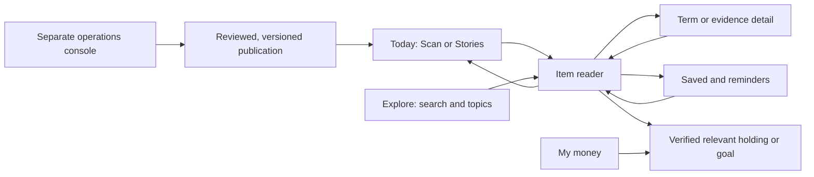

# Fingent360 mobile experience — product redesign plan

Date: 2026-09-12. Task: UX-002. Status: proposed product direction, ready for design review; implementation is planned. This document responds to the user's rejection of the current mobile experience. It supersedes the earlier workspace layout as the target experience. Existing features and historical tests remain implementation evidence, not design acceptance.

## 1. Product direction

Make Fingent360 a personal reading and planning companion: **understand what matters, connect it to your money, and pick up where you left off.** The signature experience is a compact, beautifully typeset brief that opens into a focused reader. A useful item can become a saved explanation, a reminder, a followed topic, or context for an owned holding or goal.

The experience should earn repeat use through clarity, relevance, remembered context and trustworthy follow-through. Measure whether people understand and accomplish something. Session length, swipes and notification opens are diagnostic signals, not the product's objective. Keep an explicit end to the daily brief and an optional continuation feed.

The user's examples are interaction inspiration. This plan makes a few deliberate choices: vertical movement reads more content; horizontal movement gives interest feedback; bottom navigation changes destinations. Each gesture has a visible equivalent. Users should never have to guess which action a swipe will cause.

**Five signature moments:** scan a brief in seconds; expand a term without losing the article; return to the exact item and reading position; see why an item was selected and change that preference immediately; turn a saved item into a reminder or a clearly explained next step. These moments must work with actual data and survive reload before delivery is accepted.

## 2. Current problems and what the evidence establishes

Source inspection covers apps/web/src/Macro.tsx, Sources.tsx, App.tsx and tests/e2e/cases/browser/macro.spec.ts. The user reports failures. No new runtime reproduction was performed for this planning request.

| Current behavior observed in source                                                                                                                                                         | Consequence and redesign requirement                                                                                                                                                                |
| ------------------------------------------------------------------------------------------------------------------------------------------------------------------------------------------- | --------------------------------------------------------------------------------------------------------------------------------------------------------------------------------------------------- |
| Macro History and Source fetch real API data but append their results after all cards and operator controls. No result navigation or focus transfer.                                        | On a phone the action can appear to do nothing. Open the selected result as a reader subroute, identify the exact year/revision, and restore the original row on Back.                              |
| One global busy/error area is far from many row actions.                                                                                                                                    | A person cannot tell which action is loading or failed. Show local pending, success and retry states; announce them to assistive technology.                                                        |
| “Forget operator key” only clears page memory. No visible acknowledgment; it is enabled even when empty. It does not revoke the backend credential or cancel an already authorized request. | Remove the control from investor pages. In operations use precise “Clear entered credential” copy, disabled-empty state and confirmation; distinguish it from credential rotation and cancellation. |
| Source refresh instructions, provider run messages, hashes and raw JSON sit in the investor journey.                                                                                        | Separate publishing/maintenance from research consumption. Show readable provenance first; retain technical evidence in an advanced view.                                                           |
| App hash changes reset scroll globally. Mobile uses an adapted sidebar menu.                                                                                                                | Replace this with independent tab history, selected-item and scroll restoration, plus thumb-reachable navigation.                                                                                   |
| Current tests assert returned text and overall page width.                                                                                                                                  | Those assertions can pass while results remain undiscoverable. Add visible-result, focus, return-position, gesture, touch-device and comprehension acceptance.                                      |

The implementation starts with a complete CTA inventory across every route. Inventory each visible action's label, intended outcome, handler/API, loading/empty/error/success state, focus destination, Back behavior, role and regression case. A control with no implemented outcome is removed or explicitly presented as unavailable with a reason; it never looks actionable and silently does nothing.

## 3. Information architecture

Use five labelled bottom destinations on mobile. On desktop use the same names and hierarchy in a compact navigation rail, with a wider reader and optional related-context column.

| Destination  | Primary job                              | Contents and primary action                                                                                                                                                        |
| ------------ | ---------------------------------------- | ---------------------------------------------------------------------------------------------------------------------------------------------------------------------------------- |
| **Today**    | Understand the few things worth knowing  | Five/six editorial brief items when sufficient eligible content exists; Scan/Stories view switch; latest/following filters; resume reading. Primary action: open an item.          |
| **Explore**  | Find a term, company or topic            | Search, selected topics, glossary, macro context, verified company pages as their data becomes available. Primary action: search or follow.                                        |
| **My money** | Understand owned records and plans       | Holdings/Goals segmented view, real saved state, dated valuation only when available. Primary action follows the empty/populated state: add a holding, import, or open a goal.     |
| **Saved**    | Return to useful items                   | Saved, unread and reminders; search and optional collections. Primary action: continue reading.                                                                                    |
| **More**     | Find remaining destinations and settings | Watchlist, inbox/activity, learning, source information, profile, privacy, notification preferences and help. A searchable, grouped page directory with all investor destinations. |

Today/Explore/My money/Saved/More prioritizes the requested discovery-and-return loop while keeping holdings and goals one tap inside My money. Existing URLs remain as redirects to their new destination; existing saved goal/holding identifiers remain stable. No operator entry appears in the investor More menu.

An unauthenticated person can read public content before registering. Saving/reacting/reminding prompts a short account step and resumes the intended action after explicit confirmation; an unrelated login must not perform an old action silently. Existing users retain each tab's scroll, filters and reading stack. Sign-out/account switch clears private state across all tabs. On direct links Back goes to the appropriate parent if no in-app origin exists.

## 4. Screen experience and visual language

### Today — the typographic brief

The first viewport contains a quiet date/edition header, Scan/Stories switch, and a structured field of headlines and terms. Use three controlled emphasis levels: leading item 24–28px/semibold, standard item 18–20px/medium, related terms 16–18px/regular. Content order remains a meaningful list; avoid arbitrary word placement, rotating text, collisions or reordered reading order. At most two headline emphasis levels compete in one viewport. Type weight and hierarchy indicate editorial priority with an accessible textual explanation available.

Near-black text on a warm neutral background, one restrained brand accent, fine separators and generous row spacing form the foundation. Secondary text must remain readable; grey is not a substitute for adequate contrast. Use 16px body text with roughly 1.5 line height, a modest type scale, consistent icons and 8/12/16/24 spacing. These are initial design tokens to validate on actual phones, not claims about the current app. Avoid a grid of identical dashboard cards or decorative numerical metrics on this reading surface.

Every item has a kind label (News, Explanation, Term, Annual data, Quiz), a meaningful timestamp/period, and a concise source/reason line. An annual observation retains its observation year even if fetched today. Editorial importance, freshness and relevance are distinct attributes; darker text does not imply a price forecast or stronger evidence.

Use the same ranked item collection for Scan and Stories. Scan shows several items together; Stories gives one concise item the reading stage with a restrained visual. Preserve the selected item when switching modes. Announce new content through a “New items available” control rather than moving the item being read. At the end of the brief: “You're up to date” plus voluntary Continue exploring and Saved actions. Duplicate reports about one event are grouped.

### Item reader — progressively deeper understanding

Tap/click opens a full-screen mobile reader with Back, item position and Save. Desktop can expand the same reader beside the list. The reader has three depths:

1. **Understand quickly:** headline, short explanation, key fact and its date, and a clear relevance sentence.
2. **Understand the connections:** related terms, a compact sourced diagram or actual chart where useful, and known links to companies/topics or the user's opted-in records. Present missing connections honestly.
3. **Check the basis:** source publication, effective/retrieval dates, evidence, revisions and uncertainty. The source is accessible without requiring technical vocabulary.

Inline terms open a short explanation layer. A deeper term page contains definition → concrete educational example → common misconception → related reading. Back/Escape closes only the innermost layer, restoring the word/item and reading offset. Browser Back/Forward and shared direct links follow the same state model. A desktop hover/focus preview is brief, dismissible and persistent while used; full reading always requires a deliberate click/tap/keyboard action. Hover never sends feedback or opens a succession of full readers.

The reading action bar offers More like this, Less like this, Save and More. Long pages scroll naturally. Provide visible Previous/Next actions; keyboard shortcuts are optional, discoverable and disabled while typing. Deeper evidence or form views do not inherit swipe-to-vote handlers from their parent.

### Evidence — every tap produces a visible answer

Replace macro row expansion with Indicator → Year → Revision → Source navigation. On mobile a year is a readable list row with value, unit, revision and two clear actions. A table remains an optional desktop view. Opening History immediately displays that indicator/year's heading, loading state, then revision differences. Opening Source displays publisher, item title, observed period, retrieval time, exact value/units and original source link. Raw JSON and hashes live under Advanced evidence.

If a source cannot be reached, show which evidence is stored and a local retry. If there is no revision, say so. Corrected/withdrawn evidence is marked, and historical versions remain reconstructable subject to retention/rights. A repeated click cannot make an earlier response replace the current selection. Returning restores the exact row and expanded state; the user never searches below a page for the result.

### My money — a coherent planning workspace

Holdings: saved summary → verified security picker or explicitly unverified manual entry → quantity and total cost → draft changes → review additions/edits/removals → confirm → saved detail. Explain total cost versus price per unit where entered. CSV/file import uses the same draft/review path, row-level corrections and reconciliation. Preserve valid rows and clearly identify all destructive replacements. An ISIN checksum alone is not verified security identity. Market value appears only when accepted price/identity/action data is available, with its timestamp and missing-price handling.

Goals: goal purpose/name → target and saved amount → timeline/contribution → reviewed calculation → save → goal detail. Repeated purposes are allowed. At each step show the current summary, one main action and a reliable Back. Inputs are editable and exact; a generated suggestion cannot change a calculation silently. Future allocation connects actual holding portions to goal records without double counting, preserves revisions, and explains missing valuation. Acquisition cost, current value and projected scenario value remain separate.

Forms use appropriate input modes, labels above fields, inline validation and a review step before financial record changes. Drafts survive in-flow navigation. Cross-session private draft persistence requires explicit storage consent and account ownership; browser caches are not a private-data store. On auth expiry, preserve only the permitted draft and resume safely after sign-in. On errors, retain edits. A keyboard must not cover the field or primary action.

### Saved and reminders — the return loop

Save responds immediately with a visible saved state and Undo, then confirms server persistence; a failure restores the truthful state and offers retry. Save is idempotent across double taps/devices. Preserve the saved version and surface subsequent corrections or withdrawal. Search/filter by topic, read status and reminder date; opening a saved item resumes reading when available.

“Remind me” opens a short sheet: date/time, timezone and available channel, followed by confirmation. Offer evening/tomorrow presets using the user's confirmed timezone, always showing the resolved time. In-app reminders are the first supported channel: a due item appears in Saved/Inbox; this does not promise an alert while the app is closed. Push/email are separate later capabilities with capability checks, permission/consent, delivery status and fallback. Quiet hours, snooze, edit and cancel are visible. Long press opens choices; it never schedules a reminder by itself.

### More and operations — clear boundaries

More presents all investor destinations in a compact grouped directory, with persistent labels and search as it grows. Support/privacy/session controls remain easy to find. Public Sources explains publishers and data limitations. It contains no provider key, refresh command, publication approval, SQL, host/port, job administration or setup instruction.

Create a separate operations entry point and authorized bundle (proposed /ops), protected by server-side operator sessions/roles. No ordinary account can grant itself that role or call operator APIs. Credential bootstrap/rotation stays in operator setup; investor login is sufficient for investor actions. Operations contains provider health, ingestion jobs, review/publication, rights, corrections, generation budgets and audit records. Moving a button or hiding a route is not authorization. Before removing old refresh controls, retain a working tested operator path for real ingestion and migrate its tests.

## 5. Gesture and navigation contract

| Interaction                                            | Intended result                                | Cancellation and equivalent                                                                                                    |
| ------------------------------------------------------ | ---------------------------------------------- | ------------------------------------------------------------------------------------------------------------------------------ |
| Tap/click/Enter on headline                            | Open that item with its origin state           | Back returns to the same item/offset; no background reranking jump                                                             |
| Hover or keyboard focus on a term, desktop             | Lightweight preview                            | Escape dismisses; click/Enter opens; essential info never hover-only                                                           |
| Swipe up/down in Stories                               | Next/previous story summary                    | Visible controls duplicate it; long reader text uses native scrolling                                                          |
| Vertical movement in Scan                              | Read the next/previous items and topic batches | Native scrolling with optional proximity snapping; visible topic/previous/next controls; never jumps app destinations          |
| Horizontal swipe on the designated reader summary/card | Right: More like this; left: Less like this    | Preview during gesture, commit on release only after directional threshold, then Undo; cancelled/vertical gesture does nothing |
| Tap feedback button                                    | Same persisted preference as its swipe         | Pressed state, optimistic failure rollback and Undo                                                                            |
| Long press on card action area                         | Save/Remind/Share menu                         | Visible overflow button and keyboard menu provide the same actions                                                             |
| Back/Escape                                            | Close top menu/term/evidence/reader in order   | Restore focus and offset; dirty form presents Keep editing/Discard                                                             |
| Tap bottom destination                                 | Switch to that destination's preserved stack   | No app-tab switching on vertical scroll; labels remain visible                                                                 |

Start gesture tuning around an 80px horizontal distance and a clear horizontal-to-vertical dominance threshold; validate, do not treat these numbers as universal. Reserve system edge gestures; never capture swipes starting in form fields, media seek bars, links, selectable text or nested scrollers. Test pointer cancellation, fast reversals and diagonal motion. When text grows or assistive technology needs standard gestures, use native scrolling and controls. A subtle one-time hint can teach gestures; skip remains available.

All dragging/swipe functionality must have simple controls. Aim for 44–48px primary touch targets; the WCAG 2.2 minimum target criterion is 24 CSS pixels with exceptions, so this plan deliberately sets a larger product target. Modal sheets follow managed focus, Escape and focus-return behavior. [W3C target guidance](https://www.w3.org/WAI/WCAG22/Understanding/target-size-minimum.html), [W3C dragging guidance](https://www.w3.org/WAI/standards-guidelines/wcag/new-in-22/), [WAI dialog pattern](https://www.w3.org/WAI/ARIA/apg/patterns/dialog-modal/).

## 6. Personalization that people can understand

Start with versioned deterministic ranking. Candidate eligibility comes first: permitted publication, correct locale/asset scope, valid evidence and withdrawal status. Then consider freshness appropriate to item kind, explicit followed topics, saves and reactions; optionally owned-holding/goal relevance after the user enables it. Deduplicate events and rerank for source/topic diversity and important corrections. “More like this” means an interest in coverage, not agreement with the reported claim; “Less like this” does not suppress important correction notices on something already saved.

Each item exposes **Why this is here** with actual reasons such as “You follow inflation.” Offer Latest, For you and Following modes; topic/source controls; Undo; reset personalization; and a way to stop personalizing without losing saved items. New users can skip topic selection and receive a general editorial brief. Do not infer financial risk tolerance from entertainment or reading behavior.

Optional dwell signals come later and require explicit preference controls; initially off. Count only foreground visible reading intervals, cap per-item influence and treat time as weak evidence. Proposed raw-event retention is 30 days, with retained preference state visible/resettable; finalize this in the privacy specification before enabling. Reactions and saves remain until changed/deleted. Export/deletion includes feedback, preferences, reading state and attempts. Private history does not enter a generation service merely to rank the feed.

Assess diversity and freshness after candidate ranking; this follows established recommendation-system structure, while the chosen signals and weights are Fingent360 design decisions to evaluate. [Google recommendation reranking guidance](https://developers.google.com/machine-learning/recommendation/dnn/re-ranking).

## 7. Images, short explainers, quizzes and polls

Every eligible item gets a considered visual treatment, not necessarily a generated image. Facts with numbers use accurate charts or diagrams from canonical values; terms use explanatory illustrations; news uses permitted source media or clearly labelled illustrative artwork. Images do not imply photographed evidence. No invented chart, price, quote, company event or endorsement.

Provide optional short captioned explainers, initially around 15–30 seconds where the explanation fits. Start from an approved evidence bundle → source-linked script → factual review → visual/audio generation → reviewed asset → publication. Include captions, transcript, source links, playback speed, pause and reduced-data mode. No autoplay audio; animation/video must not block text. A generation failure leaves a useful text item and an operator retry, not an investor error. Produce assets once per content/version through deduplicated jobs with budgets and rights checks; never generate on each feed scroll. Provider/model selection and access are explicit implementation dependencies.

Learning interactions belong after relevant content or in Explore: a 30-second concept question, a small “change the assumption” educational simulation, or a clearly voluntary poll. Quiz answers include the rationale and evidence; save question/rubric versions and attempts. Polls display real counts and participation limitations, not fabricated popularity or a market forecast. One active vote per eligible account, replaceable according to the disclosed rule. Avoid rewards for trading frequency, pressure to act on markets, punitive streak loss or competition over investment returns. Optional learning progress should reward understanding and remain skippable.

## 8. Form assistance grounded in user data

Automatically offer relevant suggestions when useful, and require Apply before altering a field. Label the basis: **From your saved goal**, **Your previous entry**, **Calculated from these amounts**, or **AI wording suggestion**. Preserve the original input and allow Undo/Dismiss. A suggestion is bound to the form/context version; late results cannot overwrite newer edits.

Deterministic assistance comes first: previously entered amounts, known instrument labels, exact arithmetic and clearly disclosed defaults. LLM assistance explains a field, rewrites the user's goal description, or suggests a draft name from the current conversation/history scope. Never invent income, age, dependants, ownership, affordability, a risk profile or a suitable investment. A plain-language financial request becomes a reviewable draft with missing fields, not an automatically saved record.

If an LLM uses personal history, offer a clear scoped opt-in, identify the data sent, minimize/redact context, and honor provider retention configuration. Store suggestion provenance/model/prompt version and accepted edits only as justified by the retention policy. Validate structured outputs, reject unsupported claims, and keep money calculations outside the model. Invalid/unavailable output leaves the form fully usable. Confidence wording must reflect calibrated evidence or explain a limitation; do not invent numeric certainty. [Google PAIR explainability and trust guidance](https://pair.withgoogle.com/chapter/explainability-trust/).

## 9. Complete backend, data and automation design

Continue with React/TypeScript, NestJS, PostgreSQL and MongoDB. API names below are proposed contracts. Introduce new additive migrations with new filenames after the current ledger; never edit migrations001–009. Use reviewed internal IDs, exact decimal/minor-unit values, foreign keys, ownership and version/conflict semantics. Actual media bytes use a configured asset store behind an adapter; local development can use a dedicated served asset directory, with production storage chosen explicitly.

| Domain            | Contracts and API                                                                                 | Persistence, provenance and automation                                                                                                                                                                                                                                  |
| ----------------- | ------------------------------------------------------------------------------------------------- | ----------------------------------------------------------------------------------------------------------------------------------------------------------------------------------------------------------------------------------------------------------------------- |
| Editorial content | Public GET /feed, /items/:id, /items/:id/versions/:version, /terms/:id; private GET /account/feed | feed_items and immutable feed_item_versions, evidence links, topics/instrument identities, publication/rights state, effective/published/retrieved times. Mongo retains permitted source bodies. Cursor binds filter/ranking version; no duplicate items on pagination. |
| Evidence          | Investor read model for indicator/year/revision/source; separate /ops ingestion/review endpoints  | Reuse observations and raw hashes; readable metadata plus exact raw reference. Stale selection responses are discarded. Audited operator identity, review state and additive source-rights capabilities.                                                                |
| Preferences       | PUT/DELETE /account/feed/items/:id/reaction; GET/PUT /account/feed/preferences                    | Unique account/item reaction, preference version, explicit feedback events with idempotency key; ranking-policy version and explainable reasons. Reset removes inferred preference effects without deleting saves.                                                      |
| Library/reminders | PUT/DELETE /account/saved/:itemId; GET /account/saved; POST/PATCH/DELETE /account/reminders/:id   | Unique saved account/item, saved-version reference, reading position, schedule with UTC instant and IANA timezone, channel, status/version and delivery-attempt records. Cancel/retry races are specified.                                                              |
| Learning/polls    | GET /learning/:id; POST /account/learning/attempts; PUT /account/polls/:id/vote                   | Versioned questions, rubrics/evidence, private attempts and unique eligible account/poll vote. Publish honest aggregates only after configured minimum participation where needed.                                                                                      |
| Assistance        | POST /account/suggestions; explicit Apply through normal goal/holding mutation API                | Context fingerprint, permitted inputs, deterministic derivation or model/prompt/version, suggestion expiry, accepted changes. Reuse owned goal/holding revisions; no direct model write to financial records.                                                           |
| Media             | Read-only published asset links; /ops/media generation/review endpoints                           | Asset version, source bundle, transcript/captions, generator/rights/reviewer metadata, checksum and withdrawal state. Deduplicated generation jobs and usage budget.                                                                                                    |
| Operations        | /ops/session, /ops/sources, /ops/jobs, /ops/publications, /ops/audit                              | Separate operator sessions and least-privilege roles, CSRF/Origin checks, secure cookies, rotation/revocation and auditable privileged actions. Secrets stay server-side.                                                                                               |

All private endpoints derive ownership from the session, validate strict request/response schemas, use no-store and include export/deletion coverage. Guest/public readers get no private joins. Denied auth, expired auth and unavailable storage remain different states. Item corrections/withdrawals propagate to feed, saves, explainers/media and reminder targets without silently rewriting issued history.

Use PostgreSQL durable jobs/outbox with leases, bounded retries, backoff, idempotency, cancellation and visible failure state. Processes may run inside the existing repository; no Kafka/Redis/Temporal. Ingestion is operator-invoked first; any schedule is a configured product operation with an owner and visible status. Reminder jobs are created only by the user's explicit reminder action. Transactional outbox events join saved data to jobs. Workers check current consent, account existence, reminder version and item eligibility before delivery. In-app notification insertions are unique; external delivery uses provider idempotency when available and documents any residual duplicate risk.

Source approval must distinguish ingest, store, excerpt, summarize, image display and redistribution rights. A public URL or an approved registry entry alone does not establish all those permissions. Real news adapters are missing today: until they are working and accepted, display existing annual macro content as Annual data and reviewed glossary as Learning. Do not fill a Latest news feed with generated events or recycled annual observations. Verified security identity/prices/actions remain dependencies for genuine valuation and holding relevance.

## 10. Delivery packages and sequencing

This is one redesigned product with shared navigation, reader, data and interaction contracts. Packages are complete user outcomes and can be integrated independently; they are not a sequence of cosmetic patches. Define the full screen/state system first, then implement against it. Root TODO owns status and reusable prompts.

| Package                                                | Complete outcome                                                                                                                                        | Dependencies and release gate                                                                                                                                                                             |
| ------------------------------------------------------ | ------------------------------------------------------------------------------------------------------------------------------------------------------- | --------------------------------------------------------------------------------------------------------------------------------------------------------------------------------------------------------- |
| UX-002A — Design and CTA contract                      | Screen map, all CTA inventory, mobile/desktop component states and a navigable design prototype clearly labelled as design                              | Current source audit. Review full reader, evidence, form and failure flows at phone sizes before styling production. Prototype approval is not feature completion.                                        |
| UX-002B — Reader, navigation and operations separation | Investor reads real macro → year/revision/source → Back with visible feedback; mobile bottom navigation; operator signs in separately to refresh/review | A, existing evidence APIs; new operator authorization and any additive role/session migration; migrate old links/tests. No operator secrets in investor DOM/bundle/API responses.                         |
| UX-002C — Real brief and Explore                       | Actual permitted sources → ingestion/review → versioned feed/search → reader/terms → correction                                                         | A/B and one permitted real news source; jobs/rights contract and editorial review. Annual context alone does not satisfy a news-feed release.                                                             |
| UX-002D — Saved, reminders and personalization         | Read → react/save → reload/device change → ranked reasons → reminder due → return, with Undo/reset and privacy                                          | B and eligible content; can use existing real annual content while C is onboarded. Durable jobs, preferences, library and ownership migrations. No LLM needed for initial ranking.                        |
| UX-002E — My money and grounded assistance             | Guided real holding/import/goal journeys, suggestions applied explicitly, exact persisted calculations and connected relevant content                   | A/B, existing account/holding/goals contracts; verified identity/prices for their specific views. LLM access/consent is separate from deterministic suggestions. Align with existing DEV-007–009/017/019. |
| UX-002F — Learning and rich media                      | Evidence-backed quiz/poll/visual/short explainer, generation review, real attempts/votes and correction handling                                        | C/D content/version/rights and job substrate; generation provider/asset-store setup. Working text experience remains available.                                                                           |
| UX-002G — Launch acceptance and affinity               | All CTA paths work visibly, real devices pass, accessibility/performance/privacy/operational evidence, usability findings resolved                      | All released packages. Includes limited rollout, measured evaluation and rollback. Unreleased media/adapters never appear as dead CTAs.                                                                   |

After A fixes the contracts, independent work can cover B (navigation/evidence/operator), C (content ingestion/publishing), and D (library/ranking) with agreed shared schemas. E/F reuse those foundations. Parent integration owns route/state consistency and sequential gates after edits settle. Preserve the existing Indian-equity-first roadmap; these packages change the delivery experience and dependencies, not the accepted asset/advice boundaries.

## 11. Acceptance, rollout and affinity measures

Every package delivers specification, UI, UX, API, functionality/workflow, database/migrations, real data, automation, tests and documentation. Reuse a layer with evidence or mark it not applicable with a specific reason. Add runnable API/browser cases only when the behavior is implemented; the accompanying acceptance plan contains planned scenarios, not passing placeholders.

**Interaction gate:** every CTA has visible outcome/local progress, accessible name and failure recovery. Verify all macro years/revisions and supported item kinds, not only the first row. Test Back/Forward, direct links, focus/scroll restoration, nested terms, repeated taps, out-of-order replies, offline/auth expiry and restored drafts. A passing assertion that hidden text exists cannot satisfy this gate.

**Mobile gate:** 320/360/390/430px widths, small-height landscape, 200% text sizing, long titles, empty/loaded/error states, safe areas and the on-screen keyboard. Test actual iOS Safari and Android Chrome devices in addition to automated browser projects. Verify native edge Back, diagonal/cancelled gestures, long press/text selection, reduced motion and screen-reader operation. Bottom navigation/action bars never overlap the last content item or input. Emulated Chrome alone cannot establish iOS acceptance.

**Accessibility gate:** WCAG 2.2 AA target with manual keyboard, VoiceOver/TalkBack and contrast/focus review. No essential action relies on color, hover, gesture, animation or timed interaction. Use semantic lists, headings and names; expose a standard list view if the typographic presentation becomes hard to navigate. Verify modal focus and return. State actual tested coverage instead of claiming certification from screenshots.

**Performance gate:** target mobile p75 LCP ≤2.5s, INP ≤200ms and CLS ≤0.1, then measure them with a declared device/network profile and real field data when available. Lab results are not field percentiles. Reserve media dimensions, lazy-load below the fold, cancel unused fetches, and avoid animation on financial data updates. Keep text useful on slow connections; offer reduced-data behavior and obey media preferences. [Google Web Vitals definitions](https://web.dev/articles/vitals).

**Usability gate:** recruit representative beginner and more experienced Indian investors, including one-handed use and assistive-technology needs. A proposed first review uses 6–8 participants for qualitative findings, not statistical proof. Tasks: find one useful item; explain it in their own words; inspect its source; save/remind; react and undo; return to position; correct an import; create/edit a goal. Record unassisted completion, comprehension, wrong turns, accidental actions and trust issues. Resolve critical failures before claiming acceptance. Compare Scan/Stories with the same eligible content; user preference decides the default after evidence.

**Affinity measures:** weekly returning readers who complete a useful action; saved-item revisit rate; reminder helpfulness/dismissal; self-reported clarity/trust; topic diversity; successful plan edits; optional quiz understanding. Track CTA failure and mistaken-swipe rates, reminder complaints, privacy resets and slow-page exits as guardrails. Do not claim a retention uplift before collecting a baseline and evaluating a release. Avoid optimizing fear, compulsive checking or trading frequency.

**Rollout:** keep compatible deep links and existing data; add migrations with rollback/restore preparation; gate complete capabilities server-side; use a small opt-in cohort, then expand after evidence. Correction/withdrawal and background-job failures must be observable in operations. No automatic git push, deployment, source schedule or user notification follows from writing this plan.

## 12. Planning handoff

Companion acceptance: tests/e2e/plans/mobile-experience-acceptance.md. Task/prompt tracker: root TODO UX-002A–G. Existing architecture and source parent work remain in docs/development/delivery-matrix.md.

This turn delivers a plan and source audit. No reported CTA has been fixed or runtime-reproduced by this document, no provider/media/reminder integration has been activated, and no new runtime pass is claimed. The user-manual SDLC execution boundary applies to this planning deliverable. Review the plan and, with the existing app/databases ready, use `pnpm sdlc "Plan mobile discovery and complete product experience"` for format/check, local commit and the existing regression suite. The future UX-002 cases become runnable as their packages are implemented; they are not expected to appear in the test UI yet.
